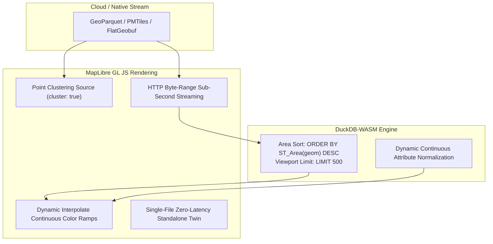

# Default WebGIS Rendering Enhancements Specification
**Ecosystem Standard for:** [`opengeos/GeoLibre`](https://github.com/opengeos/GeoLibre) & [`GetBack2Basics/Spatial_Report_Crafter`](https://github.com/GetBack2Basics/Spatial_Report_Crafter)  
**Author:** GetBack2Basics / AURA Siting Crafter  
**Status:** Adopted Default Standard (September 2026)  

---

## 1. Overview & Objective

When rendering large-scale spatial layers (such as 15.4M+ national cadastral parcels, multi-hazard envelopes, and electrical transmission grids) inside browser WebGIS applications, client-side rendering bottlenecks can lead to:
- Excessive WebGL draw calls and dropped frames (< 30 fps).
- Viewport clutter caused by tens of thousands of sub-pixel polygon slivers.
- DOM and memory pressure resulting from bloated GeoJSON transfers.

This specification defines **5 Core Rendering Standards** to serve as the default behavior across **GeoLibre** client plugins and **Spatial_Report_Crafter** digital twins.



---

## 2. The 5 Core Rendering Standards

### Standard 1: Area-Priority Viewport Feature Limiting
* **Default Setting:** `FEATURE_RENDER_LIMIT = 500`
* **Behavior:** When the total matching polygon/multipolygon count within an active viewport bounding box exceeds the limit, query and sort features by descending surface area (`ORDER BY ST_Area(geom) DESC` or bounding box magnitude).
* **Benefit:** Ensures primary regional land parcels and candidate pads are rendered cleanly without visual occlusion from micro-slivers, while maintaining consistent 60fps frame rates.

### Standard 2: Point Clustering & Density Scaling
* **Default Setting:** `cluster: true`, `clusterRadius: 50`, `clusterMaxZoom: 14`
* **Behavior:** For dense point layers (electrical substations, transmission towers, water boreholes, monitoring points), instantiate MapLibre GL cluster sources.
* **Cluster Badges:** Tiered circle radii and color steps (e.g., `< 10` points: `#3b82f6`, `10–50` points: `#f59e0b`, `> 50` points: `#ef4444`). Clicking a cluster executes bounding-box zoom expansion or spiderfying.

### Standard 3: Dynamic MapLibre Continuous Color Ramps
* **Default Setting:** GPU-driven continuous expression interpolation
* **Syntax:**
  ```javascript
  'fill-color': [
    'interpolate',
    ['linear'],
    ['get', 'suitability_score'],
    0.0, '#3b82f6',   // Blue (Low / Moderate)
    0.5, '#f59e0b',   // Amber (Viable)
    0.8, '#10b981',   // Emerald (High)
    1.0, '#06b6d4'    // Cyan (Optimal Tier-1)
  ]
  ```
* **Benefit:** Parameter adjustments in client-side DuckDB-WASM immediately recolor map polygons via WebGL shaders without re-allocating layers or textures.

### Standard 4: Sub-Second Web-Native Vector Streaming
* **Default Formats:** **PMTiles**, **FlatGeobuf**, **GeoParquet**
* **Behavior:** Client requests only the required spatial partitions or tile bytes using HTTP Range headers (`Range: bytes=start-end`), eliminating multi-megabyte GeoJSON payload downloads.

### Standard 5: Zero-Latency Standalone Digital Twins
* **Default Output:** Self-contained, single-file HTML apps
* **Behavior:** `Spatial_Report_Crafter` and GeoLibre exporters embed essential micro-layers (e.g. project boundaries, Net Developable Pads, infrastructure corridors) directly into the HTML document, allowing stakeholders to execute full spatial queries and slider re-scoring completely offline.

---

## 3. Integration Matrix

| Component | GeoLibre (`opengeos/GeoLibre`) | Spatial Report Crafter (`Spatial_Report_Crafter`) |
| :--- | :--- | :--- |
| **Area-Priority Limiter** | Core Layer Rendering Pipeline | Default Project Map Template |
| **Point Clustering** | Default on Point Ingestion | Infrastructure Layer Presets |
| **Continuous Color Ramps** | `geolibre-siting` Plugin | Live Suitability Explorer |
| **Byte-Range Streaming** | Cloud Catalog Connectors | Remote Lakehouse Layer Bridge |
| **Standalone HTML Export** | `geolibre-export-report` Action | `tools/build_project_package.py` |

---

## 4. Cross-Repository References
* 🐙 **Spatial Report Crafter:** [https://github.com/GetBack2Basics/Spatial_Report_Crafter](https://github.com/GetBack2Basics/Spatial_Report_Crafter)
* 🐙 **GeoLibre Upstream:** [https://github.com/opengeos/GeoLibre](https://github.com/opengeos/GeoLibre)
* 🐙 **AURA Siting Crafter:** [https://github.com/GetBack2Basics/aura_siting_crafter](https://github.com/GetBack2Basics/aura_siting_crafter)
