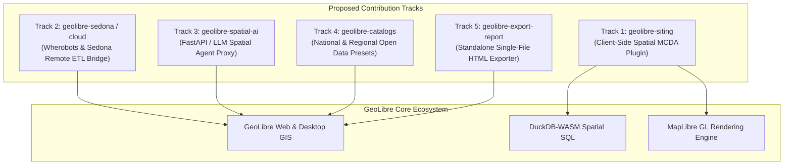

# GeoLibre Contribution & Fork Proposals
**Author & Contributor:** GetBack2Basics / AURA Siting Crafter  
**Target Repository:** [`opengeos/GeoLibre`](https://github.com/opengeos/GeoLibre)  
**Date:** September 2026  
**License:** MIT / Open Source  

---

## Executive Summary

[GeoLibre](https://github.com/opengeos/GeoLibre) has established a new benchmark for modern, cloud-native, open-source GIS by combining MapLibre GL, DuckDB-WASM, React, TypeScript, and Tauri. 

Through the development of **AURA Siting Crafter** (Australian Urban & Regional AI Siting Crafter), we have built, field-tested, and validated several spatial architectures, client-side analytical engines, and cloud ETL bridges. 

We would love to contribute these modules back to the **OpenGeos / GeoLibre** ecosystem as plugins, upstream core features, or official ecosystem templates.

---

## 1. Contribution Track 1: `geolibre-siting` (Zero-Cost Spatial MCDA Plugin)

### The Concept
A dedicated **Spatial Multi-Criteria Decision Analysis (MCDA)** plugin for GeoLibre that enables interactive suitability modeling for renewable energy, data centers, transmission corridors, and industrial precincts.

### Key Capabilities
1. **Decoupled Heavy Geometry vs. Lightweight Scoring**:
   * Heavy topological calculations (multi-distance buffers, spatial intersections, `ST_Difference` masks) are computed once.
   * Parameter tuning (weights $w_{\text{power}}, w_{\text{water}}, w_{\text{transport}}, w_{\text{hazard}}$ and curve parameters) executes **100% in client-side DuckDB-WASM** in sub-10ms queries.
2. **Flexible Scoring Curve Engine**:
   * **Sigmoidal Logistic Curves**: $S(d) = \frac{1}{1 + e^{-k(d - d_0)}}$ for gradual distance penalties.
   * **Inverted Linear Ramps**: Continuous decay over custom distance envelopes.
   * **Step & Hard Exclusion Buffers**: Strict boolean zoning masks.
3. **Interactive UI Components**:
   * Dynamic weight sliders with automatic normalization ($\sum w_i = 1.0$).
   * Interactive radar/spider charts comparing selected parcels across criteria.
   * Tiered classification badges (Tier 1 Optimal, Tier 2 Viable, Tier 3 Constrained).

---

## 2. Contribution Track 2: `geolibre-sedona` (Apache Sedona / Wherobots Cloud Bridge)

### The Concept
While GeoLibre runs smoothly in the browser for datasets up to hundreds of megabytes, national-scale workflows (e.g., buffering 15+ million cadastral parcels, polygon-in-polygon overlays across continent-wide layers) require distributed spatial compute.

### Key Capabilities
1. **Asynchronous Remote Spatial Job Submitter**:
   * A clean UI and API client within GeoLibre to dispatch heavy Spatial SQL scripts to **Apache Sedona**, **Wherobots Cloud**, or **Cloud Dataproc**.
2. **Stream-to-Client GeoParquet / FlatGeobuf**:
   * Cloud ETL outputs are converted to optimized GeoParquet or PMTiles and streamed straight into GeoLibre's layer manager.
3. **Cryptographic Fingerprinting & Memoization**:
   * Uses ETag and GeoParquet file hashes to skip redundant heavy compute when underlying geometries have not changed.

---

## 3. Contribution Track 3: `geolibre-spatial-ai` (Ask AI: Natural Language to Spatial SQL & GeoAgent Integration)

### The Concept & GeoAgent Synergy
OpenGeos maintains **GeoAgent** (`opengeos/GeoAgent`), which provides multimodal AI assistance across GeoLibre and QGIS. 

Our contribution provides a **specialized Spatial SQL compilation & viewport-grounded analytics engine** that can either integrate directly as tool skills within **GeoAgent** or run as a standalone FastAPI proxy (`geolibre-spatial-ai-proxy`).

### Key Capabilities
1. **Natural Language to Validated Spatial SQL (DuckDB-WASM & Sedona)**:
   * Translates complex multi-criteria user prompts into syntactically valid Spatial SQL (e.g. *"Find all industrial zoned parcels over 20 hectares within 5km of a 330kV substation outside 1-in-100 year flood zones"* -> `SELECT ... WHERE ST_DWithin(...) AND NOT ST_Intersects(...)`).
   * Handles dialect differences between client-side DuckDB-WASM and cloud-side Apache Sedona.
2. **Viewport-Aware Spatial Context & Grounding**:
   * Streams current map viewport bounding boxes (`bbox: [minX, minY, maxX, maxY]`), zoom levels, and active layer schemas into the LLM context so responses are strictly grounded in what the user is currently viewing.
3. **Automated MapLibre Layer Styling & Filter Expressions**:
   * Returns programmatic MapLibre GL JS filter expressions and dynamic continuous color ramps directly from the AI agent response to highlight matching polygons immediately on the map canvas.
4. **Interactive What-If Siting Formulation**:
   * Translates domain requirements into structured weighting vectors and sensitivity ranges for the client-side MCDA scoring engine.

---

## 4. Contribution Track 4: Open Spatial Catalog Presets (Australia & Regional)

### The Concept
Pre-configured catalog manifests allowing GeoLibre users to connect to national and state-level open geospatial data endpoints.

### Key Capabilities
1. **Direct Live REST & WFS Integration**:
   * Pre-configured catalog definitions for Geoscience Australia (National Electrical Grid, Renewable Energy Zones, Digital Earth Australia), Geoscape Cadastre (DCDB), SEED NSW environmental constraints, and ELVIS LiDAR elevation data.
2. **Industry Siting Presets**:
   * Pre-built schema templates for Data Centers, Clean Hydrogen Hubs, and BESS (Battery Energy Storage Systems).

---

## 5. Contribution Track 5: Standalone Single-File Interactive HTML Exporter

### The Concept
An export action in GeoLibre that packages the active map view, DuckDB-WASM engine, and MCDA scoring rules into a single, standalone `.html` file.

### Key Capabilities
* **Zero-Server Portability**: Stakeholders, regulators, and non-GIS executives can open the file in standard browsers with full offline interactivity (sliders, filters, tables, and GeoJSON/CSV exports).
* **Audit-Proof Decision Records**: Embeds the exact scoring weights, source timestamps, and methodology in the export.

---

## 6. Upstream Core Rendering Enhancements & Default Standards
*Cross-ecosystem standard for [`opengeos/GeoLibre`](https://github.com/opengeos/GeoLibre) and [`GetBack2Basics/Spatial_Report_Crafter`](https://github.com/GetBack2Basics/Spatial_Report_Crafter).*

To ensure fluid 60fps performance and avoid canvas clutter when rendering complex spatial layers in the browser, we propose adopting the following **5 Default Rendering Standards**:

### 1. Area-Priority Viewport Feature Limiting
* **Problem**: Ingesting raw national datasets (e.g., 15.4M parcels or state-wide zoning overlays) can flood the browser DOM and WebGL canvas with tens of thousands of micro-slivers and sub-pixel geometries.
* **Default Standard**: Apply an intelligent feature limit (default: **500 features** per active viewport). Sort polygon geometries by area (`ORDER BY ST_Area(geom) DESC` or bounding box magnitude) so that the largest, most significant parcels/assets are prioritized and rendered first, preventing visual clutter while maintaining full frame rates.

### 2. Point Clustering & Density Scaling
* **Problem**: Dense point datasets (e.g., electrical substations, transmission towers, monitoring boreholes, turbine locations) overlap into unreadable blobs at macro zoom levels.
* **Default Standard**: Enable native MapLibre GL cluster sources (`cluster: true`, `clusterRadius: 50`, `clusterMaxZoom: 14`) with step-based cluster count badges and auto-zoom / spiderfy expansions on click.

### 3. Dynamic MapLibre Continuous Color Ramps
* **Problem**: Re-styling layers during interactive What-If slider adjustments traditionally causes laggy layer re-instantiation.
* **Default Standard**: Leverage MapLibre GL JS data-driven expressions (`['interpolate', ['linear'], ['get', attribute], ...]`) driven directly by in-memory DuckDB-WASM query attributes for instant, GPU-accelerated continuous heatmaps and suitability grading.

### 4. Sub-Second Web-Native Vector Streaming (HTTP Byte-Range Requests)
* **Problem**: Loading entire monolithic GeoJSON files creates network latency bottlenecks and spikes browser memory.
* **Default Standard**: Stream geometries directly from S3/GCS via HTTP byte-range slicing using **PMTiles**, **FlatGeobuf**, and **GeoParquet**, enabling sub-second tile rendering and smooth 60fps pan/zoom across intricate cadastral boundaries.

### 5. Zero-Latency Standalone Digital Twins & Embedded Micro-Layers
* **Problem**: Regulators, stakeholders, and field inspectors need to access reports and interactive maps without active cloud infrastructure or authenticated backend APIs.
* **Default Standard**: Package active layers, custom symbology, and scoring logic into single-file portable HTML apps that execute with zero network lag and 100% client-side interactivity.

---

## 7. Ecosystem Synergy: `Spatial_Report_Crafter` & `GeoLibre`

These rendering standards and export capabilities establish the core foundation for **[Spatial_Report_Crafter](https://github.com/GetBack2Basics/Spatial_Report_Crafter)**:
* **Automated Package Generator**: Consumes standardized project manifests to produce zero-dependency interactive 3D WebGIS and statutory planning reports.
* **Shared Component Library**: Reusable UI widgets (dynamic weight sliders, radar spider charts, live attribute inspection docks, dual-theme contrast maps).
* **Cross-Repo Template**: Acts as the official reporting & statutory submission template for GeoLibre workflows.

---

## 8. Community Feedback & Prioritization Request

We would love the GeoLibre core team's input:

1. **Plugin vs. Monorepo**: Would you prefer `geolibre-siting` as a standalone plugin repository (`opengeos/geolibre-siting` / `geolibre-plugin-siting`) or merged directly into the core GeoLibre plugin directory?
2. **Backend Preference**: Is there interest in the Apache Sedona / Wherobots remote compute connector for GeoLibre's desktop (Tauri) or web runtime?
3. **Rendering Defaults**: Should the Area-Priority 500-feature limiter and dynamic color ramp macros be merged directly into GeoLibre's default vector layer pipeline?
4. **Feature Priority**: Which of the above tracks would deliver the most immediate value to the GeoLibre user community?

---

*Repository Reference:* [AURA Siting Crafter on GitHub](https://github.com/GetBack2Basics/aura_siting_crafter)  
*Spatial Report Engine:* [Spatial_Report_Crafter on GitHub](https://github.com/GetBack2Basics/Spatial_Report_Crafter)  
*Upstream Project:* [GeoLibre on GitHub](https://github.com/opengeos/GeoLibre)
