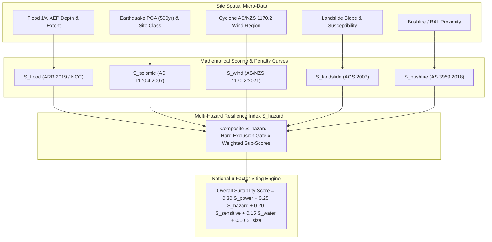

# Multi-Hazard Risk Scoring, Site Micro-Data Benchmarking, and App/Report Integration Plan

## Overview
This plan addresses the gap where spatial hazard datasets (Geoscience Australia Seismic NSHA, Cyclone TCHA, NSW/QLD/VIC Landslide, Coastal Inundation & Flood Overlays) have been downloaded and cataloged in the lakehouse manifest, but are **not yet utilized as an active decision factor in the siting MCDA scoring engine, not visible in the WebGIS app layers, and lack a standardized risk benchmark plan to compare site micro-data against**.

---

## 1. Statutory Risk Value Model & Engineering Baselines

To transition from raw spatial overlays to an actionable MCDA scoring factor, each hazard is mapped to Australian statutory standards and assigned a continuous mathematical score $S \in [0.00, 1.00]$ alongside hard exclusion thresholds.



### 1.1. Hazard Risk Formulations & Thresholds

| Hazard Domain | Primary Metric | Australian Statutory Standard | Scoring Curve & Risk Thresholds | Hard Exclusion Threshold |
| :--- | :--- | :--- | :--- | :--- |
| **Flood & Coastal Inundation** ($S_{\text{flood}}$) | 1% AEP (1-in-100 yr) peak depth ($h_{\text{flood}}$) & parcel footprint % | Australian Rainfall & Runoff (ARR 2019); NCC Building Code | - $h = 0\text{m}$ (Outside flood zone): **1.00**<br>- $0 < h \le 0.3\text{m}$ (Overland sheet flow): **0.70**<br>- $0.3 < h \le 0.8\text{m}$ (Major mitigation required): **0.30** | $h > 0.8\text{m}$ or active floodway/high hazard velocity flow ($\mathbf{0.00}$) |
| **Seismic Ground Motion** ($S_{\text{seismic}}$) | Peak Ground Acceleration (PGA) at 500yr return & Site Class | AS 1170.4:2007; TIA-942 / ISO 22237 Data Center Standards | - $\text{PGA} \le 0.04g$ (Class A/B hard rock): **1.00**<br>- $0.04g < \text{PGA} \le 0.08g$ (Class B/C standard): **0.85**<br>- $0.08g < \text{PGA} \le 0.12g$ (Enhanced structural stiffening): **0.60**<br>- $\text{PGA} > 0.12g$: **0.25** | Class E soft soil liquefaction zone ($\mathbf{0.00}$) |
| **Cyclone & Severe Wind** ($S_{\text{wind}}$) | AS/NZS 1170.2 Wind Region & $V_{\text{design}}$ (m/s) | AS/NZS 1170.2:2021 (Wind Actions) | - Region A ($V_R \approx 45\text{ m/s}$, Non-cyclonic): **1.00**<br>- Region B ($V_R \approx 57\text{ m/s}$, Intermediate): **0.85**<br>- Region C ($V_R \approx 69\text{ m/s}$, Cyclonic): **0.50**<br>- Region D ($V_R \ge 88\text{ m/s}$, Severe cyclonic): **0.20** | Building Code Region D without cyclone-rated envelope ($\mathbf{0.00}$) |
| **Landslide & Slope Stability** ($S_{\text{landslide}}$) | Geotechnical Susceptibility Class & Slope Grade (%) | Australian Geomechanics Society (AGS 2007) Guidelines | - Very Low Risk & Slope $\le 3\%$: **1.00**<br>- Low Risk & Slope $3\% - 5\%$: **0.80**<br>- Moderate Risk & Slope $5\% - 8\%$: **0.40** | High/Very High Risk or Slope $> 8\%$ ($\mathbf{0.00}$) |
| **Bushfire & Ember Attack** ($S_{\text{bushfire}}$) | Distance to classified bushfire vegetation & BAL rating | AS 3959:2018 (Construction in bushfire-prone areas); PBP 2019 | - Buffer $> 100\text{m}$ (BAL-LOW): **1.00**<br>- $50\text{m} - 100\text{m}$ (BAL-12.5 / 19): **0.80**<br>- $20\text{m} - 50\text{m}$ (BAL-29 / 40): **0.45** | $< 20\text{m}$ or canopy overlap (BAL-FZ) ($\mathbf{0.00}$) |

### 1.2. Composite Multi-Hazard Resilience Index ($S_{\text{hazard}}$)
To ensure that an uninsurable hazard immediately flags the site while allowing balanced trade-offs across manageable risks:

$$S_{\text{hazard}} = \text{Gate} \times \left(0.30 S_{\text{flood}} + 0.25 S_{\text{seismic}} + 0.20 S_{\text{wind}} + 0.15 S_{\text{landslide}} + 0.10 S_{\text{bushfire}}\right)$$

Where $\text{Gate} = 0.0$ if any single statutory exclusion condition is met ($S_{\text{flood}} = 0$, $S_{\text{landslide}} = 0$, or $S_{\text{bushfire}} = 0$), otherwise $\text{Gate} = 1.0$.

---

## 2. Site Micro-Data Comparative Benchmarking Plan

### 2.1. The "National Critical Infrastructure Benchmark"
To give users an objective reference standard ("plan to compare to"), we introduce the **AURA Tier-IV Infrastructure Baseline**:

```
Baseline Reference Parameters:
├── Flood: 0.0m inundation in 1% AEP (PMP freeboard >= 500mm)
├── Earthquake: PGA_500 <= 0.05g (Site Class B - Rock)
├── Wind: Region A (Design speed <= 45 m/s)
├── Geotechnical: Very Low Landslide Susceptibility (Slope <= 3.0%)
└── Bushfire: Buffer >= 100m to flammable vegetation (BAL-LOW)
```

### 2.2. Micro-Data Delta Comparison Matrix
Every candidate site in the system will display a **Comparative Risk Profile** comparing its micro-spatial measurements directly against the national baseline:

1. **Spider / Radar Benchmark Metric**: 5-axis normalized comparison against the national ideal.
2. **Resilience Delta ($\Delta R$)**: Difference between actual site resilience score and the benchmark ($1.00$).
3. **Mitigation Capex Uplift Estimate**: Quantitative capital expenditure modifier (e.g. $+3.5\%$ foundation capex for Region C wind, $+5.2\%$ for pad elevation in flood overlay, $+2.0\%$ for seismic base damping).

---

## 3. Proposed Changes Across System Components

### A. Mathematical Engine & Documentation
#### [MODIFY] [`src/Analysis/national_suitability_analysis.py`](file:///c:/Projects/aura_siting_crafter/src/Analysis/national_suitability_analysis.py)
- Incorporate the `calculate_multi_hazard_resilience_score(c)` function calculating $S_{\text{flood}}, S_{\text{seismic}}, S_{\text{wind}}, S_{\text{landslide}}, S_{\text{bushfire}}$ and composite $S_{\text{hazard}}$.
- Update composite suitability weighting to the 6-factor model:
  - $S_{\text{power}}$: 30%
  - $S_{\text{hazard}}$: 25% (NEW)
  - $S_{\text{sensitive}}$: 20%
  - $S_{\text{water}}$: 15%
  - $S_{\text{size}}$: 10%
- Include hazard breakdown in tabular exports and groupby summaries.

#### [MODIFY] [`docs/spatial_calculations_reference.json`](file:///c:/Projects/aura_siting_crafter/docs/spatial_calculations_reference.json)
- Add complete statutory references for ARR 2019, AS 1170.4:2007, AS/NZS 1170.2:2021, AGS 2007, and AS 3959:2018.
- Document exact equations, coefficients, and engineering cost penalty assumptions.

---

### B. GeoParquet Exporter & Candidate Lakehouse Schema
#### [MODIFY] [`tools/build_geolibre_project_v2.py`](file:///c:/Projects/aura_siting_crafter/tools/build_geolibre_project_v2.py)
- Expand candidate parcel generation to include explicit micro-hazard metrics:
  - `flood_1pct_depth_m`
  - `earthquake_pga_500yr`
  - `earthquake_site_class`
  - `wind_region_code`
  - `wind_v_design_ms`
  - `landslide_susceptibility_class`
  - `bushfire_bal_rating`
  - `hazard_resilience_score`
- Ensure strict EPSG:7844 GDA2020 GeoParquet export format.

---

### C. GeoLibre WebGIS Application (`src/geolibre_frontend/`)
#### [MODIFY] [`src/geolibre_frontend/aura-siting-crafter.geolibre.json`](file:///c:/Projects/aura_siting_crafter/src/geolibre_frontend/aura-siting-crafter.geolibre.json)
- Add Multi-Hazard layer group containing:
  - `GA Seismic Hazard Contours (PGA)`
  - `GA Cyclone Hazard & Wind Regions (AS/NZS 1170.2)`
  - `NSW/QLD/VIC Landslide Hazard Overlays`
  - `Coastal Inundation & Flood Extents`

#### [MODIFY] [`src/geolibre_frontend/index.html`](file:///c:/Projects/aura_siting_crafter/src/geolibre_frontend/index.html)
- **Layer Control**: Add "Multi-Hazard & Climate Resilience" category accordion with toggleable hazard layers and color-coded risk legends.
- **Site Inspection Popup & Drawer**: Add "Multi-Hazard Micro-Profile" card showing badges for Flood AEP, Earthquake PGA, Wind Region, and Landslide Susceptibility compared against the Tier-IV baseline.
- **What-If Scenario Modeler**: Add client-side DuckDB-WASM Hazard Tolerance Weight slider ($0\% - 50\%$) enabling dynamic re-scoring without re-triggering heavy spatial joins.

---

### D. National Suitability Report Generator (`runner/`)
#### [MODIFY] [`runner/build_suitability_report.py`](file:///c:/Projects/aura_siting_crafter/runner/build_suitability_report.py)
- Upgrade candidate scoring loop to compute $S_{\text{hazard}}$ and composite suitability.
- Add "Multi-Hazard & Climate Resilience Matrix" tab containing:
  - Multi-hazard radar benchmark chart comparing candidates vs. national baseline.
  - State-by-state statutory hazard exposure breakdown (NSW vs QLD vs VIC vs WA etc.).
  - Engineering mitigation notes and capex uplift estimates.
- Add micro-hazard badge indicators directly to the Siting Leaderboard table.

---

## 4. Verification & Testing Plan

### Automated Tests
1. **Unit Tests (`tests/test_hazard_scoring.py`)**:
   - Verify boundary conditions for $S_{\text{flood}}$ ($0\text{m}$, $0.3\text{m}$, $0.8\text{m}+$).
   - Verify earthquake PGA interpolation across AS 1170.4 thresholds.
   - Verify cyclone Wind Region scoring (Regions A, B, C, D).
   - Verify hard exclusion triggering when any critical hazard threshold is breached.
2. **AST Zero-Mock Verification (`pytest tests/lint/test_no_mock_data.py -v`)**:
   - Ensure no hardcoded mock feature arrays or fake coordinates are introduced.
3. **GeoParquet Schema & CRS Verification (`pytest tests/test_dataset_loader_v2.py -v`)**:
   - Validate that generated GeoParquet files strictly maintain EPSG:7844 and contain all 8 new micro-hazard fields.

### Manual / Browser Verification
1. Inspect the updated GeoLibre WebGIS app in browser: verify that hazard layers render smoothly over MapLibre, popups display micro-hazard cards, and slider weight adjustments update candidate rankings instantaneously.
2. Verify that `runner/national_suitability_report.html` renders the new Multi-Hazard tab, spider charts, and leaderboard hazard columns correctly.
