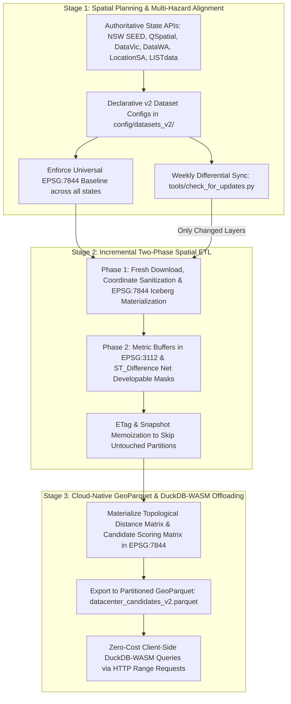

# National Multi-State High-Resolution Spatial Data Collection & Amalgamation Plan (v2 Library)

**Project:** Australian Urban & Regional AI Siting Crafter (AURA Siting Crafter)  
**Target Standard:** Multi-State Jurisdictional High-Resolution Data Collection, Natural Hazard Modeling & Canonical Amalgamation (v2 Cloud-Native Architecture)  
**CRS Standard:** Strictly **`EPSG:7844` (GDA2020 Geographic 2D Baseline)** across all persistent datasets, layers, and GeoParquet files | Metric Calculations & Buffers: **`EPSG:3112` (GDA2020 Geoscience Australia Albers Equal Area)**  
**Execution Engine:** Apache Sedona (PySpark) on Wherobots Cloud Spatial SQL & Client-Side DuckDB-WASM  
**Storage Architecture:** Cloud-Native GeoParquet & Apache Iceberg in `_v2` Lakehouse Namespace (`s3://wherobots-user-storage/aura_siting_v2/` & GCS/S3)  
**Playbook Reference:** [Wherobots & Antigravity Engineering Playbook](https://github.com/GetBack2Basics/CheatSheets/blob/main/wherobots_antigravity_playbook.md)  
**Integration Reference:** [Next Steps & GeoLibre Tab Integration](file:///c:/Projects/aura_siting_crafter/docs/next_steps_and_geolibre_tab.md)  
**Artifact Path:** `docs/multi_state_high_resolution_data_collection_and_amalgamation_plan.md`

---

## 1. Executive Summary & v2 Architectural Mandate

To maintain existing operational workflows without disruption, all new multi-state high-resolution capabilities, natural hazard layers, and GeoParquet pipelines are implemented as a **`_v2` architecture**:
1. **Preserve Legacy `v1` Pipelines**: Existing `config/datasets/nsw/`, `runner/attachments/layers/`, and `src/Ingestion/` remain untouched for stability.
2. **Unified `_v2` Pipeline**: A new versioned pipeline (`src/Ingestion_v2/` or modular `v2` configurations in `config/datasets_v2/`) downloads fresh, high-resolution datasets for **NSW** as well as **QLD, VIC, WA, SA, TAS, NT, and ACT**.
3. **Strict Universal CRS Enforcement (`EPSG:7844`)**: All ingested vector layers, Iceberg tables, and exported GeoParquet files strictly standardize on **`EPSG:7844` (GDA2020)**. No legacy AGD66, AGD84, GDA94 (`EPSG:4283`), or fragmented UTM zone projections (`EPSG:7854-7856`) are stored in persistent tables.
4. **Cloud-Native GeoParquet + DuckDB-WASM**: Suitability layers and topological distance matrices are stored in partitioned GeoParquet queried via HTTP byte-range requests at **$0.00 cloud compute cost**.
5. **Automated Weekly Differential Sync**: `tools/check_for_updates.py` checks upstream ETags/timestamps weekly and triggers ETL only for changed datasets.

---

## 2. The 3-Stage Wherobots Geospatial Lifecycle (v2)



---

## 3. Strict Universal Coordinate System Specification

To eliminate coordinate transformation drift and geographic seam artifacts across state borders:

- **Persistent Storage & File Standard:** **`EPSG:7844` (GDA2020 Geographic 2D)**
  - All GeoJSON files, GeoParquet outputs, and Iceberg/Havasu tables are transformed and validated against `EPSG:7844` before saving.
  - GeoParquet metadata includes explicit GeoParquet 1.1 / PROJJSON metadata for `EPSG:7844`.
- **Metric Distance & Spatial Calculation Standard:** **`EPSG:3112` (GDA2020 Geoscience Australia Albers Equal Area)**
  - When computing meter-accurate spatial buffers (e.g. 30m riparian, 100m bushfire APZ, 300m hard acoustic setbacks) and polygon surface areas in hectares (`ST_Area`), geometries are temporarily transformed to `EPSG:3112` in PySpark/Sedona, processed, and transformed back to `EPSG:7844` for persistence.

---

## 4. Expanded Canonical AURA Siting Schema (13 Siting Themes)

All state datasets (including fresh NSW downloads) are normalized into **13 Canonical Siting Themes**:

| Canonical Siting Layer | Primary Geometry | Key Standardized Attributes | Siting Role |
| :--- | :--- | :--- | :--- |
| **`siting_transmission_grid`** | `LineString` / `Point` | `line_id`, `line_name`, `voltage_kv`, `operator`, `status`, `substation_type` | Proximity scoring ($S_{\text{power}}$), connection headroom, easement setbacks |
| **`siting_sensitive_receptors`** | `Point` / `Polygon` | `receptor_id`, `name`, `category` (School, Hospital, Childcare, Residential), `buffer_m` | Hard exclusion (<300m) & acoustic decay ($S_{\text{sensitive}}$) |
| **`siting_biodiversity_constraints`** | `Polygon` / `MultiPolygon` | `constraint_id`, `tec_name`, `status` (Critically Endangered, Endangered, Vulnerable), `statutory_act` | Hard environmental exclusion & biodiversity offsets |
| **`siting_water_hydrography`** | `LineString` / `Polygon` | `hydro_id`, `waterway_name`, `strahler_order`, `water_type` (River, WWTW, Recycled, Dam), `buffer_m` | Cooling water access ($S_{\text{water}}$) & riparian setback masks |
| **`siting_bushfire_hazard`** | `Polygon` | `fire_id`, `hazard_category` (Cat 1, Cat 2, Buffer), `apz_setback_m` | Asset Protection Zone (APZ) footprint deduction |
| **`siting_flood_hazard`** | `Polygon` | `flood_id`, `flood_event` (1-in-100 AEP, PMF), `hazard_level` | Riverine flood plain avoidance and pad elevation constraint |
| **`siting_coastal_inundation_hazard`** | `Polygon` | `inundation_id`, `scenario` (Storm Tide, Sea Level Rise 2050/2100), `depth_m` | Coastal storm surge & sea-level rise hard setback |
| **`siting_landslide_hazard`** | `Polygon` | `hazard_id`, `slope_degrees`, `susceptibility` (Very High, High, Moderate), `instability_type` | Geotechnical slope stability & structural risk exclusion |
| **`siting_earthquake_hazard`** | `Polygon` / `Raster` | `zone_id`, `pga_value` (Peak Ground Acceleration 10% in 50yr), `site_subsoil_class` | Structural seismic engineering & foundation cost penalty |
| **`siting_cyclone_hazard`** | `Polygon` | `wind_region` (Region C - Tropical, Region D - Severe Tropical), `design_wind_speed_ms` | Wind engineering specification & structural envelope |
| **`siting_cadastre_parcels`** | `Polygon` / `MultiPolygon` | `lot_id`, `lot_plan`, `tenure` (Freehold, Crown), `area_ha`, `zoning_code`, `lga_name` | Primary candidate unit evaluation ($S_{\text{size}}$, boundary geometry) |
| **`siting_transport_logistics`** | `LineString` | `asset_id`, `name`, `type` (Heavy Rail, Freight Route, Port Corridor), `operator` | Modular transport access and logistics corridor buffer |
| **`siting_tsf_mining_hazard`** | `Polygon` | `site_id`, `facility_type` (Tailings Dam, Subsidence District, Contaminated Land), `risk_level` | Ground instability and geotechnical hard exclusion |

---

## 5. State Scoping & Transition to GeoParquet + DuckDB-WASM

1. **State-Scoped Ingestion**:
   ```bash
   # Ingest or update specific state in v2 format (strictly EPSG:7844)
   python src/Ingestion_v2/dataset_loader_v2.py --state nsw --download-all
   python src/Ingestion_v2/dataset_loader_v2.py --state qld --download-all
   python src/Ingestion_v2/dataset_loader_v2.py --state vic --download-all
   ```

2. **Cloud-Native GeoParquet Export**:
   Candidate sites and precalculated topological metric matrices are exported to partitioned GeoParquet:
   ```
   s3://wherobots-user-storage/aura_siting_v2/exports/datacenter_candidates_v2.parquet
   ```

3. **Zero-Cost Client-Side DuckDB-WASM**:
   GeoLibre in-browser DuckDB-WASM executes range queries against the GeoParquet file directly:
   ```sql
   SELECT site_id, site_name, state, area_ha, power_dist_km, sensitive_dist_km, 
          cyclone_region, landslide_risk, earthquake_pga, suitability_score
   FROM read_parquet('https://storage.googleapis.com/.../datacenter_candidates_v2.parquet')
   WHERE state = 'NSW' 
     AND area_ha >= 15.0 
     AND power_dist_km <= 2.0 
     AND sensitive_dist_km >= 0.5
     AND landslide_risk != 'Very High';
   ```

---

## 6. Weekly Differential Update Pipeline (`tools/check_for_updates.py`)

1. **Lightweight Header Inspection**:
   Checks HTTP `ETag`, `Last-Modified`, and ArcGIS REST `editingInfo.lastEditDate` across all registered dataset endpoints in `config/datasets_v2/*/*.json`.
2. **Comparison with `config/dataset_manifest_v2.json`**:
   - If **0 layers changed**: Exits in `<5 seconds` at `$0.00` cloud compute cost.
   - If **N layers changed**: Generates `docs/audit_logs/weekly_update_diff.json` and triggers targeted headless Wherobots batch ETL *only* for the affected layers.

---

## 7. Delivery Roadmap & Implementation Phases

```
Phase 1: v2 Configuration & Manifest Infrastructure
         ├── Create config/datasets_v2/ (nsw, qld, vic, wa, sa, tas, nt, act)
         └── Initialize config/dataset_manifest_v2.json with ETag & timestamp schemas.

Phase 2: Weekly Update Validator (tools/check_for_updates.py)
         ├── Implement automated differential checker.
         └── Persist weekly differential audit logs in docs/audit_logs/.

Phase 3: v2 Ingestion Engine & Strict EPSG:7844 Enforcement (src/Ingestion_v2/)
         ├── Implement dataset_loader_v2.py with fresh NSW download + QLD/VIC/WA/SA/TAS harvesters.
         ├── Enforce strict EPSG:7844 geometry validation and projection standardization.
         └── Implement two-phase spatial ETL (EPSG:7844 storage + EPSG:3112 metric buffer operations).

Phase 4: GeoParquet Export & GeoLibre WebGIS Integration
         ├── Export Wherobots candidate outputs to datacenter_candidates_v2.parquet.
         └── Connect GeoLibre frontend to DuckDB-WASM byte-range querying and state selection.

Phase 5: Automated Testing & Lint Validation
         └── Execute pytest test suites (pytest tests/lint/ -v) ensuring zero mock data, zero credentials, and 100% schema compliance.
```
