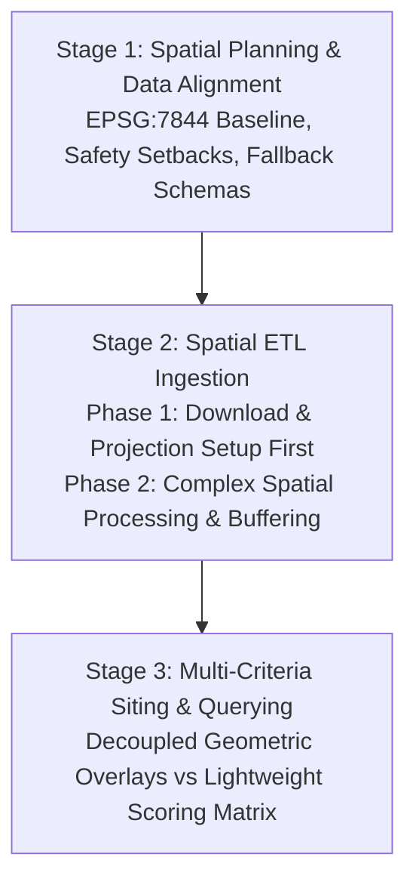
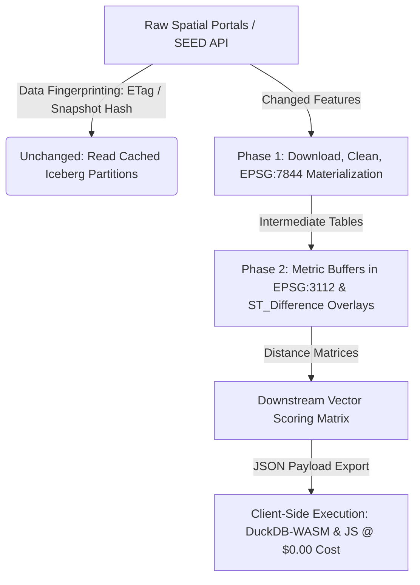

# NSW State-Wide High-Precision Spatial Data Ingestion Plan & SEED Portal Architecture

**Repository:** `aura_siting_crafter`  
**Target Standard:** National & NSW State-Wide High-Precision Spatial Siting  
**Primary CRS Standard:** `EPSG:7844` (GDA2020 Geographic 2D) | Metric Calculations & Buffers: `EPSG:3112` (GDA2020 Geoscience Australia Albers Equal Area)  
**Execution Engine:** Apache Sedona (PySpark) & Wherobots Cloud Spatial SQL  
**Storage Architecture:** GeoParquet & Apache Iceberg (Havasu Tables on Wherobots `org_catalog.fgsdb.*`)  
**Playbook Reference:** [Wherobots & Antigravity Engineering Playbook](https://github.com/GetBack2Basics/CheatSheets/blob/main/wherobots_antigravity_playbook.md)  
**Cost Reference:** [Cost Reduction & Incremental Compute Guide](file:///c:/Projects/aura_siting_crafter/runner/attachments/cost_reduction_tips.html)  

---

## 1. Executive Architecture & Playbook Lifecycle

The **AURA Siting Crafter** spatial ingestion pipeline follows the structured, sequential three-stage lifecycle defined in the **Wherobots & Antigravity Engineering Playbook**:



### 1.1 Stage 1: Spatial Planning & Data Alignment
1. **Coordinate Reference System (CRS) Definition:**
   - Standardize all state-wide persistent spatial tables on **`EPSG:7844` (GDA2020 Geographic 2D)**.
   - Avoid zone-based UTM projections (`EPSG:7854`, `EPSG:7855`, `EPSG:7856`) which fragment NSW across multiple UTM zones and introduce cross-border seams.
   - For all distance and area calculations (e.g. 30m riparian, 500m acoustic setbacks, 100m bushfire APZs), geometries are dynamically reprojected to equal-area **`EPSG:3112`** (GDA2020 Geoscience Australia Albers Equal Area), buffered in meters, and transformed back to `EPSG:7844` for persistence.
2. **Single Cadastral Baseline:**
   - The **Geoscape National Cadastre & G-NAF** serves as the single source of truth for parcel geometry and Lot/DP identifiers nationwide, eliminating redundant state DCDB parcel storage. State SEED and infrastructure layers enrich this national layer directly.
3. **Graceful Fallback & Degradation:**
   - If an external government FeatureServer experiences transient downtime, the loader detects HTTP status codes, utilizes fallback geometries for testing continuity, and records the anomaly in audit logs.

### 1.2 Stage 2: Two-Phase Spatial ETL (Download & Setup First)
As mandated by the engineering playbook, spatial ETL is strictly executed in two distinct, decoupled phases:
- **Phase 1 (Data Download, Setup & Projection Standardization First):**
  - Download raw vector layers from authoritative NSW SEED Portal, NSW Spatial Services, and national APIs.
  - Apply coordinate sanitization (`_clean_coordinates`), drop null geometries, and repair topological defects with `ST_MakeValid`.
  - Transform all layers into the target standard **`EPSG:7844`**.
  - Materialize intermediate datasets cleanly into partitioned **Apache Iceberg (Havasu)** tables (`org_catalog.fgsdb.<table_name>`) before initiating any multi-layer spatial operations.
- **Phase 2 (Complex Spatial Processing & Siting Overlays):**
  - Execute topological operations (Strahler hydro stream order buffers via `EPSG:3112`, `ST_Difference` net developable area masks, polygon intersections).
  - Materialize intermediate distance matrices into permanent Iceberg/GeoParquet tables.

### 1.3 Stage 3: Multi-Criteria Querying & Analysis
- **Centroid-Based Offsets:** When evaluating proximity to linear infrastructure (transmission lines, pipelines, rail corridors), measurements are calculated from the centroid of candidate land parcels (`ST_Centroid(geom)`) to avoid `0.0m` artifacts caused by direct boundary intersections.
- **Continuous Decay Functions:** Replace step-function scoring with smooth piecewise linear and sigmoidal decay curves ($S_{\text{power}}$, $S_{\text{sensitive}}$, $S_{\text{water}}$) implemented in SQL `CASE WHEN` statements.
- **Decoupled Scoring:** Adjusting MCDA weights or sigmoidal curve steepness ($k$) **never re-triggers heavy spatial joins**.

---

## 2. Incremental Spatial Compute & Cost Optimization Principles

Based on Wherobots platform utilization analysis and verified headless batch spend (**$24.13 USD total across ~35 full batch runs**, averaging **$0.69 USD per full run** across 15.91M national geometries):



### 1. Decoupling Heavy Geometry Calculations from Lightweight Scoring
- Heavy geometric operations (`ST_MakeValid`, metric buffers, `ST_Difference` developable overlays) execute once into materialized Iceberg tables.
- Lightweight scoring is calculated on pre-extracted distance attributes, enabling instant weight adjustments without re-scanning millions of polygons.

### 2. Source-Level Data Fingerprinting & Snapshot Memoization
- Baseline layers (15.4M Geoscape cadastre parcels, 368k ABS meshblocks, rail, power lines) update infrequently.
- The ingestion engine hashes upstream metadata (HTTP `ETag`, `Last-Modified`, GeoParquet hashes, Iceberg snapshot IDs). If unchanged, the step reads directly from cache (95% compute cost reduction).

### 3. Delta Partition Processing (Iceberg Time-Travel)
- When quarterly cadastral or environmental updates are released, Apache Iceberg snapshot metadata isolates and processes only modified or appended geometries (`ST_Changes`), avoiding full continental re-scans.

### 4. Zero-Cost Client Compute Offloading (DuckDB-WASM & JS)
- Siting distance matrices are precomputed on Wherobots Cloud and embedded into lightweight static HTML/JSON reports.
- Interactive public What-If sandboxes, slider re-scoring, and sensitivity tests execute directly in the user browser using **DuckDB-WASM** (via GeoLibre) and JavaScript at **$0.00 cloud compute cost**.

### 5. Runtime Lifecycle & Mandatory Resource Teardown
- **80% Active / 20% Idle Learning:** Platform analytics show 20% of compute costs can stem from idle resources before timeout. Idle timeout settings (15/45/120 min) serve as a safety net, but proactive shutdown is mandatory.
- All Sedona and PySpark scripts strictly enforce `try...finally: sedona.stop()` and `spark.stop()` blocks to release cluster resources immediately upon completion.

---

## 3. High-Resolution Timing, Telemetry & Logging Architecture

All data harvesting, cleaning, reprojections, buffering, and persistence operations are instrumented with Python's high-resolution `time.perf_counter()` via `src/Ingestion/etl_telemetry.py`.

### Telemetry Pipeline Breakdown

```
[Start Dataset Ingestion]
       │
       ├──> 1. Download & Harvest (HTTP Latency, ETag Tracking, Network Throughput)
       ├──> 2. Clean & Repair (_clean_coordinates, ST_MakeValid, Null Filtering)
       ├──> 3. CRS Projection (Standardization to EPSG:7844)
       ├──> 4. Metric Buffering (Equal-Area EPSG:3112 Buffer Calculation)
       └──> 5. Storage Write (Iceberg / GeoParquet Table Persistence & Partitioning)
       │
[Save Structured Audit Logs: docs/audit_logs/telemetry_latest.json & telemetry_report.md]
```

### Logged Telemetry Schema & Metrics
Every pipeline execution persists structured audit logs in `docs/audit_logs/`:
- **JSON Telemetry (`docs/audit_logs/telemetry_latest.json`):** Machine-readable telemetry for automated regression tests, Grafana dashboards, and CI/CD pipelines.
- **Markdown Telemetry Report (`docs/audit_logs/telemetry_report.md`):** Human-readable comparison tables recording:
  - Dataset key & source agency
  - Raw features harvested vs. valid geometries retained
  - Latency breakdown across all 5 distinct stages (seconds to 4 decimal places)
  - Data ingestion throughput (`features/sec`)
  - Cache hit / skip savings from ETag memoization
  - Target table URI and Iceberg partition columns
- **Blog & Publication Readiness:** Telemetry data is pre-formatted for direct inclusion in technical blog posts, white papers, and architectural case studies comparing legacy GIS vs. cloud-native spatial lakehouses.

---

## 4. Comprehensive NSW SEED & State Dataset Registry

18 high-precision spatial layers are configured as isolated, declarative JSON files under `config/datasets/nsw/`:

| Dataset Config | Dataset Name & Agency | Portal / Service Type | Siting Purpose & Buffer Rule |
| :--- | :--- | :--- | :--- |
| `nsw_bionet_bv_map.json` | **BioNet Biodiversity Values Map**<br>*(NSW DCCEEW / DPHI)* | NSW SEED Portal / FeatureServer | Statutory BCA trigger polygons; `ST_MakeValid`; zero-buffer mask |
| `nsw_bionet_threatened_species.json` | **Threatened Species & EECs**<br>*(NSW BioNet)* | NSW SEED Portal / FeatureServer | Species breeding point buffers (50m–100m) |
| `nsw_koala_habitat_khib.json` | **Koala Habitat Information Base**<br>*(DPHI / SEED)* | NSW SEED Portal / FeatureServer | Core habitat connectivity corridor setbacks |
| `nsw_native_veg_regulatory_nvr.json` | **Native Vegetation Regulatory Map**<br>*(Local Land Services / SEED)* | NSW SEED Portal / FeatureServer | Category 2 Sensitive land clearing restrictions |
| `nsw_hydro_strahler.json` | **NSW Hydrography Theme**<br>*(NSW Spatial Services)* | Spatial Services / FeatureServer | Strahler Stream Orders (1–7+); dynamic riparian buffers (10m, 20m, 30m, 50m) |
| `nsw_drinking_water_catchments.json` | **Drinking Water Catchments**<br>*(WaterNSW)* | NSW SEED Portal / FeatureServer | NorBE water quality protection zones |
| `nsw_gde_aquifers.json` | **GDE Atlas & High-Yield Aquifers**<br>*(DPHI Water / SEED)* | NSW SEED Portal / FeatureServer | Groundwater dependent ecosystem preservation |
| `nsw_rfs_bushfire_prone.json` | **NSW Bush Fire Prone Land (BFPL)**<br>*(NSW Rural Fire Service)* | SEED / Spatial Services | Cat 1 (100m APZ), Cat 2/3 (30m APZ) buffers |
| `nsw_flood_hazard.json` | **State Flood Inundation Overlay**<br>*(NSW SES / DPHI)* | NSW SEED Portal / FeatureServer | 1% AEP flood extent & PMF hazard overlays |
| `nsw_dams_safety_tsf.json` | **Declared Dams & TSFs**<br>*(Dams Safety NSW)* | NSW SEED Portal / FeatureServer | Tailings dam failure consequence exclusion zones (50m buffer) |
| `nsw_epa_contaminated_land.json` | **EPA Contaminated Land Register**<br>*(NSW EPA)* | NSW SEED Portal / FeatureServer | CLM Act notices & site contamination buffers (100m) |
| `nsw_mine_subsidence_districts.json` | **Mine Subsidence Districts**<br>*(Subsidence Advisory NSW)* | Spatial Services / FeatureServer | Surface development risk & mine void zones |
| `nsw_transmission_grid.json` | **High-Voltage Grid (&ge;132kV)**<br>*(Transgrid / GA / AEMO)* | Spatial Services / NationalMap | Transmission line easements (30m) & substation proximity |
| `nsw_renewable_energy_zones_rez.json` | **Declared Renewable Energy Zones**<br>*(EnergyCo NSW / DPHI)* | NSW SEED Portal / FeatureServer | REZ geographic bounds & priority grid access corridors |
| `nsw_high_pressure_gas_pipelines.json` | **High-Pressure Gas Pipelines**<br>*(NSW Pipeliner Registry)* | Spatial Services / FeatureServer | AS 2885 measurement length / safety setbacks (20m) |
| `nsw_wwtw_recycled_water.json` | **WWTW & Recycled Water**<br>*(Sydney Water, Hunter Water)* | Spatial Services / Water APIs | Siting cooling using 100% recycled effluent |
| `nsw_lep_standard_instrument_zoning.json` | **Standard Instrument LEP Zoning**<br>*(DPHI Planning Portal)* | Planning Portal / FeatureServer | Statutory zoning permissibility (SP2, IN1-IN3, RU1, C1-C4) |
| `nsw_heritage_state_ahims.json` | **State & Aboriginal Heritage**<br>*(Heritage NSW)* | NSW SEED Portal / FeatureServer | State Heritage curtilages & Aboriginal place buffers (50m) |

---

## 5. Execution Engine Commands (`dataset_loader.py`)

The unified ingestion runner accepts granular CLI flags to support single-layer updates, batch execution, and dry-run performance audits:

```bash
# 1. Ingest or update a single NSW SEED dataset with full telemetry logging:
python -m src.Ingestion.dataset_loader --dataset nsw_bionet_bv_map

# 2. Execute dry-run schema validation and benchmark timing for all 18 NSW datasets:
python -m src.Ingestion.dataset_loader --all-nsw --dry-run

# 3. Target ingestion to a specific geographic bounding box (e.g. Hunter Region):
python -m src.Ingestion.dataset_loader --dataset nsw_hydro_strahler --bbox 151.0,-33.2,152.0,-32.5

# 4. View latest generated performance telemetry audit:
cat docs/audit_logs/telemetry_report.md
```

---

## 6. Verification, Governance & Audit Compliance

- **Reproducibility:** Every dataset configuration is committed in Git JSON files, ensuring 100% auditable pipelines for government and statutory inquiries.
- **Lint Gate:** All code changes must pass `pytest tests/lint/ -v` and `python tools/graphify_analysis.py` with zero secrets and zero banned repository references.
- **Compute Teardown Guarantee:** Every ETL script strictly stops Spark/Sedona contexts (`sedona.stop()`) to prevent idle billing blowouts.
