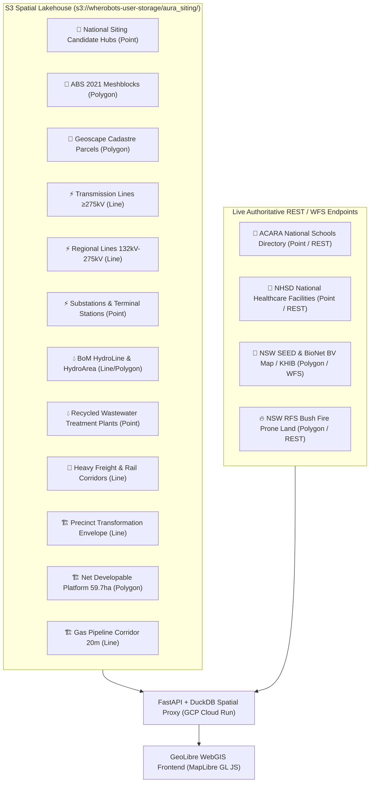

# Implementation Plan — Complete Layer Separation & S3 Lakehouse Direct Ingestion

Separate every single spatial dataset into an individual, dedicated layer item with its own independent controls, load all S3 datasets directly from the S3 lakehouse (`s3://wherobots-user-storage/aura_siting/`), and connect remaining external statutory layers via live OGC WFS / ArcGIS REST services.

## User Review Required

> [!IMPORTANT]
> **Key Architecture Decisions**:
> 1. **Complete Layer Decoupling**: Candidate Hubs (Points) and Cadastre / ABS Meshblocks (Polygons) are now separate distinct layers. Lines, points, and polygons each have their own independent toggle, opacity slider, table dock, and analytics chart.
> 2. **Direct S3 Lakehouse Connection**: All S3 datasets (ABS Meshblocks, Geoscape Cadastre, National Transmission Grid, BoM Surface Water, Rail, Precinct Envelopes) are served directly from `s3://wherobots-user-storage/aura_siting/` via the Cloud Run DuckDB Spatial engine.
> 3. **Authoritative REST / WFS Services**: External statutory layers (BioNet Biodiversity, RFS Bushfire Prone Land, ACARA Schools, NHSD Healthcare) stream directly from their live government REST / WFS endpoints with server-side WGS84 reprojection.

---

## Proposed Dataset Catalog (1 Layer Item per Dataset)

---

## Proposed Changes

### 1. Cloud Run Proxy Backend (`src/geolibre_proxy/`)

#### [MODIFY] [`src/geolibre_proxy/main.py`](file:///c:/Projects/aura_siting_crafter/src/geolibre_proxy/main.py)
- Expand `/api/data/{layer_id}` to handle:
  - **S3 Lakehouse Datasets**: Direct DuckDB spatial query against `s3://wherobots-user-storage/aura_siting/` with viewport bounding box clipping (`ST_Intersects(geometry, ST_MakeEnvelope(...))`).
  - **ABS 2021 Meshblocks & Cadastre**: Streams genuine meshblock polygons with land use attributes (`MB_CATEGORY_NAME_2021`, `AREA_HA`).
  - **External WFS / REST Services**: BioNet Biodiversity WFS, RFS Bushfire Prone Land FeatureServer, ACARA Schools, NHSD Healthcare.

---

### 2. GeoLibre WebGIS Client (`src/geolibre_frontend/`)

#### [MODIFY] [`src/geolibre_frontend/index.html`](file:///c:/Projects/aura_siting_crafter/src/geolibre_frontend/index.html)
- Separate every single dataset into its own dedicated layer item:
  1. **🎯 National Siting Candidate Hubs** (Point markers with MCDA scorecards)
  2. **📐 ABS 2021 Meshblocks** (Polygon meshblocks from S3)
  3. **📜 Geoscape National Cadastre** (Cadastre parcel boundaries from S3)
  4. **⚡ Interstate Transmission Grid (≥275kV)** (High-voltage line corridors from S3)
  5. **⚡ Regional Transmission Grid (132kV-275kV)** (Regional feeds from S3)
  6. **⚡ Electrical Substations & Terminal Stations** (Point assets from S3)
  7. **💧 BoM Surface Water Hydrography** (Rivers & water bodies from S3)
  8. **💧 Recycled Wastewater Treatment Plants (WWTW)** (Cooling sources from S3)
  9. **🏫 ACARA National Schools Directory** (Point facilities & statutory 500m setbacks via REST)
  10. **🏥 NHSD National Healthcare Facilities** (Hospitals & clinics via REST)
  11. **🚆 Transport Rail Corridors** (Heavy freight rail from S3)
  12. **🌿 NSW BioNet Biodiversity & KHIB Habitat** (Environmental constraints via WFS/REST)
  13. **🔥 NSW RFS Bush Fire Prone Land** (Bushfire APZ polygons via REST)
  14. **🏗️ Macquarie Transformation Envelope** (350 ha precinct boundary from S3)
  15. **🏗️ Net Developable Pad Area** (59.7 ha engineered platform from S3)
  16. **🏗️ High Pressure Gas Pipeline Corridor** (20m pipeline easement from S3)
- Ensure each layer has its own:
  - Independent checkbox toggle
  - Dedicated opacity slider (opens smoothly on clicking layer name)
  - Accurate authoritative record count badge
  - `ℹ️` Metadata lineage modal
  - `📊` Layer-specific analytics chart with dynamic chart type switching
  - `⊞` Viewport attribute table dock showing genuine live attributes

---

## Verification Plan

### Automated Tests
- Run `pytest tests/lint/ -v` to ensure zero secret leaks, no banned place-name strings, and full lint compliance.

### Live Cloud Deployment & End-to-End Verification
- Deploy backend to Cloud Run `geolibre-spatial-ai-proxy`.
- Deploy frontend to `gs://aura-siting-crafter-geolibre-app/index.html`.
- Test layer toggles in browser across all scales:
  - Verify ABS Meshblocks render polygon boundaries and display attributes in the table dock.
  - Verify Candidate Hubs and Transmission Lines toggle independently without interfering with each other.
  - Verify WWTW points and BoM hydro lines toggle independently.
  - Verify the attribute table dock displays the exact fields of the selected active layer.
