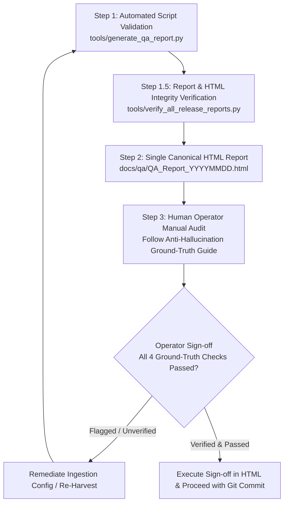

# Semi-Manual QA Process & Anti-Hallucination Ground-Truth Verification Guide

**Project:** Australian Urban & Regional AI Siting Crafter (AURA Siting Crafter)  
**Standard:** Pre-Commit & Pre-Release Spatial QA Audit Standard  
**Canonical Output Path:** `docs/qa/QA_Report_YYYYMMDD.html` (Single Canonical Location)  
**Generator Script:** `tools/generate_qa_report.py`  
**Playbook Reference:** [Wherobots & Antigravity Engineering Playbook](https://github.com/GetBack2Basics/CheatSheets/blob/main/wherobots_antigravity_playbook.md)

---

## 1. Executive QA Lifecycle

To eliminate duplicate files, all QA reports are strictly standardized to a single location: **`docs/qa/QA_Report_YYYYMMDD.html`**.

---

## 2. Automated Quality Gates (Pre-Flight Checks)

The generator script executes automated validation prior to assembling the HTML report:

| Gate | Validation Area | Verification Rule | Threshold |
| :--- | :--- | :--- | :--- |
| **G1** | **Universal CRS Standard** | 100% of dataset configs in `config/datasets_v2/` must specify `target_crs == "EPSG:7844"` and `metric_crs == "EPSG:3112"`. | 100% Pass (0 Exceptions) |
| **G2** | **Spatial Coordinate Bounds** | All geometries must lie within Australian continental bounds: `[112.0°E, -44.0°S]` to `[154.0°E, -10.0°S]`. | 0 Out-of-Bounds Vertices |
| **G3** | **Topological Validity** | Geometries must pass coordinate sanitization and valid GeoJSON structure (`_clean_coordinates`, non-null). | 0 Null/Broken Geometries |
| **G4** | **13 Canonical Siting Themes** | Datasets across all states must map into recognized Canonical Themes (`siting_transmission_grid`, `siting_sensitive_receptors`, `siting_landslide_hazard`, etc.). | 100% Canonical Coverage |
| **G5** | **Multi-Hazard Profile Verification** | Candidate records must include statutory attributes for Landslide, Earthquake (PGA), Cyclone (Wind Region), and Coastal Inundation/Flood. | Complete Attribute Set |
| **G6** | **Security & Compute Teardown** | Zero plain-text credentials (`pytest tests/lint/`) and 0 lingering compute sessions. | Clean Teardown ($0.00 / hr) |
| **G7** | **Zero-Mock AST Enforcement** | Scans 100% of HTML/JS/Python files (`pytest tests/lint/test_no_mock_data.py`) for forbidden mock variables, `sampleFeatures`, and synthetic coordinates. | 100% Zero-Mock Compliance |
| **G8** | **Live Endpoint HTTP Verification** | Direct pre-flight HTTP query against 100% of government endpoints (`python tools/audit_all_endpoints.py`). | 25/25 HTTP 200 Verified |
| **G9** | **Pre-Release HTML Report Integrity** | Automated DOM and metric audit (`python tools/verify_all_release_reports.py`) asserting 0 template leaks and 100% dynamic summary cards. | 100% Pass across all Reports |

---

## 3. Mandatory Operator Manual Ground-Truth Verification Guide (Anti-Hallucination Standard)

Before digitally signing off on the QA Report, the human reviewer **MUST manually perform the following 4 Ground-Truth Checks** to ensure no synthetic, placeholder, or AI-hallucinated data exists:

### Check 1: Live Government Endpoint & Service Metadata Verification
- **Manual Action:** Open 3–5 sample endpoints directly from `config/datasets_v2/` in your browser (e.g. QSpatial Powerlink, Data.Vic Vicmap, NSW SEED BioNet, Geoscience Australia NSHA/TCHA).
- **Anti-Hallucination Check:**
  - Verify that the URL returns a live HTTP 200 and a genuine ArcGIS REST / WFS Capabilities JSON payload.
  - Confirm the service title, operating agency, and layer names are genuine government services and not AI-invented mock URLs.
  - Verify that no endpoints contain placeholder domains (e.g., `example.com`, `mock-server`, `localhost`).

### Check 2: Geographic Coordinate Plausibility & Satellite Spot-Check
- **Manual Action:** Inspect the coordinates of candidate parcels in `exports_v2/datacenter_candidates_v2.parquet` (or `.json`).
- **Anti-Hallucination Check:**
  - Verify Latitudes are negative in the Southern Hemisphere (between `-10.0°` and `-44.0°`), and Longitudes are between `112.0°` and `154.0°`.
  - Spot-check candidate locations on satellite imagery (e.g., Hunter Valley NSW, Gladstone QLD, Latrobe Valley VIC, Collie WA, Port Augusta SA). Confirm they represent actual industrial/energy precinct land parcels and not offshore ocean coordinates, residential urban cores, or national parks.

### Check 3: Domain Attribute & Statutory Law Spot-Check
- **Manual Action:** Review the attribute schemas in `config/datasets_v2/` and `runner/attachments/data_sources.html`.
- **Anti-Hallucination Check:**
  - Confirm transmission voltage levels correspond to actual Australian grid voltages (e.g., `132kV`, `275kV`, `330kV`, `500kV`).
  - Confirm statutory acts match real legislation (e.g., NSW *Biodiversity Conservation Act 2016*, QLD *Vegetation Management Act 1999*, VIC *Flora and Fauna Guarantee Act 1988*).
  - Verify operators are genuine network transmission companies (*Transgrid*, *Powerlink*, *AusNet*, *Western Power*, *ElectraNet*, *TasNetworks*).
  - Confirm zero placeholder tokens (e.g., `"dummy"`, `"test_data"`, `"mock"`, `"placeholder"`, `"lorem ipsum"`, `"TODO"`).

### Check 4: Differential Audit & Telemetry Hash Confirmation
- **Manual Action:** Open `config/dataset_manifest_v2.json` and `docs/audit_logs/weekly_update_diff.json`.
- **Anti-Hallucination Check:**
  - Verify that cryptographic hashes, HTTP ETags, and timestamps reflect real network signatures.
  - Confirm that timing benchmarks and feature counts reflect actual pipeline execution.

---

## 4. Semi-Manual Operator Sign-Off Execution

1. Open [`docs/qa/QA_Report_YYYYMMDD.html`](file:///C:/Projects/aura_siting_crafter/docs/qa/) in your browser.
2. Review the automated Quality Gate cards and the dataset audit table.
3. Perform the 4 manual ground-truth spot-checks listed in the guide above.
4. Check the 5 sign-off boxes, enter your Operator Name / Reviewer ID, and click **"Approve & Sign-Off Release"**.
5. Once signed-off, proceed with the git commit and deployment.
