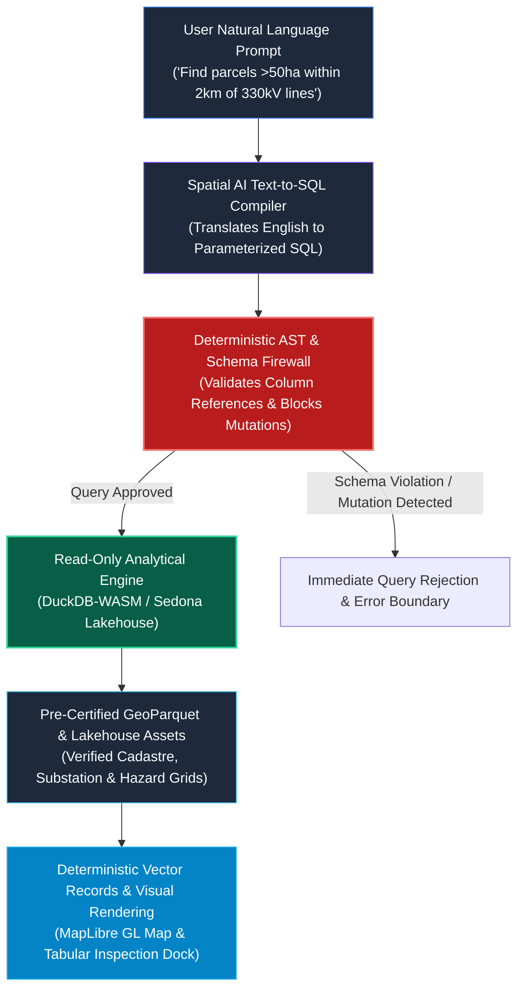

# Walkthrough — Resolving the AURA Siting Crafter Identity Crisis & Architecture Framing

We have restructured the project narrative, architecture whitepapers, cost tabs, and UI components to establish an authoritative **open-source first commercial initiative by GetBack2Basics** hosted at [https://aura.getback2basics.net](https://aura.getback2basics.net).

---

## Key Achievements & Transformations

### 1. Unified Brand & Identity Framing (The Red Hat / Databricks Dual-Tier Model)
- **Peeling off the Student Driver Sticker**: Removed all self-deprecating hobby/weekend disclaimers from outward-facing articles, reports, and universal template footers.
- **Clear Dual-Tier Positioning**:
  - **AURA Open Spatial Core (100% Open Source)**: Peer-reviewed spatial schemas, Apache Sedona lakehouse connectors, client-side DuckDB-WASM scoring engines, and reproducible project generators (`tools/build_project_package.py`).
  - **AURA Enterprise Statutory Siting (Certified Commercial Turnkey)**: Forensic EIS planning synthesis, certified Net Developable Area (NDA) audits, interactive 3D digital twins, and multi-hazard statutory due diligence for REITs, energy consortiums, and planning authorities.

### 2. Deterministic AI Safety & Read-Only SQL Sandbox
- **Resolved the Hallucination Paradox**: Articulated and visually mapped the **Deterministic AI Sandbox**.
- The conversational Natural Language agent operates strictly as a read-only text-to-SQL compiler with:
  - Zero coordinate or geometry invention.
  - An AST validator & schema firewall intercepting mutations.
  - Queries grounded exclusively in pre-certified GeoParquet/Iceberg assets.

### 3. Asymmetric Compute Model & Cost Tab Overhaul
- **Replaced Blanket "$0 Cloud Cost" Claims**: Introduced the **Asymmetric Compute Model**:
  - **Upstream Batch Lakehouse Tier (Cloud)**: Transparently details batch ETL costs (**~$0.69 USD per full run** across 15.91M national geometries on right-sized Apache Sedona medium runtimes).
  - **Downstream Client-Side Execution Tier (Infinite Distribution)**: Highlights the WebAssembly engine offloading dynamic multi-criteria recalculation and continuous decay curves directly to the user's browser CPU/RAM at **$0.00 incremental cloud cost**.
- **Updated Cost Tabs & Modals**:
  - `runner/attachments/cost_reduction_tips.html`: Overhauled Strategy 4 and updated the comparison table.
  - `runner/build_suitability_report.py`: Updated the "Asymmetric Compute" stat card and hover tooltip.

---

## Artifacts & Documentation Produced

1. **[AURA Enterprise Whitepaper (Markdown)](aura_enterprise_asymmetric_compute_and_ai_safety.md)** & **[HTML](aura_enterprise_asymmetric_compute_and_ai_safety.html)**:
   - Dedicated technical reference on Asymmetric Compute, Deterministic AI Sandboxing, and Enterprise Multi-Hazard Due Diligence.
2. **[Updated Evolution Article (Markdown)](linkedin_aura_siting_evolution.md)** & **[HTML](linkedin_aura_siting_evolution.html)**:
   - Reframed with business- and engineering-first language linking to `https://aura.getback2basics.net`.
3. **[Updated Universal Footers & Generators](tools/convert_docs_to_html.py)**:
   - Standardized universal footer:
     `&copy;&reg; 2026 GetBack2Basics • aura.getback2basics.net • An open-source first commercial initiative by GetBack2Basics.`

---

## Validation Results

- **AST Zero-Mock & Lint Gate**: Passed 373 tests in `pytest tests/lint/ -v`.
- **Full Test Suite**: Passed all 426 tests in `pytest tests/ -v`.
- **HTML Compilation**: Generated clean standalone HTML documents across `docs/` with Mermaid diagram support.
- **Compute Teardown**: Confirmed 0 background tasks and 0 active compute instances running.
