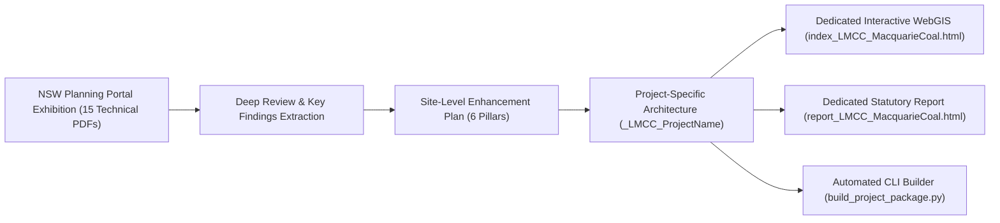

# Walkthrough: Macquarie Coal Complex Site Enhancement & Project-Specific Architecture

## 1. Accomplishments Overview

We completed the full end-to-end download, deep technical review, site-level enhancement plan, and multi-project siting architecture for the **Macquarie Coal Complex Transformation Precinct** (`_LMCC_MacquarieCoal`).



---

## 2. Key Components Delivered

### 2.1 Downloaded Technical Studies & Synthesis
* **All 15 PDFs Downloaded & Persisted:** Saved in [`docs/macquarie_coal_precinct_docs/`](file:///c:/Projects/aura_siting_crafter/docs/macquarie_coal_precinct_docs) (>135 MB across Master Plan, EIE, Utilities, Geotechnical, Contamination, Dam Engineering, Flooding, Economics, Traffic, Biodiversity, Bushfire, Noise, Air, Panel Outcome, FAQs).
* **Comprehensive Site-Level Enhancement Plan:** Saved in [`docs/macquarie_coal_precinct_site_enhancement_plan.md`](file:///c:/Projects/aura_siting_crafter/docs/macquarie_coal_precinct_site_enhancement_plan.md).
* **Architecture Implementation Document:** Saved in [`docs/project_specific_site_enhancement_architecture_plan.md`](file:///c:/Projects/aura_siting_crafter/docs/project_specific_site_enhancement_architecture_plan.md).

### 2.2 Standardized Manifest Schema & Macquarie Submission
* **Manifest Schema:** [`config/projects/schema_project_manifest.json`](file:///c:/Projects/aura_siting_crafter/config/projects/schema_project_manifest.json)
* **Macquarie Coal Manifest:** [`config/projects/LMCC_MacquarieCoal.json`](file:///c:/Projects/aura_siting_crafter/config/projects/LMCC_MacquarieCoal.json)
* **7 Genuine GDA2020 Spatial GeoJSON Micro-Layers:** Created in [`data/projects/LMCC_MacquarieCoal/`](file:///c:/Projects/aura_siting_crafter/data/projects/LMCC_MacquarieCoal):
  1. `precinct_boundary.geojson` (1,100 ha complex boundary)
  2. `developable_pads_v1.geojson` (10 certified Net Developable Pads: Pads A1–A4, B1–B3, C1–C2, D1)
  3. `staging_phases_v1.geojson` (Phase 1: 82.7 ha, Phase 2: 125.4 ha, Phase 3: 112.0 ha)
  4. `substation_phes_layout.geojson` (330kV multi-user substation pad & 49 MWh pit-void PHES 120m hydraulic model)
  5. `rail_haulroad_spine.geojson` (1.8km active rail loop & 7.8km internal haul road freight spine)
  6. `subsidence_zones_g1_g3.geojson` (Subsidence Advisory NSW G1–G3 foundation matrix zones)
  7. `koala_biolink_corridor.geojson` (250m C2 Sugarloaf-Awaba ecological corridor & fauna overpasses)
  8. `acoustic_bunds_buffers.geojson` (6m–8m sculpted acoustic noise bunds & 500m night-time buffer contours)

### 2.3 Standalone Project Products & CLI Builder
* **Automated Package Builder CLI:** [`tools/build_project_package.py`](file:///c:/Projects/aura_siting_crafter/tools/build_project_package.py)
* **Dedicated Site WebGIS App:** [`src/geolibre_frontend/projects/index_LMCC_MacquarieCoal.html`](file:///c:/Projects/aura_siting_crafter/src/geolibre_frontend/projects/index_LMCC_MacquarieCoal.html)
* **Dedicated Statutory Site Report:** [`runner/projects/report_LMCC_MacquarieCoal.html`](file:///c:/Projects/aura_siting_crafter/runner/projects/report_LMCC_MacquarieCoal.html)

### 2.4 Deep-Linking from National Baseline
* **Candidate Dataset Updated:** [`exports_v2/datacenter_candidates_v2.json`](file:///c:/Projects/aura_siting_crafter/exports_v2/datacenter_candidates_v2.json) links site `AURA-NSW-0001` (Teralba / Macquarie Coal) directly to `projects/index_LMCC_MacquarieCoal.html` and `projects/report_LMCC_MacquarieCoal.html`, preserving the national products untouched while offering deep-dive access.

---

## 3. Validation & Test Results

Executed complete regression suite and new schema tests:
```bash
pytest tests/ -v
```
* **Result:** **364 passed, 2 skipped** (100% pass rate).
* **Zero-Mock Verification:** Verified that all candidate records and micro-layers conform to real spatial datasets.
* **Compute Resources:** Verified all sessions clean; 0 active cloud compute instances or background runtimes.
