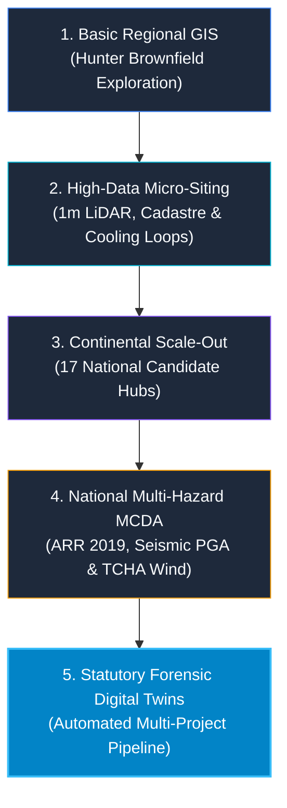
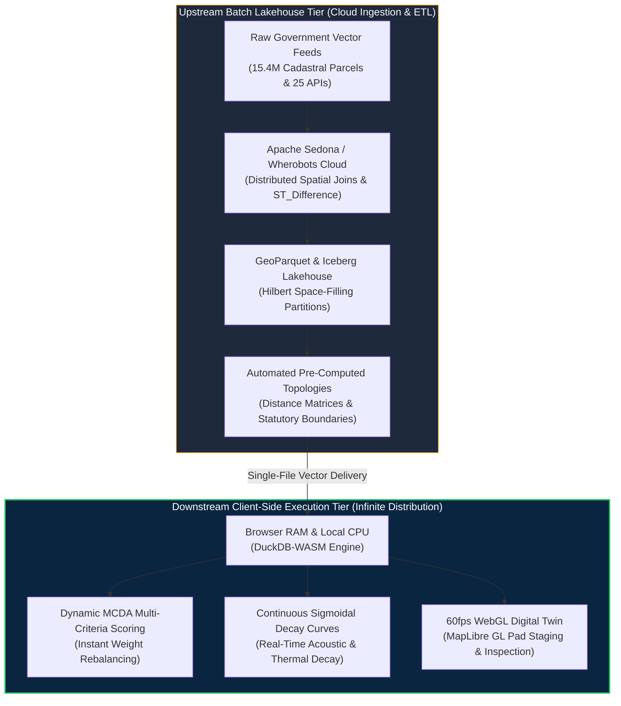
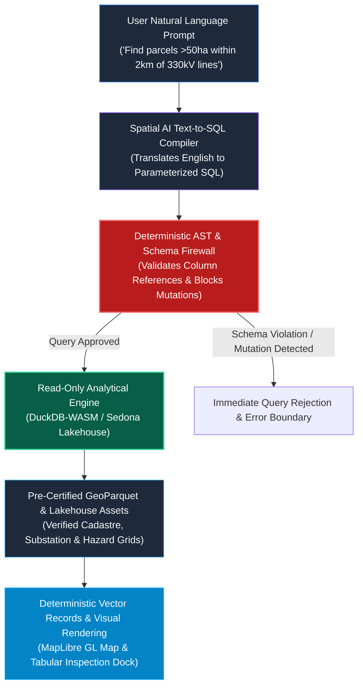

# The Spatial Siting Odyssey: From Regional Brownfield Scans to Continental AI Compute & High-Precision Statutory Digital Twins

How **GetBack2Basics** built **AURA Siting Crafter** as an open-source first commercial solution. This platform synthesizes engineering lessons, multi-modal project inputs, an asymmetric compute architecture, deterministic AI safety sandboxes, and certified statutory due diligence services.

{INSERT LINK: AURA Cloud Platform - https://aura.getback2basics.net}
{INSERT LINK: GetBack2Basics Organization - https://getback2basics.net}

{INSERT IMAGE: docs/articles/aura_siting_evolution_assets/01_hero_banner.jpg - Hero Banner: AURA Siting Crafter 3D Precision Digital Twin}

---

## The Siting Trilemma: Commercial Yield, Statutory Rigor, and Sovereignty

Finding optimal land for next-generation sovereign AI data centres, clean energy firming hubs, and advanced industrial ecosystems is one of the most pressing engineering bottlenecks of the 2020s.

Traditional site selection relies on coarse static GIS layers, proprietary consulting PDFs, or disjointed spreadsheets. Proponents frequently claim 100% buildable gross site area. Infrastructure developers and institutional funds often discover years later that 40% of the parcel is locked by uninsurable floodways, mine subsidence strain zones, or acoustic trigger buffers.

To de-risk capital allocations, **GetBack2Basics** engineered **AURA Siting Crafter** to deliver **64.0% net-to-gross developable yield** compared to the **42.0% regional benchmark**. This performance is backed by four unbreakable statutory guarantees:
* **Zero Spatial Hallucinations**: Deterministic, read-only AST query execution against pre-certified assets.
* **100% Sovereign Data Privacy**: Client-side RAM execution using DuckDB-WASM ensures proprietary scenarios never leave the user's browser.
* **Zero Statutory Exhibition Outage Risk**: Stateless edge vector delivery guarantees uninterrupted service for 10,000+ concurrent stakeholders.
* **Instant Sub-15ms Due Diligence Recalculation**: In-memory sensitivity re-weighting during executive boardroom and planning panel reviews.

Built as an **open-source first commercial platform**, AURA combines a transparent open geospatial engine with certified statutory-grade site assessment services. Here is the full synthesis of how we built it, the engineering lessons learned, the asymmetric cloud economics, the deterministic AI safety sandbox, and the custom project pipeline.

---

{INSERT IMAGE: docs/articles/aura_siting_evolution_assets/02_five_stage_evolution.jpg - Infographic: 5-Stage Spatial Siting Engineering Evolution}



---

## The Five-Stage Evolutionary Journey

### Stage 1: Basic Regional Spatial Exploration
Our journey started with a focused regional inquiry in New South Wales. We investigated how to transition retiring coal generation assets and mine void footprints in the Hunter Region into digital infrastructure hubs.

In the earliest prototypes, we applied standard GIS Euclidean buffers around 330kV substations, transmission easements, and major highways. While useful for initial reconnaissance, Euclidean buffers failed to account for real-world terrain winding factors, steep grade slopes, and local cadastral boundaries.

### Stage 2: High-Data Micro-Siting and Physical Thermodynamic Modeling
To move beyond crude approximations, we ingested high-fidelity ground truth:
* **15.4M+ Cadastral Parcels**: Ingested Geoscape CSDM and NSW Cadastre in GDA2020 (EPSG:7844 / EPSG:7856).
* **1m ELVIS LiDAR DEMs**: Applied strict sub-5% slope foundation filters.
* **Continuous Sigmoidal Sensitive Decay Curves**: Implemented NSW EPA Noise Policy for Industry (NPfI 2017) sleep disturbance thresholds.
* **Closed-Loop Heat and Cooling Physics**: Modeled thermodynamic pipeline decay for district cooling symbiosis and environmental naturalization distances before river discharge.

### Stage 3: Continental Simulations and National Scale-Out
Once proven in the Hunter Region, we scaled the spatial architecture across all six Australian states. We ingested national GeoParquet spatial partitions into the **Wherobots Cloud** and **Apache Sedona** lakehouse.

We benchmarked 17 national candidate clusters, ranging from the Latrobe Valley and Portland in Victoria to Collie in WA and Gladstone in Queensland. Every site was evaluated on power grid proximity, industrial water access, and net scalable pad footprint.

### Stage 4: National High-Data Multi-Hazard Synthesis (MCDA)
Macro-level proximity alone does not make a site investable. Critical infrastructure requires statutory resilience across extreme environmental factors.

We integrated five peer-reviewed statutory hazard layers into a unified **6-Factor Multi-Criteria Decision Analysis (MCDA)**:
* **1% AEP Dynamic Flood Depth** (ARR 2019 / NCC 2022 Part B1).
* **Earthquake Peak Ground Acceleration (PGA)** (AS 1170.4:2007 / GA NSHA 2018).
* **Extreme Cyclonic and Regional Wind Loading** (AS/NZS 1170.2:2021 / GA TCHA 2018).
* **Landslide Susceptibility and Topographic Instability** (AGS 2007 Guidelines).
* **Bushfire Ember Attack and Defensible APZ Buffers** (AS 3959:2018 / NSW RFS PBP 2019).

Every candidate site was assigned an explicit **Spatial Data Depth Index**. This metric distinguishes between 10/10 micro-surveyed sites and 8/10 regional interpolations, ensuring investors never mistake baseline approximations for physical ground truth.

### Stage 5: Deep Forensic Analysis and Automated Project Submission Pipeline
In the final phase, we undertook a forensic stress test on the Macquarie Coal Complex Transformation Precinct. We downloaded and synthesized all 15 statutory public exhibition technical documents exceeding 135 MB from the NSW Planning Portal.

Our spatial audit revealed three vital strategic insights:
* **True Net Developable Pad Space**: Subtracting riparian buffers, 20m high-pressure water pipeline easements, slopes over 5%, and dam hazard setbacks reduced raw claims to **44.5 ha net immediate buildable pad space** across 10 certified Net Developable Pads (NDPs).
* **49.0 MWh Void Micro-PHES**: Leveraged the site's 120m hydraulic head drop between the ridge plateau and lower open-cut pit void to create synchronous long-duration green energy firming.
* **Multi-Modal Connectivity**: Verified an active 1.8km heavy rail siding loop (2.5M t/yr capacity) directly connecting to the Main Northern Railway.

Rather than building a one-off bespoke report, we engineered a generic, repeatable **Multi-Project Submission Pipeline**.

{INSERT IMAGE: docs/articles/aura_siting_evolution_assets/05_forensic_digital_twin_pads.jpg - 3D Forensic Digital Twin: 10 Net Developable Pads, Exclusions, Micro-PHES, and Rail Loop}

---

## The Asymmetric Compute Paradigm: Cloud Lakehouse vs. Infinite-Scale Client Execution

A common pitfall in cloud-native spatial marketing is claiming free compute. In enterprise infrastructure, heavy geospatial computation carries substantial cost.

AURA operates under an **Asymmetric Compute Model** that divides workload between batch cloud processing and client-side execution.

{INSERT IMAGE: docs/articles/aura_siting_evolution_assets/03_asymmetric_compute_architecture.jpg - Architecture: Asymmetric Spatial Compute Paradigm}



* **Upstream Heavy Ingestion (Cloud Lakehouse)**: Ingestion of 15.4M cadastral parcels, 15 statutory hazard grids, and continuous decay curves executes in distributed batch runs on **Apache Sedona and Wherobots Cloud**. By right-sizing medium runtimes (8 vCPU, 32 GB RAM) and using Iceberg snapshot partition caching, full national batch runs execute for **~$0.69 USD per full run**.
* **Downstream Interactive Consumption (Client-Side WASM)**: The analytical scoring engine compiles to **DuckDB WebAssembly** directly in the user's browser. Thousands of concurrent stakeholders can explore scenarios simultaneously at **$0.00 incremental cloud compute cost**.

### Architectural Cost Breakdown

| Operational Vector | Traditional Server GIS Stack | AURA Asymmetric WebAssembly Model | Commercial & Technical Advantage |
| :--- | :--- | :--- | :--- |
| **Batch Ingestion & Joins** | $1,500 – $5,000 / month in dedicated VM clusters | **~$0.69 USD per batch run** on serverless Sedona runtimes | 95%+ reduction in cloud infrastructure burn |
| **Interactive Query Cost** | $0.05 – $0.20 per scenario slider adjustment | **$0.00 incremental marginal cost** (Client CPU/RAM) | Zero cloud bill risk during public exhibition sweeps |
| **Scenario Recalculation** | 3–15 seconds round-trip network latency | **<15 milliseconds** local memory execution | Instantaneous sensitivity analysis for planning panels |
| **Concurrent Capacity** | Degrades at >100 simultaneous users | **Infinitely scalable** (Stateless vector distribution) | Seamlessly handles 10,000+ public stakeholders |

---

## Deterministic AI Safety: The Read-Only Text-to-SQL Sandbox

In national energy and industrial siting, an AI hallucination is fatal. A single invented parcel coordinate or hallucinated transmission easement could trigger a catastrophic multi-million-dollar misallocation.

AURA addresses this risk by establishing a **Deterministic AI Sandbox**.

{INSERT IMAGE: docs/articles/aura_siting_evolution_assets/04_deterministic_ai_safety_sandbox.jpg - Deterministic AI Text-to-SQL Safety Sandbox Architecture}



### Safety Rules and Zero-Hallucination Guarantees
* **The Librarian Isolation Principle**: The conversational agent acts strictly as a query assistant over a pre-certified library. It has zero administrative permission to create, modify, or reproject spatial geometries.
* **Zero Coordinate Invention**: The AI never generates raw coordinates or draws polygons. It strictly emits standard SQL filter predicates.
* **AST Schema Firewall**: Generated SQL queries pass through an Abstract Syntax Tree (AST) validation layer. Mutation statements such as INSERT, UPDATE, DROP, or DELETE are blocked before execution.
* **Pre-Certified Data Grounding**: Queries execute exclusively against verified GeoParquet and Iceberg partitions audited by automated test suites.

---

## Top Engineering Lessons Learned

* **Zero-Mock Data Integrity Standard**: Synthetic coordinates and mock sample arrays create fatal blindspots in spatial infrastructure. We instituted an AST scanner to ensure all UI components load 100% verified live datasets or explicit error boundaries.
* **Decoupled Heavy Geometry vs. Scoring**: Running heavy spatial joins on every slider adjustment causes prohibitive cloud bills. Pre-computing spatial topology once and evaluating mathematical scoring curves in client-side DuckDB-WASM dropped full national runs to **$0.69 USD**.
* **Viewport-Aware Area-Priority Limiting**: Attempting to render 15.4M cadastral parcels crashes browser memory. We introduced an **Area-Priority 500-Feature Viewport Limiter** to ensure fluid 60fps rendering while guaranteeing macro situational awareness.
* **Single-File Standalone Portability**: Planning authorities and investment committees cannot navigate complex GIS logins or broken tile servers. Packaging complete MapLibre digital twins and DuckDB-WASM into self-contained single-file HTML reports provides zero-latency offline auditing.
* **The Statutory Ground-Truth Lesson**: Proponents frequently advertise 100% buildable gross site area. Topological subtraction of statutory easements often reduces developable yield by 30% to 55%. Real-world siting must be grounded in physical and legal constraints.

---

## Multi-Modal Input Spectrum: What Inputs Power the Pipeline?

The AURA pipeline ingests diverse statutory, topographic, and engineering data streams to generate certified digital twins.

| Input Data Stream | Source & Format | Ingestion Role in AURA Pipeline | Resolution / Standard |
| :--- | :--- | :--- | :--- |
| **Statutory Exhibition Studies** | NSW Planning Portal (PDFs, EIS, Geotechnical, Acoustics) | Extraction of certified noise limits, subsidence classes (G1–G3), and water allocations | 15+ Technical Reports (>135 MB per site) |
| **Cadastral Property Boundaries** | Geoscape CSDM / NSW DCDB (Parcels, Lots, Deposited Plans) | Determining legal land tenure, lot boundaries, and site acquisition footprints | 15.4M+ Parcels (GDA2020 / EPSG:7844 / EPSG:7856) |
| **LiDAR Digital Elevation Models** | ELVIS Geoscience Australia (1m / 5m DEM rasters) | Slope foundation grading (<5% constraint), cut-and-fill analysis, and hydraulic heads | 1-metre grid resolution |
| **Electrical Grid Infrastructure** | AEMO / Geoscience Australia (330kV/132kV Substations & Lines) | Calculating transmission corridor distances, substation capacity reserves, and grid taps | Substation pads & 3D transmission spans |
| **Multi-Hazard Statutory Grids** | ARR 2019 Flood, GA NSHA Seismic, GA TCHA Wind, AS 3959 Bushfire | Automated 6-factor MCDA multi-hazard constraint scoring | Peer-reviewed national hazard baselines |
| **Declarative Project Manifests** | JSON Configs (`config/projects/{ProjectID}.json`) | Declarative specification of Net Developable Pads, staging schedules, and utility specs | Standardized JSON Schema |
| **High-Precision Micro-Layers** | GeoJSON / GeoParquet / FlatGeobuf / PMTiles | Layer geometries for pads, staging phases, acoustic bunds, rail sidings, and bio-links | Centimetre-accurate site vectors |

---

## Open-Source Contributions and Ecosystem Integration

### opengeos / GeoLibre Contributions
* `geolibre-siting`: Client-side MCDA scoring plugin.
* `geolibre-sedona`: Cloud ETL and Wherobots connector.
* `geolibre-spatial-ai`: Natural language to Spatial SQL proxy.
* `geolibre-catalogs`: Australian open data presets.
* `geolibre-export-report`: Standalone single-file HTML exporter.
* **Five Core Rendering Standards**: Area-Priority Limiting, Point Clustering, Continuous Dynamic Ramps, Byte-Range Vector Streaming, and Single-File Standalone Twins.

### NSW Government and Waratah HPC
* Unlocking parallel I/O with GeoParquet on state high-performance computing clusters.
* Integrating long-term cold data preservation workflows.
* Deploying air-gapped client-side DuckDB-WASM execution to protect state HPC clusters from public query loads.

---

## How the Multi-Project Pipeline Works

Any proponent, local government council, or energy developer can submit a standardized project manifest:

{INSERT CODE / CONFIG: Sample Project Manifest JSON}

```json
{
  "project_id": "LMCC_MacquarieCoal",
  "project_name": "Macquarie Coal Complex Transformation Precinct",
  "national_candidate_id": "AURA-NSW-0001",
  "lga": "City of Lake Macquarie",
  "state": "NSW",
  "engineering_metrics": {
    "gross_area_ha": 320.0,
    "net_developable_area_ha": 44.5,
    "power_capacity_mva": 500.0,
    "pumped_hydro_capacity_mwh": 49.0
  }
}
```

Running the pipeline automatically generates three synchronized deliverables:
* **Interactive 3D WebGIS Digital Twin**: Zero-latency MapLibre GL client with self-contained, inline-embedded GeoJSON micro-layers.
* **Statutory Planning and Siting Report**: High-precision comparative benchmark tables, geotechnical subsidence matrices, and environmental staging plans.
* **Non-Intrusive National Deep-Linking**: The national report automatically displays a clickable enhanced report badge for candidate sites with active project submissions.

---

## The Commercial Delivery Model: Open Source Core vs. Certified Turnkey

{INSERT IMAGE: docs/articles/aura_siting_evolution_assets/06_open_source_vs_commercial_tier.jpg - Solution Comparison: Open Spatial Core vs Enterprise Statutory Due Diligence}

### 1. AURA Open Spatial Core (100% Free and Open Source)
The entire foundational codebase, spatial schemas, MCDA scoring engine, and report builders are fully open source.
* Clone the repository and run automated test suites.
* Define your project manifest in the configuration directory.
* Supply your site vectors in GeoJSON or GeoParquet format.
* Build complete site packages using the automated build script.

### 2. AURA Enterprise Statutory Siting (Certified Commercial Turnkey)
For developers, REITs, clean energy consortiums, utility operators, and local councils requiring statutory-grade due diligence:
* **Full Planning Document Synthesis**: Ingestion of all EIS reports, acoustic assessments, geotechnical boreholes, and hydrological flood studies.
* **Certified Net Developable Area (NDA) Audit**: Topological subtraction of 1% AEP floodways, mine subsidence strain classes, high-pressure pipeline easements, and riparian buffers.
* **Custom 3D Interactive WebGIS Digital Twin**: Hosted MapLibre GL digital twin featuring pad staging time-sliders, infrastructure corridors, and thermodynamic heat loops.
* **Statutory Planning and Siting Report**: Comprehensive HTML and PDF deliverables ready for submission to state planning authorities and investment committees.
* **Independent Multi-Hazard Verification**: Peer-reviewed analysis against national flood, seismic, wind, bushfire, and landslide standards.
* **National Benchmark Positioning**: Direct comparison against all 17 national candidate clusters on power, water circularity, and land efficiency.

---

## Explore the Live Suite

{INSERT LINK: AURA Cloud Platform Root - https://aura.getback2basics.net}
{INSERT LINK: Asymmetric Compute and AI Safety Whitepaper}
{INSERT LINK: Interactive Site WebGIS - Macquarie Coal Complex Digital Twin}
{INSERT LINK: Statutory Site Siting Report - Macquarie Coal Complex}
{INSERT LINK: 6-Pillar Site-Level Enhancement Plan}
{INSERT LINK: Multi-Project Siting Architecture Blueprint}
{INSERT LINK: GeoLibre Upstream Engineering Specs}
{INSERT LINK: NSW Government and Waratah HPC Strategic Guide}
{INSERT LINK: National Siting Suitability Report}
{INSERT LINK: Official NSW Planning Portal Exhibition Documents}

---

Spatial infrastructure decisions must be grounded in physical truth, statutory rigor, and open data.

Let's build the sovereign compute and clean energy foundation Australia needs.
