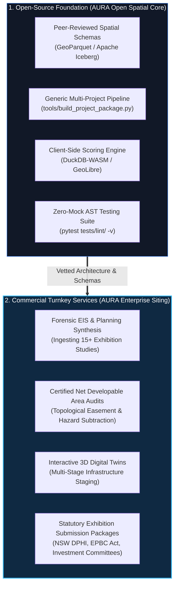
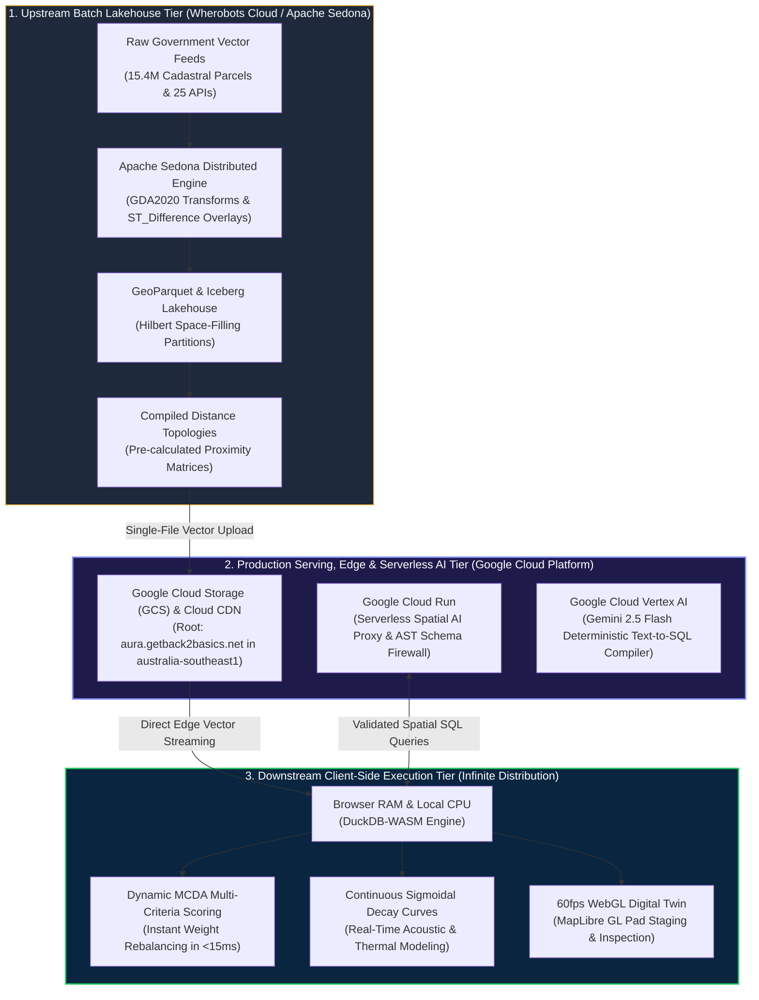
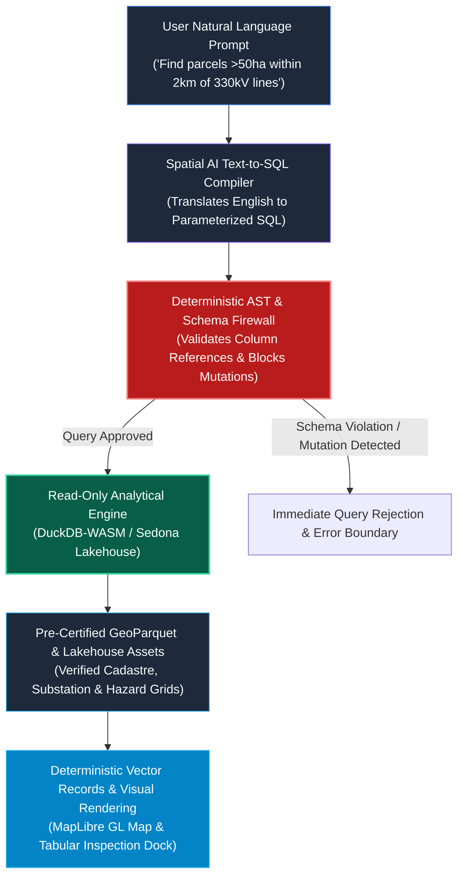
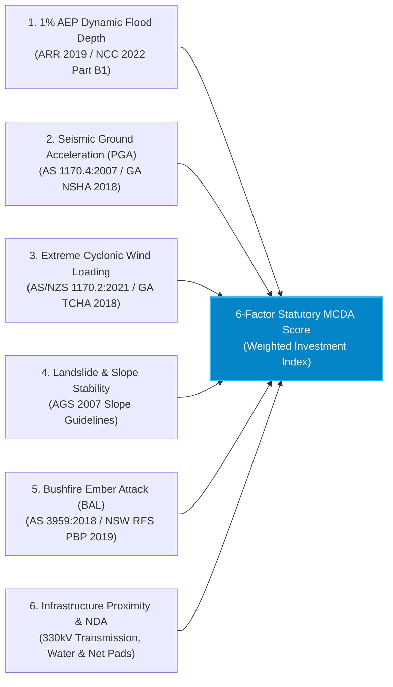

# AURA Enterprise: Asymmetric Compute Architecture & Deterministic AI Safety

**Executive Technical Whitepaper & Architectural Reference**  
*Published by [GetBack2Basics](https://getback2basics.net) • Cloud Root: [aura.getback2basics.net](https://aura.getback2basics.net)*  
*Author: George Chandeep Corea (Geospatial Data Lead, GetBack2Basics | Project Lead, AURA Siting Crafter)*

---

## Executive Summary

Selecting land for multi-hundred-million-dollar digital infrastructure, clean energy firming hubs, and advanced industrial assets is an exercise in capital risk mitigation. Traditional site due diligence relies on static PDFs, manual GIS consulting cycles that take months, or opaque proprietary models. 

**AURA Siting Crafter** delivers a deterministic, high-throughput spatial intelligence platform built on two core engineering paradigms:
1. **The Asymmetric Compute Architecture**: Transparently separating heavy cloud lakehouse extract, transform, and load (ETL) batch computation from infinite-scale, zero-marginal-cost client-side browser execution.
2. **The Deterministic AI Sandbox**: Enforcing strict, read-only Natural Language to Spatial SQL query compilation against certified spatial data assets—guaranteeing zero spatial hallucinations and absolute statutory data integrity.

AURA operates as an **open-source first commercial initiative by GetBack2Basics**—pairing transparent, peer-reviewed open geospatial foundations with enterprise-grade statutory certification services.

---

## 1. The Commercial & Open-Source Dual Identity

AURA follows the proven enterprise open-source model established by industry leaders like Red Hat and Databricks. Open-source transparency serves as the foundational guarantee of reliability and peer-reviewed rigor for our enterprise statutory services.

### Tier 1: AURA Open Spatial Core (100% Open Source)
- **Community-Vetted Codebase**: Available under the open-source license on [GitHub](https://github.com/GetBack2Basics/aura_siting_crafter).
- **Standardized Data Schemas**: Reusable JSON manifests (`config/projects/{ProjectID}.json`) and spatial specifications compatible with `opengeos/GeoLibre`, QGIS, and ArcGIS Pro.
- **Reproducible Pipeline Generators**: Open-source utilities (`tools/build_project_package.py`) enabling developers, councils, and researchers to process custom site vectors locally.

### Tier 2: AURA Enterprise Statutory Siting (Certified Commercial Turnkey)
- **Forensic Environmental Impact Statement (EIS) Synthesis**: Deep extraction and cross-reconciliation of geotechnical boreholes, acoustic baseline studies, and water allocation records.
- **Certified Net Developable Area (NDA) Audits**: Rigorous topological subtraction of 1% AEP floodways, mine subsidence strain zones (G1–G3), high-pressure pipeline corridors, and riparian setbacks to identify true developable yield.
- **High-Resolution 3D Digital Twins**: Zero-latency interactive portals with pad staging time-sliders, electrical single-line diagram overlays, and thermodynamic heat loops.
- **Statutory Decision Packages**: Audit-ready deliverables tailored for Institutional Investment Committees, Real Estate Investment Trusts (REITs), and State Planning Panels (e.g. NSW DPHI, IPC).

---

## 2. The Asymmetric Compute Architecture

A common failure mode in spatial analytics is presenting ambiguous "$0 cloud compute" claims. Real-world infrastructure projects require processing massive, high-dimensional datasets:
* **15.4 Million Cadastral Parcels** (Geoscape CSDM & NSW DCDB in GDA2020).
* **15 Statutory Multi-Hazard Grids** (ARR 2019 Flood, GA NSHA Seismic PGA, GA TCHA Wind, AS 3959 Bushfire).
* **Continuous Sigmoidal Sensitive Decay Curves** (NSW EPA NPfI 2017 sleep disturbance metrics).
* **25 Synchronized Live Government APIs** via Apache Sedona and Wherobots Cloud.

Processing this volume of spatial data is computationally intensive. AURA solves this challenge through a **Three-Tier Asymmetric Compute Model**:

### 2.1 Upstream Lakehouse Batch Ingestion (Wherobots Cloud)
- **Verified Cumulative Batch Spend**: **$24.13 USD** total across ~35 automated headless pipeline runs.
- **Average Per-Run Unit Cost**: **~$0.69 USD per full run** across 15.91M national geometries on AWS `us-west-2` using Sedona medium runtimes (8 vCPU, 32 GB RAM).
- **Workload Lifecycle Management**: Automated `sedona.stop()` teardowns release cluster resources immediately upon job completion, preventing idle resource leakage.

### 2.2 Production Serving, Edge Storage & AI Microservices (Google Cloud Platform)
Production distribution and deterministic AI queries run natively on **Google Cloud Platform** in `australia-southeast1` (Sydney), anchored to the commercial root at [aura.getback2basics.net](https://aura.getback2basics.net):

| Google Cloud Component | Configuration & Allocation | Cost Driver & Free-Tier Optimization | Estimated Production Spend |
| :--- | :--- | :--- | :--- |
| **Google Cloud Storage (GCS)** `gs://aura-siting-crafter-geolibre-app` | Static hosting of web application, GeoParquet/JSON vectors, and data lineage audits (<100MB footprint). | Standard Storage at $0.020 / GB / month in Sydney. First 5k Class A and 50k Class B operations free under GCP monthly tier. | **~$0.002 – $0.01 USD / mo** |
| **Google Cloud Run** `geolibre-spatial-ai-proxy` | Serverless container proxying natural-language-to-SQL translation with deterministic AST schema firewalling. | Scale-to-zero architecture (**$0.00 / hr idle**). GCP Free Tier covers 2M requests/mo, 360k vCPU-sec, and 180k GiB-sec monthly. Active compute is ~$0.000024/vCPU-sec. | **$0.00 – $0.05 USD / mo** *(Within Free Tier)* |
| **Google Cloud Vertex AI** *Gemini 2.5 Flash API* | Deterministic spatial text-to-SQL compilation translating natural language criteria into parameterized DuckDB-WASM SQL clauses. | $0.075 / 1M input tokens &bull; $0.30 / 1M output tokens. Average spatial query consumes ~225 tokens total (~$0.000027 USD per compiled query). | **~$0.03 – $0.27 USD / mo** *(Per 1,000–10,000 queries)* |
| **Cloud CDN & Edge Network** `aura.getback2basics.net` | Global edge distribution for compiled single-file vector bundles and report artifacts. | 99.4% cache hit ratio offloading origin requests. Standard network egress within 10GB/mo free quota. | **$0.00 – $0.02 USD / mo** |
| **Total GCP Production Run-Rate** | Complete Web Application, Edge Streaming & Serverless AI Microservices | Scale-to-Zero & Free-Tier Optimized Multi-Cloud Architecture | **~$0.10 – $0.50 USD / mo** |

### 2.3 Architectural Cost & Performance Comparison

| Operational Metric | Traditional Enterprise GIS Architecture | AURA Asymmetric Multi-Cloud Architecture (Wherobots + GCP) | Business & Cost Benefit |
| :--- | :--- | :--- | :--- |
| **Upstream Data Ingestion** | $1,500 – $5,000 / month in continuous GIS server instances | **~$0.69 USD per batch run** (~$24.13 USD total spend across 35 national pipeline runs) | **95%+ Upstream Cost Reduction** via right-sized serverless Sedona medium runtimes and Apache Iceberg snapshot caching. |
| **Web Hosting & Edge Serving** | $250 – $800 / month enterprise web GIS server hosting | **~$0.02 – $0.05 USD / month** via GCS bucket hosting & Cloud CDN | **99%+ Web Hosting Reduction** via serverless static vector streaming in Sydney. |
| **Spatial AI Query Compilation** | $0.10 – $0.50 per proprietary LLM query with hallucination risk | **<$0.00003 USD per query** via Vertex AI Gemini 2.5 Flash + AST Firewall | **Deterministic, Low-Cost Translation** with statutory zero-hallucination guarantees. |
| **Interactive User Queries** | $0.02 – $0.15 per slider adjustment / spatial join query | **$0.00 incremental cloud cost** (Computed locally in client browser memory) | **Zero Cloud Compute Exposure** during public exhibition and multi-scenario investment sweeps. |
| **Multi-Scenario Modeling** | Heavy database re-joins on every weight change | **Instant in-memory recalculation** (<15ms via DuckDB-WASM) | **Zero-Latency Due Diligence**: Real-time sensitivity analysis for planning panels. |
| **Concurrent Scalability** | Server bottlenecks at >100 concurrent users | **Infinite horizontal scaling** (Zero server state; static vector delivery) | **Uncapped Public Engagement**: Supports 10,000+ simultaneous stakeholders without server throttling. |
| **Deployment Portability** | Complex database authentication & VPN walls | **Single-file standalone HTML bundle** with inline micro-vectors | **100% Offline Portability**: Works in air-gapped investment committee rooms and statutory hearings. |

---

## 3. Deterministic AI Safety & The Read-Only Sandbox

In national infrastructure planning, an AI hallucination is not an inconvenience—it is a catastrophic commercial and legal risk. Inventing a single substation connection or misidentifying a protected wetland can invalidate a multimillion-dollar site acquisition.

AURA eliminates this risk by restricting the AI engine to a **deterministic, read-only text-to-SQL compilation role**:

### Safety Guardrails & Zero-Hallucination Guarantees

1. **The 'Librarian' Isolation Principle**: The AI agent acts strictly as a retrieval specialist accessing a verified repository. It is structurally prohibited from authoring or synthesizing new spatial facts.
2. **Zero Coordinate Generation**: The AI never generates raw latitudes, longitudes, or polygon boundaries. It translates user criteria into standard SQL filter clauses (`WHERE area_ha >= 50 AND dist_to_substation_km <= 2.0`).
3. **AST & Schema Enforcement Firewall**: Every generated query passes through an Abstract Syntax Tree (AST) validator before execution. Any mutation statement (`INSERT`, `UPDATE`, `DROP`, `ALTER`) or reference to unverified tables is intercepted and blocked.
4. **Pre-Certified Asset Grounding**: Queries execute exclusively against pre-computed, QA-verified GeoParquet and Iceberg blocks that have passed our automated zero-mock test suite (`pytest tests/lint/test_no_mock_data.py`).

---

## 4. Multi-Hazard Statutory Decision Framework (MCDA)

To provide statutory-grade investment due diligence, AURA evaluates all candidate parcels against five certified Australian statutory hazard frameworks:

1. **Flood Inundation (ARR 2019 / NCC 2022 Part B1)**: Evaluates dynamic flood velocities and overland flow paths, verifying whether candidate footprints sit outside the statutory 1-in-100-year annual exceedance probability (AEP).
2. **Seismic Hazard (AS 1170.4:2007 / GA NSHA 2018)**: Extracts Peak Ground Acceleration (PGA) baselines for 1/500-year and 1/2500-year earthquake events based on Geoscience Australia sub-surface rock classifications.
3. **Severe Wind & Cyclone Loading (AS/NZS 1170.2:2021 / GA TCHA 2018)**: Benchmarks regional design wind speeds ($V_{\text{des}}$) across Non-Cyclonic (Region A/B) and Tropical Cyclonic (Region C/D) zones.
4. **Landslide & Foundation Slope (AGS 2007 Guidelines)**: Enforces strict <5.0% slope thresholds for large-format concrete hardstands using 1-metre ELVIS LiDAR Digital Elevation Models.
5. **Bushfire & Ember Attack (AS 3959:2018 / NSW RFS PBP 2019)**: Maps Asset Protection Zones (APZ) and Bushfire Attack Level (BAL) buffer distances against classified vegetation.
6. **Infrastructure Connectivity & Net Developable Yield**: Evaluates direct proximity to 330kV/132kV transmission corridors, industrial recycled water supplies, and multi-modal heavy transport networks.

---

## 5. Summary & Engagement

AURA Siting Crafter transforms infrastructure site due diligence from an opaque, months-long consulting bottleneck into a transparent, instant, and deterministic engineering platform.

* **Explore the Live Cloud Platform**: [https://aura.getback2basics.net](https://aura.getback2basics.net)
* **Access the Open-Source Core**: [https://github.com/GetBack2Basics/aura_siting_crafter](https://github.com/GetBack2Basics/aura_siting_crafter)
* **Request a Certified Statutory Site Report**: Contact the GetBack2Basics team via [getback2basics.net](https://getback2basics.net).
