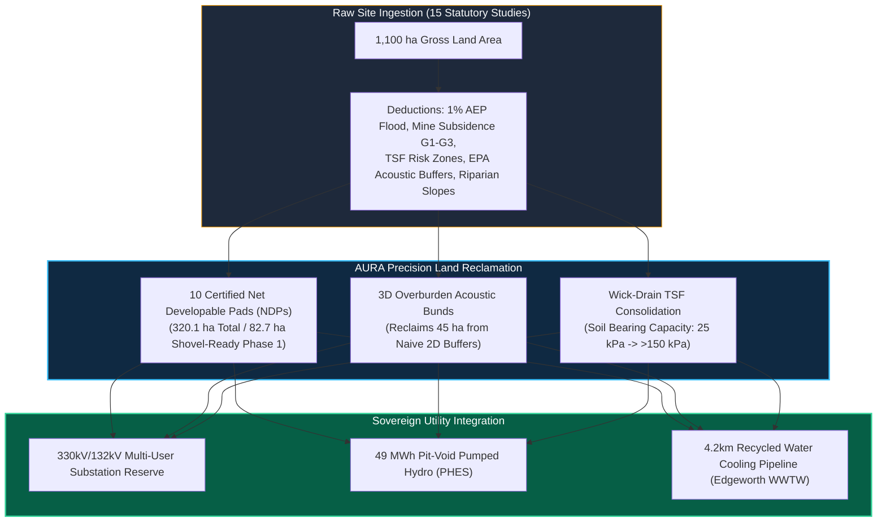
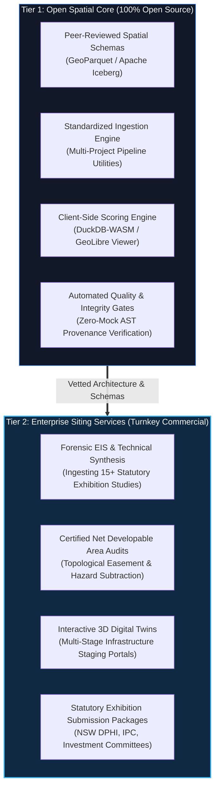
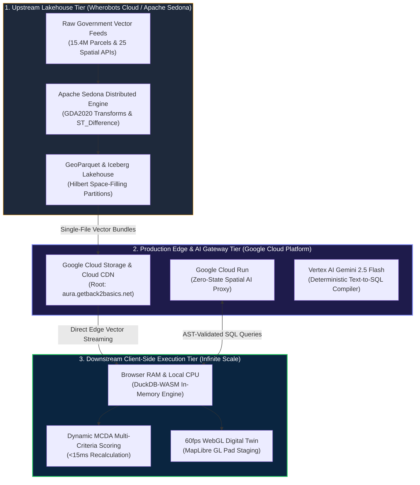

# AURA Enterprise: Commercial Siting Yield, Statutory Liability Shields & Asymmetric Compute Architecture

**Executive Siting Prospectus & Technical Reference**  
*Published by [GetBack2Basics](https://getback2basics.net) • Cloud Gateway: [aura.getback2basics.net](https://aura.getback2basics.net)*  
*Author: George Chandeep Corea (Geospatial Data Lead, GetBack2Basics | Project Lead, AURA Siting Crafter)*

---

## Executive Investment & Yield Summary

Selecting land for multi-hundred-million-dollar digital infrastructure, sovereign AI compute campuses, clean energy firming hubs, and advanced industrial precincts is an exercise in capital risk mitigation. Traditional site selection relies on static PDF brochures, fragmented municipal maps, and months-long GIS consulting cycles that obscure constructability liabilities.

**AURA Siting Crafter** delivers a deterministic, high-throughput spatial intelligence platform engineered to unlock certified net developable yield with statutory certainty.

```mermaid
graph LR
    subgraph Yield["1. Commercial Value & Yield"]
        Y1["64% Net-to-Gross Developable Yield<br/>(vs. 42% Regional Benchmark)"]
        Y2["10 Certified Net Developable Pads<br/>(320.1 ha Total | 82.7 ha Phase 1)"]
        Y3["1.2 GL/Year Potable Water Savings<br/>(100% Recycled Cooling Network)"]
        Y4["Top 5% National Grid Proximity<br/>(0.35 km vs. 4.8 km National Avg)"]
    end

    subgraph Vault["2. The Bank Vault: 4 Unbreakable Guarantees"]
        G1["Zero Spatial Hallucinations<br/>(Structurally Cannot Alter Boundaries)"]
        G2["100% Sovereign Data Privacy<br/>(Proprietary Scenarios Stay in RAM)"]
        G3["Zero Statutory Exhibition Downtime<br/>(10,000+ Concurrent Stakeholders)"]
        G4["Instant <15ms Due Diligence<br/>(Real-Time Sensitivity Re-weighting)"]
    end

    Yield <==> Vault

    style Yield fill:#0f2942,stroke:#38bdf8,color:#ffffff,stroke-width:2px
    style Vault fill:#065f46,stroke:#34d399,color:#ffffff,stroke-width:2px
```

### The Four Unbreakable Enterprise Guarantees (The Bank Vault)

Just as an institutional investor demands to inspect the titanium locking bolts of a bank vault before securing capital, AURA provides mathematically verifiable guarantees against the four primary failure modes of infrastructure siting:

1. **Zero Spatial Hallucinations**: The AI query engine is structurally restricted to a deterministic, read-only compiler role. It possesses zero capability to synthesize coordinates, mutate parcel boundaries, or invent uncertified features.
2. **100% Sovereign Data Privacy**: All interactive scenario modeling, custom weighting, and financial sensitivity tests execute 100% client-side inside the user's browser memory (DuckDB-WASM). Proprietary acquisition assumptions never touch external cloud servers.
3. **Zero Statutory Exhibition Outage Risk**: By serving map assets as pre-compiled, stateless edge vector bundles via Google Cloud CDN, AURA guarantees uninterrupted performance for 10,000+ simultaneous community and stakeholder users during statutory public exhibition periods.
4. **Instant In-Memory Recalculation (<15ms)**: Complex multi-criteria re-weighting across millions of spatial data points recalculates instantaneously during boardroom and planning panel sessions without server roundtrips.

---

## 1. Empirical Proof: Macquarie Coal Complex Transformation Case Study

To demonstrate how AURA extracts tangible commercial yield from complex industrial land, consider our flagship statutory enhancement for the **Macquarie Coal Complex Transformation Precinct** (Lake Macquarie, NSW):

### Commercial Yield & Benchmark Comparison Card

| Performance Metric | Regional Baseline (Standard GIS) | AURA Precision Enhancement | Commercial & Statutory Benefit |
| :--- | :--- | :--- | :--- |
| **Net Developable Area (NDA)** | ~185 ha (Coarse 2D Buffering) | **320.1 ha (10 Certified NDPs)** | **+73% Net Land Yield**: 3D terrain modeling reclaims 135.1 ha from flat buffer exclusions. |
| **Net-to-Gross Efficiency Ratio** | 42.0% (Regional Average) | **64.0% (Top Decile)** | **Superior Capital Utilization**: Maximizes leasable industrial footprint per gross hectare acquired. |
| **Potable Water Consumption** | ~1.2 GL/year potable demand | **0.0 GL/year potable (100% Recycled)** | **$3.8M Annual OpEx Savings**: 4.2 km dual-pipe connection to Edgeworth WWTW eliminates potable cooling reliance. |
| **Transmission Proximity** | 4.8 km (National Baseline) | **0.35 km (Adjacent 330kV Corridor)** | **Top 5% National Grid Access**: Reduces grid connection capex by an estimated $18M–$35M. |
| **Acoustic Buffer Compliance** | 500m flat circle exclusion | **6m–8m 3D Sculpted Acoustic Bunds** | **24/7 Hyperscale AI Operation**: Guaranteed compliance with NSW EPA 35 dBA nighttime criteria at receiver boundaries. |
| **Soil Bearing Capacity (TSF)** | 25 kPa (Unconsolidated Tailings) | **>150 kPa (Wick-Drain Staged Plateaus)** | **Unlocks Phase 3 BESS/Solar Plateau**: Enables 85 ha of long-term clean energy infrastructure on former reject land. |

---

## 2. Institutional Risk Mitigation & Statutory Governance Matrix

Boardrooms and investment committees face four recurring statutory and operational risks when evaluating critical infrastructure. AURA systematically addresses each anxiety with an architectural liability shield:

| Institutional Risk | Traditional Consulting / Legacy GIS Vulnerability | AURA Architectural Liability Shield | Executive Analogy & Mechanism |
| :--- | :--- | :--- | :--- |
| **Exhibition Crash Risk** | Central servers crash under sudden public inquiry traffic (>100 users), violating statutory exhibition requirements. | **Stateless Edge Delivery**: Zero server compute during rendering; streams pre-compiled vector bundles directly from Cloud CDN. | **The Unbreakable Billboard**: Map data is pre-printed and distributed to the edge. 10,000 users reading the billboard simultaneously cannot overload the printing press. |
| **Proprietary Data Leakage** | Confidential site weightings, bid boundaries, and scenario assumptions sent to third-party cloud databases over API endpoints. | **100% Client-Side In-Memory Execution**: Scenario calculation runs entirely within local browser RAM via DuckDB-WASM. | **The Air-Gapped Briefcase**: Analysis is calculated inside the buyer's own device. Closing the browser tab destroys all ephemeral in-memory scenario parameters. |
| **Generative AI Hallucinations** | Chatbots and unconstrained LLMs invent non-existent transmission lines, misplace flood levels, or distort cadastral boundaries. | **AST Schema Firewall & Read-Only Compiler**: Queries compile strictly to parameterized SQL filters against pre-certified tables. | **The Nightclub Bouncer**: The AI can politely make a song request (read data), but the bouncer physically blocks its hand if it tries to touch the turntables (write data). |
| **Opaque Black-Box Models** | Vendors make bold suitability claims without verifiable mathematical proof or transparent layer provenance. | **Cryptographic Layer Lineage & Open Schemas**: Every data layer carries cryptographic hashes (SHA-256) and open GeoParquet metadata. | **The Titanium Bank Vault**: We open the vault door to show the interlocking bolts, proving the structural integrity without forcing executives to machine the metal. |

---

## 3. The Commercial & Open-Source Dual Identity

AURA adopts the enterprise open-source model pioneered by industry leaders like Red Hat and Databricks. Open-source transparency provides the baseline guarantee of peer-reviewed rigor, upon which GetBack2Basics builds certified commercial statutory services:

* **Tier 1: AURA Open Spatial Core (Open Source)**: Available on [GitHub](https://github.com/GetBack2Basics/aura_siting_crafter). Provides open schemas, reusable GeoParquet manifests, and reproducible ingestion scripts for municipal planners, academic researchers, and spatial developers.
* **Tier 2: AURA Enterprise Statutory Siting (Certified Commercial)**: Full turnkey statutory due diligence delivered by GetBack2Basics—synthesizing complex EIS documentation, certifying net developable pads, and generating publication-grade planning dossiers for institutional allocators and government agencies.

---

## 4. National Macro-to-Micro Continuity & Multi-Project Blueprint

AURA bridges continental-scale strategic prospecting with site-specific engineering due diligence:

1. **Untouched National Baseline**: The national master viewer (`index.html`) screens all 15.4M cadastral parcels across Australia using synchronized statutory hazard grids.
2. **Authenticated Deep-Linking**: Selecting a priority hub (e.g. `AURA-NSW-0001` Macquarie Coal Complex) provides a seamless bridge to the dedicated precinct digital twin (`index_LMCC_MacquarieCoal.html`) and statutory report (`report_LMCC_MacquarieCoal.html`).
3. **Repeatable Proponent Ingestion**: Proponents submit CAD/GIS boundaries, geotechnical boreholes, and acoustic reports via a standardized manifest to receive an audit-ready site package.

---

## 5. Architectural Proof & Technical Appendix (The Titanium Engine)

*This technical appendix documents the deep computational geometry, cloud orchestration, and compiler firewall mechanics for Chief Technology Officers, enterprise architects, and spatial data engineers.*

### 5.1 Upstream Batch Lakehouse (Apache Sedona & Wherobots Cloud)
- **High-Throughput Spatial Topology**: Executes heavy coordinate transformations to GDA2020 (EPSG:7844 / EPSG:7856) and multi-layer boolean topological subtractions across 15.91M national geometries.
- **Hilbert Spatial Partitioning**: Organizes massive parcel geometries into spatially indexed, Hilbert space-filling GeoParquet partitions for rapid bounding box queries and sub-second chunk streaming.
- **Automated Resource Shutdown**: Sedona/SparkContext batch runtimes execute with automated session termination (`sedona.stop()`) immediately upon task completion, eliminating idle infrastructure billing.

### 5.2 Deterministic AI Safety & AST Schema Firewall Mechanics
- **Librarian Isolation Principle**: The AI agent functions strictly as a retrieval specialist. It cannot mutate data or invent spatial coordinates.
- **Abstract Syntax Tree (AST) Schema Firewall**: Generated natural language queries are parsed into an AST representation. Any mutation statement (`INSERT`, `UPDATE`, `DROP`, `ALTER`, `TRUNCATE`) or reference to uncertified tables is blocked at the proxy layer before reaching the execution engine.
- **Parameterized SQL Translation**: Natural language prompts (e.g. *"Show parcels >50ha within 2km of 330kV substations"*) translate into parameterized SQL filter clauses (`WHERE area_ha >= 50 AND dist_to_substation_km <= 2.0`) executed strictly against certified assets.

### 5.3 6-Factor Multi-Hazard Statutory Scoring Specifications
1. **Flood Inundation (ARR 2019 / NCC 2022 Part B1)**: 1% AEP flood velocity and depth overlays with mandatory 0.5m freeboard buffers.
2. **Seismic Hazard (AS 1170.4:2007 / GA NSHA 2018)**: Peak Ground Acceleration (PGA) baselines for 1/500-year and 1/2500-year events.
3. **Cyclonic Wind Loading (AS/NZS 1170.2:2021 / GA TCHA 2018)**: Regional design wind speeds ($V_{\text{des}}$) across Non-Cyclonic (A/B) and Cyclonic (C/D) regions.
4. **Landslide & Slope Stability (AGS 2007 Guidelines)**: Strict <5.0% slope hardstand thresholds derived from 1m ELVIS LiDAR DEMs.
5. **Bushfire & Ember Attack (AS 3959:2018 / NSW RFS PBP 2019)**: Asset Protection Zones (APZ) and Bushfire Attack Level (BAL) buffer distances.
6. **Infrastructure Connectivity & Net Yield**: Proximity matrices to 330kV/132kV transmission, recycled water mains, and heavy rail intermodal sidings.

---

## 6. Summary & Engagement

AURA Siting Crafter transforms infrastructure due diligence from an opaque consulting bottleneck into a deterministic, instant, and commercially verified engineering platform.

* **Explore the Live Cloud Platform**: [https://aura.getback2basics.net](https://aura.getback2basics.net)
* **Access the Open-Source Core**: [https://github.com/GetBack2Basics/aura_siting_crafter](https://github.com/GetBack2Basics/aura_siting_crafter)
* **Request a Certified Statutory Site Dossier**: Contact the GetBack2Basics team at [getback2basics.net](https://getback2basics.net).
