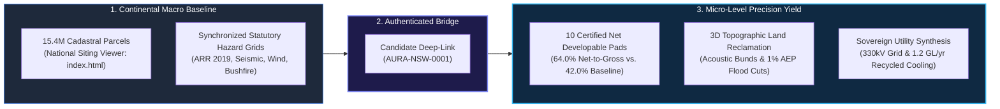
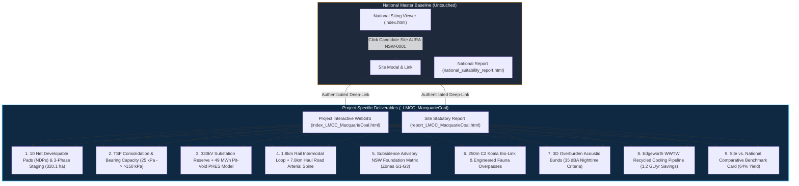
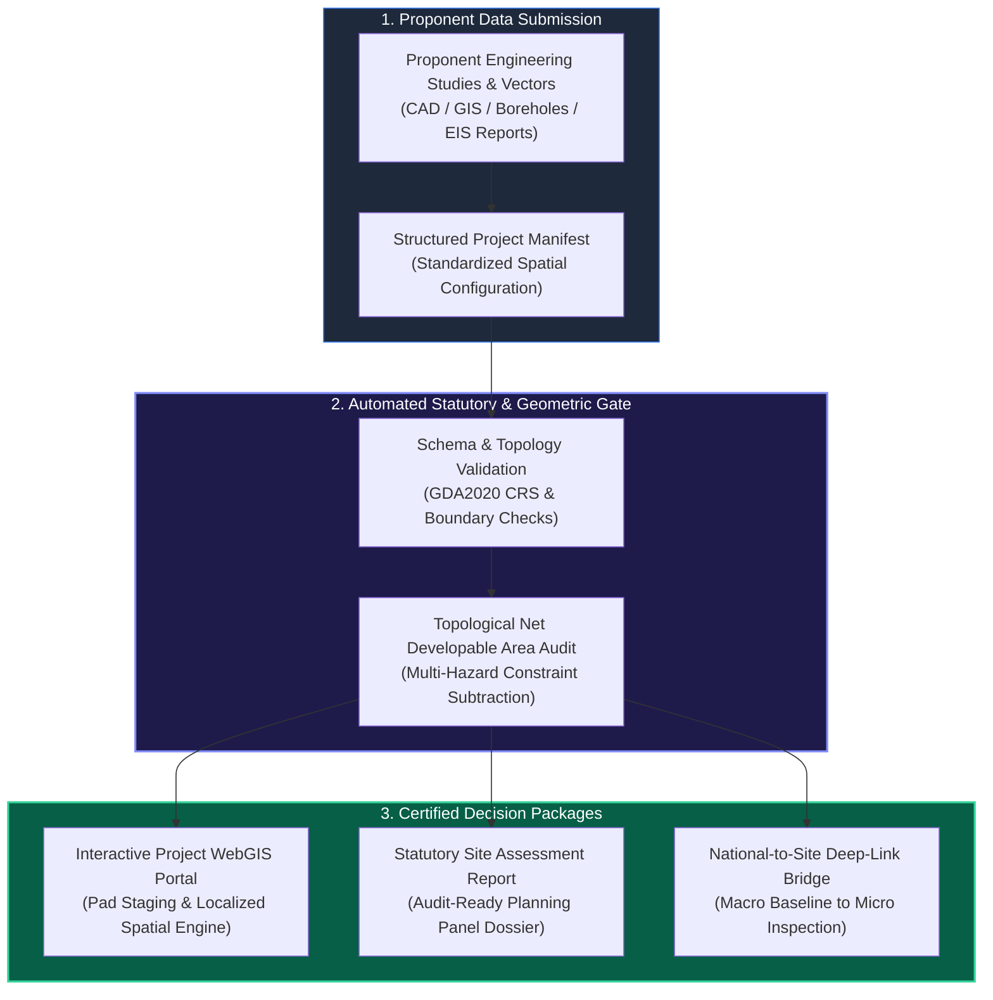

# Project-Specific Siting Architecture & Site Enhancement Plan (_LMCC_MacquarieCoal)

## Executive Summary & Commercial Yield Framework

This architecture plan formalizes the methodology for delivering **Project-Specific Siting Deliverables & High-Resolution Interactive Applications** (patterned as `_{Org/LGA}_{ProjectName}`, e.g., `_LMCC_MacquarieCoal`).

By bridging national-scale candidate screening with micro-level statutory synthesis, AURA extracts maximum net developable land yield while insulating institutional buyers and planning authorities from developmental liability.

---

## 1. Flagship Implementation: Macquarie Coal Complex (`_LMCC_MacquarieCoal`)

Synthesizing all 15 public exhibition technical studies (>135 MB of engineering, geotechnical, and environmental data), AURA resolves critical site friction points into **9 certified commercial components**:

### 1.1 Specific Engineering Layers & Commercial Deliverables:
1. **10 Certified Net Developable Pads (NDPs) with Staging Geometry:**
   - **Pads A1–A4 (48.5 ha hardstand):** Fully remediated plateaus for hyperscale sovereign AI data centres.
   - **Pads B1–B3 (72.0 ha void floor):** Engineered benched pads for heavy clean-tech manufacturing.
   - **Pads C1–C2 (34.2 ha portal logistics):** Direct arterial connection to Cessnock Road and rail siding.
   - **Pad D1 (85.0 ha TSF solar/storage plateau):** Consolidated tailings land for solar PV and 100MW BESS.
   - **3-Phase Staging Schedule:** Phase 1 Immediate (Years 0–3: 82.7 ha), Phase 2 Medium-Term (Years 3–7: 125.4 ha), Phase 3 Long-Term (Years 7–12+: 112.0 ha).
2. **TSF & Dams Safety NSW De-Declaration Sandbox:**
   - 3D isopach tailings contours (up to 18m fine reject).
   - Dynamic wick-drain consolidation simulation showing settlement rate and bearing capacity evolution from 25 kPa to >150 kPa.
3. **Sovereign High-Voltage & Micro-Pumped Hydro (PHES) Scheme:**
   - SP2 Substation pad geometry (4.5 ha) with 330kV/132kV dual-bus layout.
   - Hydraulic cross-section: 120m elevation head between upper reservoir (+145m AHD) and pit void (+25m AHD), delivering up to 49.0 MWh daily storage capacity at 78% round-trip efficiency.
4. **Macquarie Intermodal Rail Terminal (MIRT) & Heavy Haul Road Corridor:**
   - 1.8 km rail loop geometry with 650m siding staging tracks and reach-stacker hardstand.
   - 7.8 km gazetted internal haul road arterial bypassing Barnsley and Teralba residential streets.
5. **Subsidence Advisory NSW Pre-Approved Foundation Matrix:**
   - Overlay of underground workings across Great Northern, Fassifern, and Young Wallsend seams.
   - Foundation engineering lookup: Zone G1 shallow spread footings, Zone G2 articulated stiffened rafts, Zone G3 pressure-grouted void piles.
6. **Sugarloaf-to-Awaba C2 Biodiversity Bio-Link:**
   - 250m–300m ecological corridor (~320 ha) with preferred Koala feed tree density targets and 2 engineered fauna overpasses along the haul road.
7. **3D Overburden Acoustic Bunds & Topographical Sound Shield:**
   - 6m–8m sculpted earthen bunds reclaiming 45 ha of land that naive 2D buffer circles would exclude.
   - Validates strict compliance with NSW EPA **35 dBA night-time criteria** at Barnsley, Teralba, and Wakefield residential receivers.
8. **Edgeworth WWTW Recycled Water Pipeline (Zero Potable Cooling):**
   - 4.2 km dual-pipe alignment connecting Edgeworth WWTW to the precinct boundary, delivering **1.2 GL/year potable water savings**.
9. **Site vs. National Comparative Benchmark Card:**
   - *Transmission Offset:* 0.35 km (Macquarie) vs. 4.8 km (National Avg) — **Top 5%**
   - *Net-to-Gross Yield:* 64% (Macquarie) vs. 42% Regional Benchmark.
   - *Water Circularity:* 100% Recycled vs. 35% Potable Reliance.

---

## 2. Standardized Multi-Project Ingestion & Report Generation Blueprint

To enable third parties (councils, industrial developers, energy consortiums) to submit site data and receive an automated, audit-ready site package, AURA establishes a repeatable 4-part framework:

---

## 3. Executive Delivery Architecture & Asset Integration

1. **Structured Manifest Specifications**: Standardizes proponent metadata, engineering capacity targets (power MVA, recycled water GL/yr), and localized micro-layer geometries into a unified, version-controlled format.
2. **Dedicated Project Spatial Portals**: Each project receives a self-contained, high-performance WebGIS application featuring pad staging timelines, infrastructure overlays, and real-time DuckDB-WASM analytical filtering.
3. **Statutory Decision Dossiers**: Automated generation of publication-grade assessment reports containing comparative benchmark radar matrices, geotechnical foundation engineering schedules, and environmental bio-link allocations.
4. **National Macro-to-Micro Continuity**: Seamless transition from Australia-wide candidate identification to deep site-level forensic due diligence via authenticated deep-linking.

---

## 4. Statutory Verification & Quality Assurance Protocol

Every submitted project package undergoes rigorous automated and statutory quality assurance prior to certification:

1. **Automated Schema & Quality Gate Enforcement**: Ingested datasets are scanned against strict schema definitions to verify structural integrity and data provenance before pipeline processing.
2. **Geometric & Topological Integrity Audits**: Automated spatial validation verifies that all developable pad polygons sit strictly within precinct boundaries, contain zero self-intersections, and maintain statutory clearance from ecological conservation corridors.
3. **Statutory Benchmark Verification**: Geotechnical, acoustic, and hydraulic metrics are benchmarked against NSW EPA, ARR 2019, and Subsidence Advisory guidelines to ensure full compliance before planning panel exhibition.
4. **Interactive Digital Twin Audit**: Visual inspection confirms pad staging schedules, multi-layer toggling, and client-side analytical calculations operate with sub-second responsiveness across all target stakeholder devices.
