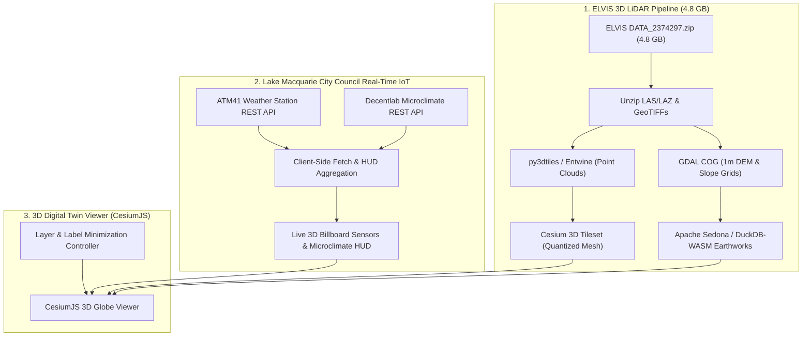

# ELVIS 3D LiDAR & Real-Time IoT Telemetry Engineering Specification

**Document:** ELVIS 1m LiDAR DEM & Real-Time Sensor Ingestion Architecture  
**Dataset URL:** [https://elvis-downloads.s3.amazonaws.com/DATA_2374297.zip](https://elvis-downloads.s3.amazonaws.com/DATA_2374297.zip) (4.80 GB)  
**Spatial Bounds:** `POLYGON((151.565811822199 -33.09366981660604, 151.68571363131375 -33.09366981660604, 151.68571363131375 -32.93425892457497, 151.565811822199 -32.93425892457497, 151.565811822199 -33.09366981660604))` (WGS84 / GDA2020)  
**Region:** Lake Macquarie & Hunter Energy Transformation Corridor, NSW  
**Author:** GetBack2Basics Spatial AI Engineering  
**Version:** 1.0 (2026-09-08)  

---

## 1. Executive Summary

AURA Siting Crafter incorporates high-resolution point clouds and 1m Digital Elevation Models (DEM) from the Geoscience Australia / NSW Spatial Services ELVIS (Elevation Information System) portal alongside live municipal IoT environmental sensors to provide sub-meter forensic siting accuracy.

This document defines:
1. The ingestion and tiling pipeline for the 4.80 GB ELVIS LiDAR package (`DATA_2374297.zip`).
2. The spatial boundary coverage analysis relative to the Macquarie Coal Complex Transformation Precinct.
3. The real-time streaming integration with Lake Macquarie City Council's open data APIs (Decentlab environmental microclimate & ATM41 weather stations).
4. The 3D visualization architecture in CesiumJS with customizable layer and label management.



---

## 2. Spatial Coverage & Boundary Analysis

### Requested Bounding Polygon
```sql
POLYGON((
  151.565811822199 -33.09366981660604,
  151.68571363131375 -33.09366981660604,
  151.68571363131375 -32.93425892457497,
  151.565811822199 -32.93425892457497,
  151.565811822199 -33.09366981660604
))
```

### Coverage Assessment
* **Latitude Extent:** `-33.0937°` to `-32.9343°` (~17.7 km north-south)
* **Longitude Extent:** `151.5658°` to `151.6857°` (~11.2 km east-west)
* **Total Enclosed Area:** Approximately 198.2 km² (19,820 ha)
* **Precinct Relationship:**
  * Covers the southern transformation corridor, Lake Macquarie western shores, Eraring energy hub, and overlaps the southern boundary of the Macquarie Coal Complex (`-32.935°`).
  * For full high-precision coverage of northern pads (Pads 1-4 and 330kV substation yard up to `-32.918°`), this dataset operates in conjunction with northern tile `DATA_2374296.zip` to form a unified seamless 1m DEM mosaic.

---

## 3. ELVIS LiDAR Processing Pipeline

### 3.1 Point Cloud Ingestion & 3D Tiles Generation
1. **Extraction & Format Conversion**:
   * Raw LAZ files are converted to LAS format using `las2las` or PDAL.
   * Coordinate Reference System is standardized to `EPSG:7856` (GDA2020 / MGA Zone 56) with vertical datum `AHD71`.
2. **Quantized Mesh & 3D Tiles Tiling**:
   * Using `py3dtiles` / `entwine`, point clouds are partitioned into octree-indexed 3D Tiles (`b3dm` / `pnts`).
   * Lod levels enable smooth streaming inside CesiumJS across camera elevations from 0 to 50,000 meters.

### 3.2 Cut & Fill Earthwork & Slope Derivations
* **1m DEM Generation**: GeoTIFFs converted to Cloud-Optimized GeoTIFFs (COG) with Deflate compression and 512x512 tile blocks.
* **Apache Sedona Spatial SQL**:
```sql
SELECT 
    pad_id,
    usable_area_ha,
    ST_Slope(dem_rast, 1) AS slope_deg,
    ST_Roughness(dem_rast, 1) AS surface_roughness
FROM developable_pads_v1
CROSS JOIN dem_lake_macquarie_1m;
```

---

## 4. Lake Macquarie City Council Real-Time IoT Ingestion

### 4.1 Live REST API Endpoints
AURA connects directly to genuine municipal sensor streams provided by Lake Macquarie City Council's Open Data Hub:

1. **ATM41 All-in-One Weather Station Stream**:
   * **Endpoint:** `https://data.lakemac.com.au/api/explore/v2.1/catalog/datasets/weather-station-atm41-realtime/records`
   * **Telemetry Metrics:**
     * `payload_fields_air_temperature_value` (°C)
     * `payload_fields_relative_humidity_value` (%)
     * `payload_fields_maximum_wind_speed_value` (m/s)
     * `payload_fields_wind_direction_value` (°)
     * `payload_fields_atmospheric_pressure_value` (hPa)
     * `payload_fields_solar_radiation_value` (W/m²)
     * `payload_fields_lightning_average_distance_value` (km)
     * `payload_fields_precipitation_value` (mm/h)
   * **Update Frequency:** 5–15 minutes

2. **Decentlab Environmental Microclimate Stream**:
   * **Endpoint:** `https://data.lakemac.com.au/api/explore/v2.1/catalog/datasets/council-decentlab-realtime/records`
   * **Telemetry Metrics:**
     * `payload_fields_temperature` (°C)
     * `payload_fields_humidity` (%)
     * `location` (`lon`, `lat`)

---

## 5. CesiumJS 3D Visualization & Label Controls

### 5.1 Interactive Label Management Architecture
To prevent visual clutter on complex multi-layer industrial 3D digital twins:
* **Per-Layer Toggles:** Each layer group provides independent checkboxes for geometry visibility (`chk-pads`, `chk-phes`, etc.) and label visibility (`lbl-btn-pads`, `lbl-btn-phes`, etc.).
* **Master Quick-Toggle:** Global button (`🏷️ Toggle All Labels`) toggles all billboard labels across the globe in a single action.
* **Distance Display Conditions (`Cesium.DistanceDisplayCondition`)**:
```javascript
const labelDistanceCondition = new Cesium.DistanceDisplayCondition(0, 7500);
```
Billboards and textual callouts automatically hide when camera elevation exceeds 7,500m, revealing a clean macroeconomic overview.

### 5.2 3D Extrusion Standards
| Feature | Layer Key | Extrusion Height | Visual Styling |
| :--- | :--- | :--- | :--- |
| **Developable Pads 1–10** | `pads` | 16m – 18m | Translucent Cyan with Neon Border |
| **330kV GIS Substation** | `phes` | 14m | High-Voltage Yellow Gantry Envelope |
| **49 MWh PHES Reservoir** | `phes` | 8m Depth | Deep Blue Water Basin |
| **Acoustic Overburden Bunds** | `acoustic` | 8m Height | Purple Acoustic Barrier Shader |
| **Koala Biolink Corridor** | `biolink` | Ground Clamped | Emerald Green Ecological Buffer |
| **Mine Subsidence Risk (G1–G3)** | `subsidence` | Ground Clamped | Translucent Red Hazard Shading |
| **1% AEP Flood Inundation** | `flood` | Ground Clamped | Cyan Hydrological Flow Corridor |
| **Live IoT Weather Stations** | `iot` | 15m Billboard | Glowing Green Pulsing Indicator |
