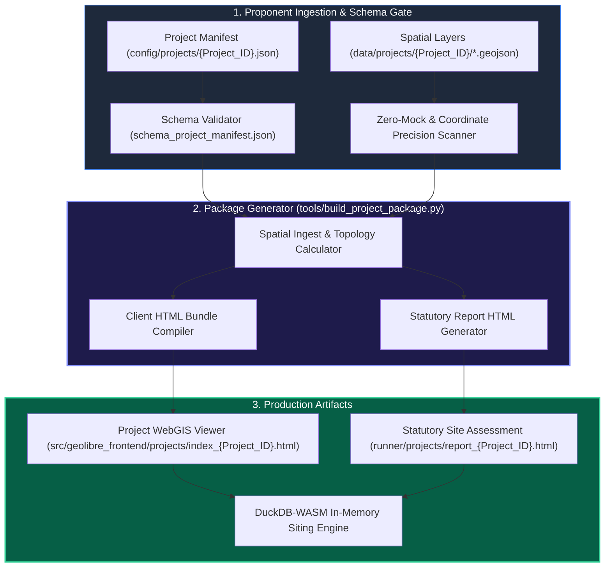

# Multi-Project Ingestion Pipeline & Schema Specifications

**Module:** Multi-Project Siting & Package Generator  
**Maintainer:** GetBack2Basics Spatial AI Engineering  
**Version:** 2.0 (September 2026)  

---

## 1. System Architecture & Technical Data Flow

The Multi-Project Ingestion Pipeline establishes a repeatable, schema-validated workflow for compiling localized proponent spatial studies into standalone, high-performance web artifacts and statutory assessment reports.



---

## 2. Project Directory Structure

```
aura_siting_crafter/
├── config/
│   └── projects/
│       ├── schema_project_manifest.json           [Manifest JSON Schema specification]
│       └── LMCC_MacquarieCoal.json               [Site-specific project manifest]
├── data/
│   └── projects/
│       └── LMCC_MacquarieCoal/                   [Site-specific spatial layers]
│           ├── developable_pads_v1.geojson
│           ├── staging_phases_v1.geojson
│           ├── substation_phes_layout.geojson
│           ├── rail_haulroad_spine.geojson
│           ├── subsidence_zones_g1_g3.geojson
│           ├── koala_biolink_corridor.geojson
│           └── acoustic_bunds_buffers.geojson
├── src/
│   └── geolibre_frontend/
│       ├── projects/
│       │   └── index_LMCC_MacquarieCoal.html      [Interactive site WebGIS viewer]
│       └── index.html                             [National viewer with project deep-links]
├── runner/
│   ├── projects/
│   │   └── report_LMCC_MacquarieCoal.html         [Dedicated statutory site report]
│   └── build_project_package.py                   [CLI package compilation tool]
└── docs/
    ├── business/                                  [Executive & Institutional Dossiers]
    └── engineering/                               [Developer Specifications & Schemas]
```

---

## 3. Project Manifest JSON Schema (`schema_project_manifest.json`)

```json
{
  "$schema": "http://json-schema.org/draft-07/schema#",
  "title": "AURA Project Manifest Schema",
  "type": "object",
  "required": ["project_id", "project_name", "proponent", "lga", "coordinates", "layers"],
  "properties": {
    "project_id": { "type": "string", "pattern": "^[A-Za-z0-9_]+$" },
    "project_name": { "type": "string" },
    "proponent": { "type": "string" },
    "lga": { "type": "string" },
    "coordinates": {
      "type": "object",
      "required": ["lat", "lng", "zoom"],
      "properties": {
        "lat": { "type": "number" },
        "lng": { "type": "number" },
        "zoom": { "type": "number" }
      }
    },
    "engineering_baseline": {
      "type": "object",
      "properties": {
        "gross_site_area_ha": { "type": "number" },
        "target_nda_ha": { "type": "number" },
        "power_capacity_mva": { "type": "number" },
        "water_savings_gl_yr": { "type": "number" }
      }
    },
    "layers": {
      "type": "array",
      "items": {
        "type": "object",
        "required": ["id", "name", "file", "type"],
        "properties": {
          "id": { "type": "string" },
          "name": { "type": "string" },
          "file": { "type": "string" },
          "type": { "type": "string", "enum": ["polygon", "line", "point"] },
          "color": { "type": "string" }
        }
      }
    }
  }
}
```

---

## 4. Execution & Testing Commands

### Build Project Package CLI
```bash
python tools/build_project_package.py --project LMCC_MacquarieCoal
```

### Automated Validation Suite
```bash
# Run all lint checks and zero-mock AST scanning
pytest tests/lint/ -v

# Validate project manifest schema compliance
pytest tests/test_project_manifest_schema.py -v

# Run full project package integration tests
pytest tests/test_project_package_builder.py -v
```
