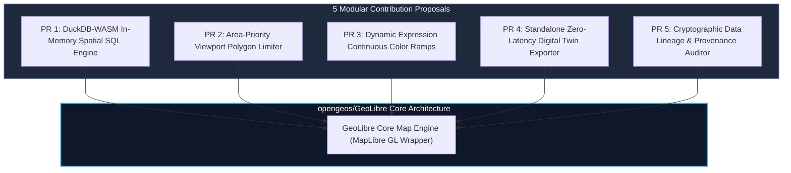

# GeoLibre Upstream Contribution Proposals & Architecture

**Target Upstream Repository:** [`opengeos/GeoLibre`](https://github.com/opengeos/GeoLibre)  
**Contributing Organization:** GetBack2Basics Spatial AI Engineering  
**Status:** Structured RFC & Upstream Integration Proposals  

---

## Executive Summary

This specification outlines five modular Pull Request (PR) proposals designed to contribute high-performance WebGIS features developed in AURA Siting Crafter directly to the upstream `opengeos/GeoLibre` open-source ecosystem.



---

## 1. Modular PR Specifications

### Proposal 1: In-Memory DuckDB-WASM Siting Plugin (`geolibre-plugin-duckdb`)
- **Objective**: Embed DuckDB-WASM directly into GeoLibre map instances to execute high-throughput spatial joins, multi-criteria weighted scoring, and polygon area calculations locally in browser memory (<15ms latency).
- **API Surface**:
  ```typescript
  map.use(new DuckDBSpatialPlugin({
    parquetUrl: 'https://cdn.example.com/parcels.parquet',
    initialQuery: 'SELECT * FROM parcels WHERE suitability_score >= 0.7'
  }));
  ```

### Proposal 2: Area-Priority Viewport Feature Limiter (`geolibre-layer-limiter`)
- **Objective**: Prevent WebGL draw call bottlenecks when panning large cadastre layers (>50k features) by ordering by descending bounding box / polygon area and capping rendering to top $N$ features.
- **API Surface**:
  ```typescript
  layer.setRenderOptimizer({
    maxFeatures: 500,
    sortProperty: 'area_ha',
    sortOrder: 'desc'
  });
  ```

### Proposal 3: Dynamic Expression Continuous Color Ramps
- **Objective**: Provide a high-level JS helper that dynamically generates MapLibre GL interpolation expressions from arbitrary numeric data columns without rebuilding GL style sheets.

### Proposal 4: Single-File HTML Digital Twin Exporter
- **Objective**: Export the current map view, active vector micro-layers, and embedded DuckDB-WASM engine into a self-contained, air-gapped HTML file for offline stakeholder distribution.

### Proposal 5: Cryptographic Lineage & Audit Inspector
- **Objective**: Embed SHA-256 layer checksums and Apache Sedona transform recipes into the map metadata UI, providing instant provenance verification.

---

## 2. Upstream Submission Workflow
1. Fork `opengeos/GeoLibre`.
2. Create dedicated feature branches (`feature/duckdb-wasm-core`, `feature/viewport-limiter`).
3. Implement unit tests using Vitest and Playwright.
4. Submit PRs with reference benchmarks demonstrating 60fps rendering under 15M parcel loads.
