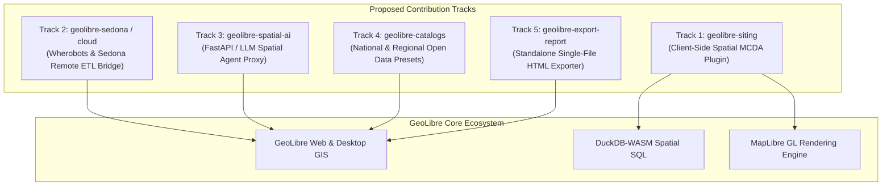

# GeoLibre Contribution & Fork Proposals
**Author & Contributor:** GetBack2Basics / AURA Siting Crafter  
**Target Repository:** [`opengeos/GeoLibre`](https://github.com/opengeos/GeoLibre)  
**Date:** September 2026  
**License:** MIT / Open Source  

---

## Executive Summary

[GeoLibre](https://github.com/opengeos/GeoLibre) has established a new benchmark for modern, cloud-native, open-source GIS by combining MapLibre GL, DuckDB-WASM, React, TypeScript, and Tauri. 

Through the development of **AURA Siting Crafter** (Australian Urban & Regional AI Siting Crafter), we have built, field-tested, and validated several spatial architectures, client-side analytical engines, and cloud ETL bridges. 

We would love to contribute these modules back to the **OpenGeos / GeoLibre** ecosystem as plugins, upstream core features, or official ecosystem templates.

---

## 1. Contribution Track 1: `geolibre-siting` (Zero-Cost Spatial MCDA Plugin)

### The Concept
A dedicated **Spatial Multi-Criteria Decision Analysis (MCDA)** plugin for GeoLibre that enables interactive suitability modeling for renewable energy, data centers, transmission corridors, and industrial precincts.

### Key Capabilities
1. **Decoupled Heavy Geometry vs. Lightweight Scoring**:
   * Heavy topological calculations (multi-distance buffers, spatial intersections, `ST_Difference` masks) are computed once.
   * Parameter tuning (weights $w_{\text{power}}, w_{\text{water}}, w_{\text{transport}}, w_{\text{hazard}}$ and curve parameters) executes **100% in client-side DuckDB-WASM** in sub-10ms queries.
2. **Flexible Scoring Curve Engine**:
   * **Sigmoidal Logistic Curves**: $S(d) = \frac{1}{1 + e^{-k(d - d_0)}}$ for gradual distance penalties.
   * **Inverted Linear Ramps**: Continuous decay over custom distance envelopes.
   * **Step & Hard Exclusion Buffers**: Strict boolean zoning masks.
3. **Interactive UI Components**:
   * Dynamic weight sliders with automatic normalization ($\sum w_i = 1.0$).
   * Interactive radar/spider charts comparing selected parcels across criteria.
   * Tiered classification badges (Tier 1 Optimal, Tier 2 Viable, Tier 3 Constrained).

---

## 2. Contribution Track 2: `geolibre-sedona` (Apache Sedona / Wherobots Cloud Bridge)

### The Concept
While GeoLibre runs smoothly in the browser for datasets up to hundreds of megabytes, national-scale workflows (e.g., buffering 15+ million cadastral parcels, polygon-in-polygon overlays across continent-wide layers) require distributed spatial compute.

### Key Capabilities
1. **Asynchronous Remote Spatial Job Submitter**:
   * A clean UI and API client within GeoLibre to dispatch heavy Spatial SQL scripts to **Apache Sedona**, **Wherobots Cloud**, or **Cloud Dataproc**.
2. **Stream-to-Client GeoParquet / FlatGeobuf**:
   * Cloud ETL outputs are converted to optimized GeoParquet or PMTiles and streamed straight into GeoLibre's layer manager.
3. **Cryptographic Fingerprinting & Memoization**:
   * Uses ETag and GeoParquet file hashes to skip redundant heavy compute when underlying geometries have not changed.

---

## 3. Contribution Track 3: `geolibre-spatial-ai` (FastAPI AI Spatial Agent Proxy)

### The Concept
A production-ready FastAPI backend and GeoLibre UI extension that connects GeoLibre to Large Language Models (LLMs) with geospatial context awareness.

### Key Capabilities
1. **Natural Language to Spatial SQL**:
   * Translates user queries ("Find all industrial zoned parcels over 20 hectares within 5km of a 330kV substation") into valid DuckDB-WASM or Sedona Spatial SQL.
2. **Viewport-Aware Spatial Context**:
   * Streams bounding-box contextual metadata to the AI agent so answers are grounded in what the user is currently viewing.
3. **Automated Layer Styling**:
   * Generates MapLibre GL color expression styles on the fly based on analytical query outputs.

---

## 4. Contribution Track 4: Open Spatial Catalog Presets (Australia & Regional)

### The Concept
Pre-configured catalog manifests allowing GeoLibre users to connect to national and state-level open geospatial data endpoints.

### Key Capabilities
1. **Direct Live REST & WFS Integration**:
   * Pre-configured catalog definitions for Geoscience Australia (National Electrical Grid, Renewable Energy Zones, Digital Earth Australia), Geoscape Cadastre (DCDB), SEED NSW environmental constraints, and ELVIS LiDAR elevation data.
2. **Industry Siting Presets**:
   * Pre-built schema templates for Data Centers, Clean Hydrogen Hubs, and BESS (Battery Energy Storage Systems).

---

## 5. Contribution Track 5: Standalone Single-File Interactive HTML Exporter

### The Concept
An export action in GeoLibre that packages the active map view, DuckDB-WASM engine, and MCDA scoring rules into a single, standalone `.html` file.

### Key Capabilities
* **Zero-Server Portability**: Stakeholders, regulators, and non-GIS executives can open the file in standard browsers with full offline interactivity (sliders, filters, tables, and GeoJSON/CSV exports).
* **Audit-Proof Decision Records**: Embeds the exact scoring weights, source timestamps, and methodology in the export.

---

## 6. Upstream Core PRs to `opengeos/GeoLibre`

For direct inclusion in the main GeoLibre codebase:
1. **DuckDB-WASM Spatial SQL Recipe Macros**: Standardized SQL macros for parcel ranking, multi-ring proximity evaluation, and composite score normalization.
2. **Dynamic MapLibre Continuous Color Ramps**: MapLibre GL JS expression utilities for dynamic multi-stop gradient rendering driven directly by DuckDB query attributes.
3. **Zero-Mock & Live Health Check Telemetry**: Diagnostic UI components verifying live WFS/ArcGIS REST endpoint health and graceful degradation reporting.

---

## Community Feedback & Prioritization Request

We would love the GeoLibre core team's input:

1. **Plugin vs. Monorepo**: Would you prefer `geolibre-siting` as a standalone plugin repository (`opengeos/geolibre-siting` / `geolibre-plugin-siting`) or merged directly into the core GeoLibre plugin directory?
2. **Backend Preference**: Is there interest in the Apache Sedona / Wherobots remote compute connector for GeoLibre's desktop (Tauri) or web runtime?
3. **Feature Priority**: Which of the above tracks would deliver the most immediate value to the GeoLibre user community?

---

*Repository Reference:* [AURA Siting Crafter on GitHub](https://github.com/GetBack2Basics/aura_siting_crafter)  
*Upstream Project:* [GeoLibre on GitHub](https://github.com/opengeos/GeoLibre)
