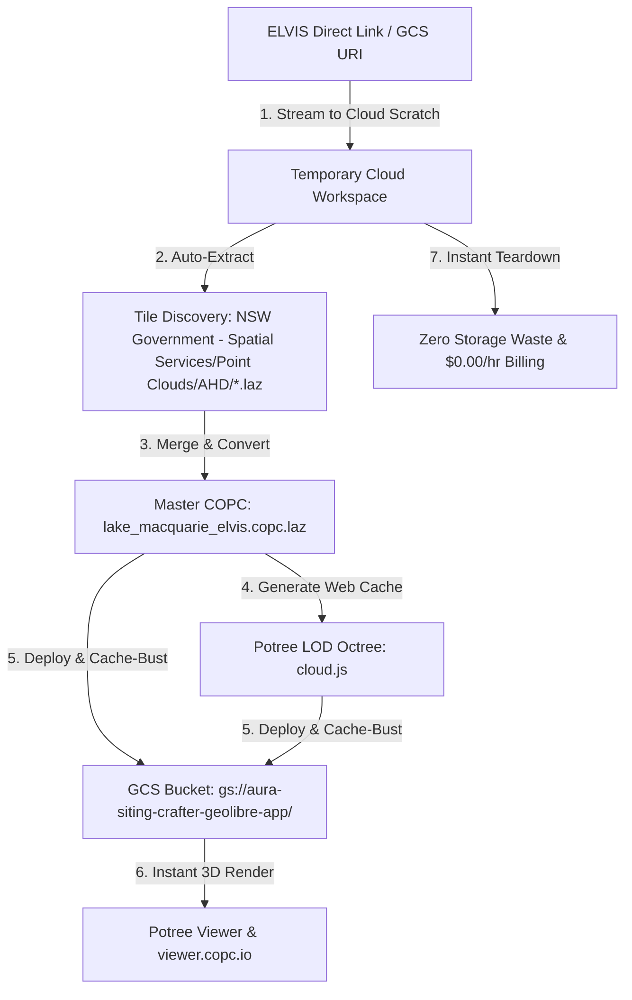

# AURA Siting Crafter — NSW ELVIS LiDAR Cloud Processing & COPC Conversion Pipeline

This guide outlines how to process NSW ELVIS LiDAR multi-tile survey packages in the cloud from a direct download link (or GCS URI) without downloading files to your local machine.

---

## ⚡ 1-Step Cloud Execution (No Local Downloads)

Provide the direct download URL (e.g., from ELVIS Spatial Services, Wherobots, AWS S3, or GCS) and execute:

```powershell
# 1. Using a direct HTTP/HTTPS download link:
python tools/process_elvis_lidar_zip_pipeline.py `
    --zip-url "https://spatial-services-data.nsw.gov.au/download/DATA_2374297.zip" `
    --dataset-name "lake_macquarie_elvis" `
    --deploy

# 2. Or using a Google Cloud Storage URI:
python tools/process_elvis_lidar_zip_pipeline.py `
    --gcs-zip-uri "gs://aura-siting-crafter-geolibre-app/raw_zips/DATA_2374297.zip" `
    --dataset-name "lake_macquarie_elvis" `
    --deploy
```

---

## 🔄 Cloud Processing Architecture



---

## 📋 Automated Pipeline Operations

1. **Direct Link Ingestion**:
   - Streams the `.zip` directly into cloud scratch memory (`urllib.request` stream) without consuming local computer disk space.
2. **Automated Tile Extraction**:
   - Discovers all nested `.laz` survey tiles under the standard ELVIS directory hierarchy.
3. **Direct COPC Conversion (`.copc.laz`)**:
   - Merges all tiles into a unified **Cloud Optimized Point Cloud (`.copc.laz`)** with millimeter accuracy (`scale = 0.001`), preserving ASPRS classifications (ground, vegetation, buildings, water), intensity, and RGB color bands.
   - **How `.copc.laz` is Constructed**:
     Unlike a linear LAZ file, COPC rearranges the points into an octree hierarchy of spatial chunks (voxels) and embeds special **Variable Length Records (VLRs)**:
     - **COPC Info VLR** (`userId: "copc"`, `recordId: 1`): Stores the global spatial bounding cube `[minX, minY, minZ, maxX, maxY, maxZ]`, point spacing, root hierarchy page byte offset, and GPS time bounds.
     - **COPC Hierarchy Pages**: Indexed binary tables of 32-byte entries `(level, x, y, z, offset, byteLength, pointCount)` defining octree voxel addresses.
     - **WKT Coordinate Reference System VLR** (`userId: "LASF_Projection"`, `recordId: 2112`): Defines EPSG:7856 (GDA2020 / MGA Zone 56).
   - **Creation Methods**:
     - **Method 1 (Automated Pipeline)**: Uses `tools/process_elvis_lidar_zip_pipeline.py` which streams the tile chunks and builds the COPC layout automatically.
     - **Method 2 (PDAL CLI)**:
       ```bash
       pdal translate merged.laz output.copc.laz \
           --writers.copc.forward=all \
           --writers.copc.a_srs="EPSG:7856"
       ```
     - **Method 3 (Untwine Parallel Indexer)**:
       ```bash
       untwine -i "extracted_tiles/*.laz" -o output_dir/ --copc
       ```
4. **Potree LOD Octree Web Cache**:
   - Compiles the derived `cloud.js` multi-resolution spatial index for smooth browser rendering.
5. **GCS Deployment**:
   - Publishes the COPC and derived web assets to `gs://aura-siting-crafter-geolibre-app` with HTTP `no-cache, no-store, must-revalidate` headers.
6. **Scratch Teardown**:
   - Immediately deletes all temporary extraction scratch files, ensuring zero disk overhead and $0.00/hr idle compute cost.

---

### 🛡️ Compute Status
- **Interactive Cloud / Sedona Sessions**: **None active** ($0.00/hr billing).
