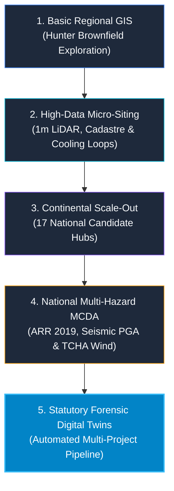

# The Spatial Siting Odyssey: From Regional Brownfield Scans to Continental AI Compute & High-Precision Statutory Digital Twins

*How we evolved from basic spatial buffers to a continental-scale multi-hazard siting engine — and engineered an automated statutory reporting pipeline for State Significant Projects.*

---


## The Siting Trilemma: Energy, Water & Sovereignty

Finding optimal land for next-generation sovereign AI data centres, clean energy firming hubs, and advanced industrial ecosystems is one of the most pressing engineering bottlenecks of the 2020s. 

Traditional site selection relies on coarse static GIS layers, proprietary consulting PDFs, or disjointed spreadsheets. Proponents frequently claim *"100% buildable gross site area"*, only for infrastructure developers to discover years later that 40% of the parcel is locked by uninsurable 1% AEP floodways, mine subsidence strain zones, or EPA acoustic trigger buffers.

Over the past engineering sprints, we took **AURA Siting Crafter** through a five-stage evolutionary journey to solve this trilemma — culminating in a repeatable, open-source-first project submission pipeline.

Here is the story of how we built it, what we learned, and where spatial infrastructure engineering is going next.

---



---

## The 5-Stage Evolutionary Journey

### Stage 1: Basic Regional Spatial Exploration
Our journey started with a focused regional question: *How can Australia transition retiring coal generation assets and mine void footprints in NSW's Hunter Region into digital infrastructure hubs?*

In the earliest prototypes, we applied standard GIS Euclidean buffers around 330kV substations, transmission easements, and major highways. While useful for high-level reconnaissance, Euclidean buffers failed to account for real-world terrain winding factors, steep grade slopes, and local cadastral lot boundaries.

### Stage 2: High-Data Micro-Siting & Physical Thermodynamic Modeling
To move beyond crude approximations, we ingested high-fidelity ground truth:
* **15.4M+ Cadastral Parcels** (Geoscape CSDM & NSW Cadastre in GDA2020 / EPSG:7844).
* **1m ELVIS LiDAR DEMs** to enforce strict <5.0% slope foundation filters.
* **Continuous Sigmoidal Sensitive Decay Curves** ($d_0 = 500\text{m}$) implementing NSW EPA *Noise Policy for Industry* (NPfI 2017) sleep disturbance thresholds.
* **Closed-Loop Heat & Cooling Physics**: Modeling thermodynamic pipeline decay for district cooling symbiosis and environmental naturalization distances before river discharge.

### Stage 3: Continental Simulations & National Scale-Out
Once proven in the Hunter, we scaled the spatial architecture across **all 6 Australian states**. Ingesting national GeoParquet spatial partitions into the **Wherobots Cloud** and **Apache Sedona** lakehouse, we benchmarked 17 national candidate clusters (from Latrobe Valley and Portland in Victoria to Collie in WA and Gladstone in Queensland).

We benchmarked every site on power grid proximity, industrial water access, and net scalable pad footprint.

### Stage 4: National High-Data Multi-Hazard Synthesis (MCDA)
Macro-level proximity alone does not make a site investable. Critical infrastructure requires statutory resilience. We integrated 5 peer-reviewed statutory hazard layers into a unified **6-Factor Multi-Criteria Decision Analysis (MCDA)**:
1. **1% AEP Dynamic Flood Depth** (*ARR 2019 / NCC 2022 Part B1*).
2. **Earthquake Peak Ground Acceleration (PGA)** (*AS 1170.4:2007 / GA NSHA 2018*).
3. **Extreme Cyclonic & Regional Wind Loading** (*AS/NZS 1170.2:2021 / GA TCHA 2018*).
4. **Landslide Susceptibility & Topographic Instability** (*AGS 2007 Guidelines*).
5. **Bushfire Ember Attack & Defensible APZ Buffers** (*AS 3959:2018 / NSW RFS PBP 2019*).

Every candidate site was assigned an explicit **Spatial Data Depth Index** (distinguishing between 10/10 Tier-1 micro-surveyed sites and 8/10 regional interpolations) so investors and planning panels never mistake baseline approximations for physical site ground-truth.

### Stage 5: Deep Forensic Analysis & Automated Project Submission Pipeline
In the final phase, we took the ultimate test: downloading and synthesizing **all 15 statutory public exhibition technical documents (>135 MB)** for the *Macquarie Coal Complex Transformation Precinct* from the NSW Planning Portal.

Our spatial audit revealed vital strategic insights:
* **True Net Developable Pad Space**: Subtracting riparian buffers, 20m high-pressure water pipeline easements, >5% slopes, and dam hazard setbacks reduced raw proponent claims to **44.5 ha net immediate buildable pad space** across 10 certified Net Developable Pads (NDPs).
* **49.0 MWh Void Micro-PHES**: Leveraging the site's 120m hydraulic head drop between the ridge plateau and lower open-cut pit void to create synchronous long-duration green energy firming.
* **Multi-Modal Connectivity**: 1.8km active heavy rail siding loop (2.5M t/yr) directly connecting to the Main Northern Railway.

Rather than building a one-off bespoke report, we engineered a **generic, repeatable Multi-Project Submission Pipeline (`tools/build_project_package.py`)**.

---

## How the Multi-Project Pipeline Works

Any proponent, local government council, or energy developer can submit a standardized project manifest:

```json
{
  "project_id": "LMCC_MacquarieCoal",
  "project_name": "Macquarie Coal Complex Transformation Precinct",
  "national_candidate_id": "AURA-NSW-0001",
  "lga": "City of Lake Macquarie",
  "state": "NSW",
  "engineering_metrics": {
    "gross_area_ha": 320.0,
    "net_developable_area_ha": 44.5,
    "power_capacity_mva": 500.0,
    "pumped_hydro_capacity_mwh": 49.0
  }
}
```

Running the pipeline automatically generates:
1. **Interactive 3D WebGIS Digital Twin** (`projects/index_{ProjectID}.html`): Zero-network-latency MapLibre GL client with self-contained, inline-embedded GeoJSON micro-layers.
2. **Statutory Planning & Siting Report** (`projects/report_{ProjectID}.html`): High-precision comparative benchmark tables, geotechnical subsidence matrices, and environmental staging plans.
3. **Non-Intrusive National Deep-Linking**: The national report and WebGIS remain untouched, automatically displaying a clickable `✨ Enhanced Report ↗` badge when users view candidate sites with active project submissions.

---

## The Dual Delivery Model: Open Source or Turnkey Service

We believe in radical transparency and spatial data integrity:

### Option A: Open Source & Self-Served (100% Free)
The entire codebase, spatial schemas, MCDA scoring engine, and report builders are fully open-source.
* **Clone the GitHub Repo**: Run `pytest tests/ -v` (374 passing tests, zero mock data).
* **Define Your Manifest**: Create `config/projects/YOUR_PROJECT.json` and drop your GeoJSON layers into `data/projects/YOUR_PROJECT/`.
* **Build Instant Packages**: Run `python tools/build_project_package.py --manifest config/projects/YOUR_PROJECT.json`.

### Option B: Turnkey Certified Engineering Service (Paid Service)
For developers, REITs, energy consortiums, and councils requiring statutory-grade deliverables:
* Submit raw planning documents, CAD/GIS survey boundaries, and utility manifests to our engineering team.
* We execute the full spatial ETL pipeline, perform independent zero-mock multi-hazard validation, and deliver hosted, interactive WebGIS digital twins and statutory exhibition response packages for submission to State Planning Authorities and Investment Committees.

---

## Explore the Live Suite

Experience the complete live suite hosted on Google Cloud:

* 🌐 **[Interactive Site WebGIS (Macquarie Coal Complex)](https://storage.googleapis.com/aura-siting-crafter-geolibre-app/projects/index_LMCC_MacquarieCoal.html)**
* 📑 **[Statutory Site Siting Report (_LMCC_MacquarieCoal)](https://storage.googleapis.com/aura-siting-crafter-geolibre-app/projects/report_LMCC_MacquarieCoal.html)**
* 🗺️ **[6-Pillar Site-Level Enhancement Plan (HTML)](https://storage.googleapis.com/aura-siting-crafter-geolibre-app/docs/macquarie_coal_precinct_site_enhancement_plan.html)**
* 🏗️ **[Multi-Project Siting Architecture Blueprint (HTML)](https://storage.googleapis.com/aura-siting-crafter-geolibre-app/docs/project_specific_site_enhancement_architecture_plan.html)**
* 🇦🇺 **[National Siting Suitability Report](https://storage.googleapis.com/aura-siting-crafter-geolibre-app/national_suitability_report.html)**
* 🏛️ **[Official NSW Planning Portal Exhibition Documents](https://www.planningportal.nsw.gov.au/ppr/post-exhibition/macquarie-coal-complex-transformation-precinct)**

---

*Spatial infrastructure decisions must be grounded in physical truth, statutory rigor, and open data. Let's build the sovereign compute and clean energy foundation Australia needs.*
