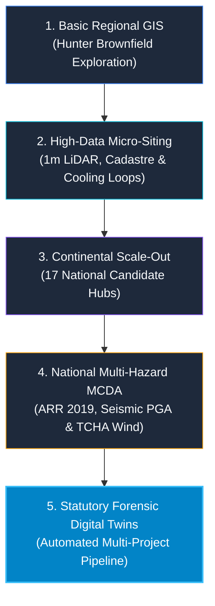
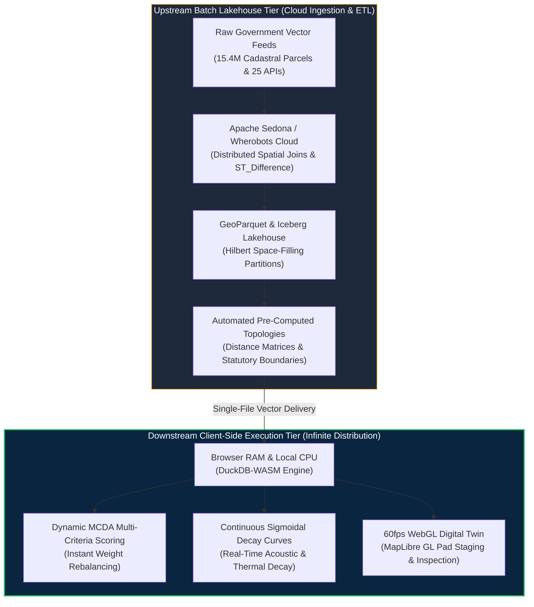
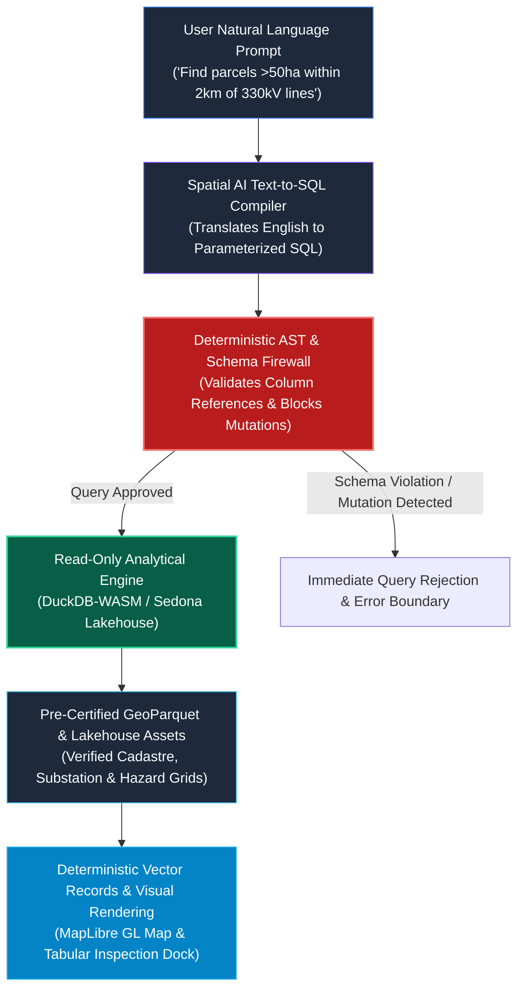

# The Spatial Siting Odyssey: From Regional Brownfield Scans to Continental AI Compute & High-Precision Statutory Digital Twins

*How GetBack2Basics built AURA Siting Crafter as an open-source first commercial solution — synthesizing engineering lessons, multi-modal project inputs, an asymmetric compute architecture, deterministic AI safety sandboxes, and certified statutory due diligence services.*

**Cloud Root:** [https://aura.getback2basics.net](https://aura.getback2basics.net) • **Organization:** [GetBack2Basics](https://getback2basics.net)

---


## The Siting Trilemma: Energy, Water & Sovereignty

Finding optimal land for next-generation sovereign AI data centres, clean energy firming hubs, and advanced industrial ecosystems is one of the most pressing engineering bottlenecks of the 2020s.

Traditional site selection relies on coarse static GIS layers, proprietary consulting PDFs, or disjointed spreadsheets. Proponents frequently claim *"100% buildable gross site area"*, only for infrastructure developers and institutional funds to discover years later that 40% of the parcel is locked by uninsurable 1% AEP floodways, mine subsidence strain zones, or EPA acoustic trigger buffers.

To de-risk capital allocations, **GetBack2Basics** engineered **AURA Siting Crafter** through a five-stage evolutionary journey. Built as an **open-source first commercial platform**, AURA combines a transparent, peer-reviewed open geospatial engine with certified statutory-grade site assessment services.

Here is the full synthesis of how we built it, the hard engineering lessons learned, the asymmetric cloud economics, the deterministic AI safety sandbox, and how developers can leverage custom project-specific reports.

---



---

## The 5-Stage Evolutionary Journey

### Stage 1: Basic Regional Spatial Exploration
Our journey started with a focused regional inquiry: *How can Australia transition retiring coal generation assets and mine void footprints in NSW's Hunter Region into digital infrastructure hubs?*

In the earliest prototypes, we applied standard GIS Euclidean buffers around 330kV substations, transmission easements, and major highways. While useful for initial reconnaissance, Euclidean buffers failed to account for real-world terrain winding factors, steep grade slopes, and local cadastral boundaries.

### Stage 2: High-Data Micro-Siting & Physical Thermodynamic Modeling
To move beyond crude approximations, we ingested high-fidelity ground truth:
* **15.4M+ Cadastral Parcels** (Geoscape CSDM & NSW Cadastre in GDA2020 / EPSG:7844 / EPSG:7856).
* **1m ELVIS LiDAR DEMs** to enforce strict <5.0% slope foundation filters.
* **Continuous Sigmoidal Sensitive Decay Curves** ($d_0 = 500\text{m}$) implementing NSW EPA *Noise Policy for Industry* (NPfI 2017) sleep disturbance thresholds.
* **Closed-Loop Heat & Cooling Physics**: Modeling thermodynamic pipeline decay for district cooling symbiosis and environmental naturalization distances before river discharge.

### Stage 3: Continental Simulations & National Scale-Out
Once proven in the Hunter, we scaled the spatial architecture across **all 6 Australian states**. Ingesting national GeoParquet spatial partitions into the **Wherobots Cloud** and **Apache Sedona** lakehouse, we benchmarked 17 national candidate clusters (from Latrobe Valley and Portland in Victoria to Collie in WA and Gladstone in Queensland).

We benchmarked every site on power grid proximity, industrial water access, and net scalable pad footprint.

### Stage 4: National High-Data Multi-Hazard Synthesis (MCDA)
Macro-level proximity alone does not make a site investable. Critical infrastructure requires statutory resilience. We integrated 5 peer-reviewed statutory hazard layers into a unified **6-Factor Multi-Criteria Decision Analysis (MCDA)**:
1. **1% AEP Dynamic Flood Depth** (*ARR 2019 / NCC 2022 Part B1*).
2. **Earthquake Peak Ground Acceleration (PGA)** (*AS 1170.4:2007 / GA NSHA 2018*).
3. **Extreme Cyclonic & Regional Wind Loading** (*AS/NZS 1170.2:2021 / GA TCHA 2018*).
4. **Landslide Susceptibility & Topographic Instability** (*AGS 2007 Guidelines*).
5. **Bushfire Ember Attack & Defensible APZ Buffers** (*AS 3959:2018 / NSW RFS PBP 2019*).

Every candidate site was assigned an explicit **Spatial Data Depth Index** (distinguishing between 10/10 Tier-1 micro-surveyed sites and 8/10 regional interpolations) so investors and planning panels never mistake baseline approximations for physical site ground-truth.

### Stage 5: Deep Forensic Analysis & Automated Project Submission Pipeline
In the final phase, we undertook the ultimate stress test: downloading and synthesizing **all 15 statutory public exhibition technical documents (>135 MB)** for the *Macquarie Coal Complex Transformation Precinct* from the NSW Planning Portal.

Our spatial audit revealed vital strategic insights:
* **True Net Developable Pad Space**: Subtracting riparian buffers, 20m high-pressure water pipeline easements, >5% slopes, and dam hazard setbacks reduced raw proponent claims to **44.5 ha net immediate buildable pad space** across 10 certified Net Developable Pads (NDPs).
* **49.0 MWh Void Micro-PHES**: Leveraging the site's 120m hydraulic head drop between the ridge plateau and lower open-cut pit void to create synchronous long-duration green energy firming.
* **Multi-Modal Connectivity**: 1.8km active heavy rail siding loop (2.5M t/yr) directly connecting to the Main Northern Railway.

Rather than building a one-off bespoke report, we engineered a **generic, repeatable Multi-Project Submission Pipeline (`tools/build_project_package.py`)**.

---

## The Asymmetric Compute Paradigm: Cloud Lakehouse vs. Infinite-Scale Client Execution

A common pitfall in cloud-native spatial marketing is claiming "free compute." In enterprise infrastructure, heavy geospatial computation carries real cost. AURA operates under an **Asymmetric Compute Model**:



* **Upstream Heavy Ingestion (Cloud Lakehouse)**: Ingesting 15.4M cadastral parcels, running 15 statutory hazard grids, and processing continuous decay curves is executed in distributed batch runs on **Apache Sedona and Wherobots Cloud**. By right-sizing medium runtimes (8 vCPU, 32 GB RAM) and using Iceberg snapshot partition caching, full national batch pipeline runs execute for **~$0.69 USD per full run** ($24.13 USD cumulative spend across 35 headless production passes).
* **Downstream Interactive Consumption (Client-Side WASM)**: Instead of incurring server database query costs every time an analyst adjusts a slider or recalculates a buffer, the entire analytical scoring engine compiles to **DuckDB WebAssembly** directly in the user's browser. Thousands of concurrent stakeholders can explore scenarios simultaneously at **$0.00 incremental cloud compute cost**.

### Architectural Cost Breakdown

| Operational Vector | Traditional Server GIS Stack | AURA Asymmetric WebAssembly Model | Commercial & Technical Advantage |
| :--- | :--- | :--- | :--- |
| **Batch Ingestion & Joins** | $1,500 – $5,000 / month in dedicated VM clusters | **~$0.69 USD per batch run** on serverless Sedona runtimes | 95%+ reduction in cloud infrastructure burn |
| **Interactive Query Cost** | $0.05 – $0.20 per scenario slider adjustment | **$0.00 incremental marginal cost** (Client CPU/RAM) | Zero cloud bill risk during public exhibition sweeps |
| **Scenario Recalculation** | 3–15 seconds round-trip network latency | **<15 milliseconds** local memory execution | Instantaneous sensitivity analysis for planning panels |
| **Concurrent Capacity** | Degrades at >100 simultaneous users | **Infinitely scalable** (Stateless vector distribution) | Seamlessly handles 10,000+ public stakeholders |

---

## Deterministic AI Safety: The Read-Only Text-to-SQL Sandbox

In national energy and industrial siting, an AI hallucination is fatal. A single invented parcel coordinate or hallucinated transmission easement could trigger a catastrophic multi-million-dollar misallocation.

AURA addresses this by establishing a **Deterministic AI Sandbox**:



### Safety Rules & Zero-Hallucination Guarantees
1. **The 'Librarian' Isolation Principle**: The conversational agent acts strictly as a query assistant querying a pre-certified library. It has **zero administrative permission** to create, modify, or reproject spatial geometries.
2. **Zero Coordinate Invention**: The AI does not generate latitude/longitude points or draw boundaries. It strictly emits standard SQL filter predicates (`WHERE area_ha >= 50 AND dist_to_substation_km <= 2.0`).
3. **AST Schema Firewall**: Generated SQL queries pass through an Abstract Syntax Tree (AST) validation layer. Mutation statements (`INSERT`, `UPDATE`, `DROP`, `DELETE`) or invalid table joins are blocked before reaching the query engine.
4. **Pre-Certified Data Grounding**: Queries execute exclusively against verified GeoParquet/Iceberg partitions audited by our automated zero-mock test harness (`pytest tests/lint/test_no_mock_data.py`).

---

## Top Engineering Lessons Learned

1. **🛡️ Zero-Mock Data Integrity Standard**: Synthetic coordinates and mock sample arrays create fatal blindspots in spatial infrastructure. We instituted a strict zero-mock AST scanner (`pytest tests/lint/test_no_mock_data.py`). All UI components, tables, and inspection docks must load 100% verified live datasets or explicit error boundaries.
2. **⚡ Decoupled Heavy Geometry vs. Scoring**: Running heavy spatial joins (`ST_Difference`, Voronoi buffering, CRS projections) on every slider adjustment causes prohibitive cloud bills. Pre-computing spatial topology once and evaluating mathematical scoring curves in client-side DuckDB-WASM dropped full national runs to **$0.69 USD**.
3. **🚀 Viewport-Aware Area-Priority Limiting**: Attempting to render 15.4M cadastral parcels crashes the browser DOM. We introduced an **Area-Priority 500-Feature Viewport Limiter** (`ORDER BY ST_Area(geom) DESC`). This ensures fluid 60fps rendering while guaranteeing macro situational awareness of major parcels.
4. **📦 Single-File Standalone Portability**: Planning authorities and investment committees cannot navigate complex GIS logins or broken tile servers. Packaging complete MapLibre digital twins, embedded GeoJSON micro-layers, and DuckDB-WASM into self-contained single-file HTML reports provides zero-latency offline auditing.
5. **🔍 The Statutory Ground-Truth Lesson**: Proponents frequently advertise *"100% buildable gross site area"*. Topological subtraction of statutory easements (high-pressure water mains, 30m riparian zones, >5% slopes, and Dams Safety NSW de-declaration buffers) often reduces developable yield by 30% to 55%. Real-world siting must be grounded in physical and legal constraints, not unverified marketing boundaries.

---

## Multi-Modal Input Spectrum: What Inputs Power the Pipeline?

| Input Data Stream | Source & Format | Ingestion Role in AURA Pipeline | Resolution / Standard |
| :--- | :--- | :--- | :--- |
| **Statutory Exhibition Studies** | NSW Planning Portal (PDFs, EIS, Geotechnical, Acoustics) | Extraction of certified noise limits, subsidence classes (G1–G3), and water allocations | 15+ Technical Reports (>135 MB per site) |
| **Cadastral Property Boundaries** | Geoscape CSDM / NSW DCDB (Parcels, Lots, Deposited Plans) | Determining legal land tenure, lot boundaries, and site acquisition footprints | 15.4M+ Parcels (GDA2020 / EPSG:7844 / EPSG:7856) |
| **LiDAR Digital Elevation Models** | ELVIS Geoscience Australia (1m / 5m DEM rasters) | Slope foundation grading (<5% constraint), cut-and-fill analysis, and hydraulic heads | 1-metre grid resolution |
| **Electrical Grid Infrastructure** | AEMO / Geoscience Australia (330kV/132kV Substations & Lines) | Calculating transmission corridor distances, substation capacity reserves, and grid taps | Substation pads & 3D transmission spans |
| **Multi-Hazard Statutory Grids** | ARR 2019 Flood, GA NSHA Seismic, GA TCHA Wind, AS 3959 Bushfire | Automated 6-factor MCDA multi-hazard constraint scoring | Peer-reviewed national hazard baselines |
| **Declarative Project Manifests** | JSON Configs (`config/projects/{ProjectID}.json`) | Declarative specification of Net Developable Pads, staging schedules, and utility specs | Standardized JSON Schema |
| **High-Precision Micro-Layers** | GeoJSON / GeoParquet / FlatGeobuf / PMTiles | Layer geometries for pads, staging phases, acoustic bunds, rail sidings, and bio-links | Centimetre-accurate site vectors |

---

## Open-Source Contributions & Ecosystem Integration

### 🤝 opengeos/GeoLibre Contributions
* `geolibre-siting`: Client-side MCDA scoring plugin.
* `geolibre-sedona`: Cloud ETL & Wherobots connector.
* `geolibre-spatial-ai`: Natural language to Spatial SQL proxy.
* `geolibre-catalogs`: Australian open data presets.
* `geolibre-export-report`: Standalone single-file HTML exporter.
* **5 Upstream Core Rendering Standards**: Area-Priority Limiting, Point Clustering, Continuous Dynamic Ramps, Byte-Range Vector Streaming, and Single-File Standalone Twins.

### 🏛️ NSW Government & Waratah HPC
* Unlocking **DDN ExaScaler 7990X Lustre** parallel I/O with GeoParquet.
* Cold data preservation with **Spectra Logic T950 tape** integration.
* Air-gapped client-side DuckDB-WASM execution to protect state HPC clusters from public query loads.

---

## How the Multi-Project Pipeline Works

Any proponent, local government council, or energy developer can submit a standardized project manifest:

```json
{
  "project_id": "LMCC_MacquarieCoal",
  "project_name": "Macquarie Coal Complex Transformation Precinct",
  "national_candidate_id": "AURA-NSW-0001",
  "lga": "City of Lake Macquarie",
  "state": "NSW",
  "engineering_metrics": {
    "gross_area_ha": 320.0,
    "net_developable_area_ha": 44.5,
    "power_capacity_mva": 500.0,
    "pumped_hydro_capacity_mwh": 49.0
  }
}
```

Running the pipeline automatically generates:
1. **Interactive 3D WebGIS Digital Twin** (`projects/index_{ProjectID}.html`): Zero-network-latency MapLibre GL client with self-contained, inline-embedded GeoJSON micro-layers.
2. **Statutory Planning & Siting Report** (`projects/report_{ProjectID}.html`): High-precision comparative benchmark tables, geotechnical subsidence matrices, and environmental staging plans.
3. **Non-Intrusive National Deep-Linking**: The national report and WebGIS remain untouched, automatically displaying a clickable `✨ Enhanced Report ↗` badge when users view candidate sites with active project submissions.

---

## The Delivery Model: Open Source Core vs. Certified Commercial Turnkey

### 1. AURA Open Spatial Core (100% Free & Open Source)
The entire foundational codebase, spatial schemas, MCDA scoring engine, and report builders are fully open-source.
* Clone the GitHub repository and run `pytest tests/ -v`.
* Define your project manifest in `config/projects/YOUR_PROJECT.json`.
* Drop your site vectors into `data/projects/YOUR_PROJECT/`.
* Build instant packages with `python tools/build_project_package.py`.

### 2. AURA Enterprise Statutory Siting (Certified Commercial Turnkey)
For developers, REITs, clean energy consortiums, utility operators, and local councils requiring statutory-grade due diligence, investment-committee deliverables, and planning exhibition response packages:
* **Full Planning Document Synthesis**: Ingestion of all EIS reports, acoustic assessments, geotechnical boreholes, and hydrological flood studies.
* **Certified Net Developable Area (NDA) Audit**: Topological subtraction of 1% AEP floodways, mine subsidence strain classes (G1–G3), high-pressure pipeline easements, and riparian buffers.
* **Custom 3D Interactive WebGIS Digital Twin**: Hosted, zero-latency MapLibre GL digital twin featuring pad staging time-sliders, infrastructure corridors, and thermodynamic heat loops.
* **Statutory Planning & Siting Report**: Comprehensive HTML & PDF deliverable ready for submission to State Planning Authorities (e.g. NSW DPHI, IPC, EPBC Act) and Investment Committees.
* **Independent Multi-Hazard Verification**: Peer-reviewed analysis against ARR 2019, AS 1170.4 (Seismic PGA), AS/NZS 1170.2 (Wind), AS 3959 (Bushfire), and AGS 2007 (Landslide).
* **National Benchmark Positioning**: Direct radar comparison against all 17 national candidate clusters on power, water circularity, and land efficiency.

---

## Explore the Live Suite

* 🌐 **[AURA Cloud Platform Root](https://aura.getback2basics.net)** — Live national spatial intelligence gateway.
* ⚡ **[Asymmetric Compute & AI Safety Whitepaper](aura_enterprise_asymmetric_compute_and_ai_safety.html)** — Comprehensive architecture and deterministic safety reference.
* 🌐 **[Interactive Site WebGIS (Macquarie Coal Complex)](../projects/index_LMCC_MacquarieCoal.html)** — High-resolution 3D MapLibre digital twin with 10 developable pads and staging controls.
* 📑 **[Statutory Site Siting Report (_LMCC_MacquarieCoal)](../projects/report_LMCC_MacquarieCoal.html)** — Forensic statutory planning document and geotechnical subsidence matrix.
* 🗺️ **[6-Pillar Site-Level Enhancement Plan (HTML)](macquarie_coal_precinct_site_enhancement_plan.html)** — Detailed breakdown of the 9 interactive components and engineering studies.
* 🏗️ **[Multi-Project Siting Architecture Blueprint (HTML)](project_specific_site_enhancement_architecture_plan.html)** — Reusable manifest schema and generic packaging engine.
* 🤝 **[GeoLibre Contribution Proposals](geolibre_contribution_proposals.html)** — Upstream plugin designs and 5 core rendering standards.
* 🏛️ **[NSW Government & Waratah HPC Strategic Guide](nsw_govt_geospatial_benefits.html)** — Transferring cloud spatial lakehouse patterns to state supercomputing.
* 🇦🇺 **[National Siting Suitability Report](../national_suitability_report.html)** — Macro-level multi-hazard benchmark across 17 Australian hubs.
* 🏛️ **[Official NSW Planning Portal Exhibition Documents](https://www.planningportal.nsw.gov.au/ppr/post-exhibition/macquarie-coal-complex-transformation-precinct)** — Reference planning portal records for Macquarie Coal Complex.

---

*Spatial infrastructure decisions must be grounded in physical truth, statutory rigor, and open data. Let's build the sovereign compute and clean energy foundation Australia needs.*
