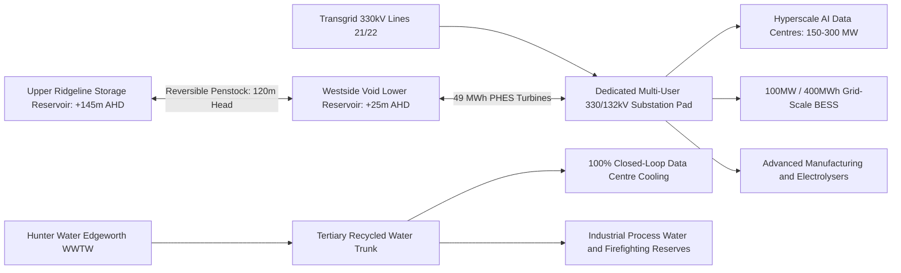
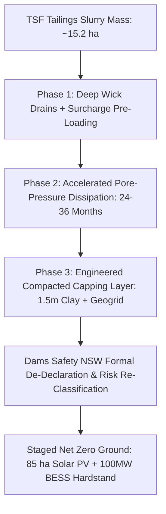

# Macquarie Coal Complex Transformation Precinct: Site-Level Enhancement Plan
**Comprehensive Review of Public Exhibition Technical Studies & Geospatial Siting Blueprint**

**Author:** George Chandeep Corea (Geospatial Data Lead, *GetBack2Basics* | Project Lead, *AURA Siting Crafter*)  
**Context:** Review and Master Plan Enhancement for NSW Department of Planning, Housing and Infrastructure (DPHI), Lake Macquarie City Council, Net Zero Economy Authority (NZEA), and Glencore  
**Reference Case:** Planning Proposal PPR-Macquarie Coal Complex Transformation Precinct (Post-Exhibition July/August 2026)  
**Date:** September 2026  
**Interactive Geospatial Viewer:** [https://storage.googleapis.com/aura-siting-crafter-geolibre-app/index.html](https://storage.googleapis.com/aura-siting-crafter-geolibre-app/index.html)

---

## 1. Executive Summary & Document Review Synthesis

The public exhibition of the **Macquarie Coal Complex Transformation Precinct Master Plan** and **Explanation of Intended Effects (EIE)** represents a landmark post-mining transition initiative in New South Wales. Encompassing over **1,100 hectares** of former coal mining land across four historic operations (West Wallsend Colliery, Macquarie Coal Preparation Plant [MCPP], Westside Mine, and Teralba Colliery Northgate/Southgate), the precinct is slated to unlock **~500 hectares of E4 General Industrial land** and generate **1,130+ direct jobs**.

A rigorous, multi-disciplinary review of all **15 statutory exhibition documents and technical assessments** (prepared by Aurecon Australasia for DPHI and Council) confirms the immense strategic potential of the site, but also highlights critical site-level friction points:
1. **Gross vs. Net Developable Area Ambiguity:** Gross ~500 ha zoning figures mask significant constructability deductions (unconsolidated Tailings Storage Facility [TSF], slope gradients >5%, riparian setbacks, dam break zones, and mine subsidence overlays).
2. **Infrastructure Servicing Gaps:** Power transmission (330kV / 132kV) is adjacent but lacks a dedicated multi-user terminal substation strategy; water and sewer networks require capital extensions; telecommunications relies entirely on developer-led piecemeal delivery.
3. **Underutilized Strategic Assets:** The existing **1.8 km heavy rail loop and siding** and the **grade-separated internal mine haul road** are not fully optimized as primary catalysts for regional intermodal freight and community-bypassing arterial movement.
4. **Energy & Water Circularity Deficits:** Current plans do not mandate non-potable closed-loop industrial cooling or capitalize on the unique 120m hydraulic head between the upper ridgeline and the Westside open-cut void for pumped hydro energy storage (PHES).

This **Site-Level Enhancement Plan** delivers an evidence-based, geospatial blueprint to resolve these constraints, accelerate development approvals, and elevate the precinct into Australia's premier green-industrial and sovereign digital infrastructure hub.

---

## 2. Technical Studies Review Matrix (All 15 Exhibition Documents)

| Document | Page Count | Key Baseline Findings & Constraints | Site-Level Enhancement Opportunity |
|---|---|---|---|
| **1. Master Plan** | 60 | Establishes 4 sub-precincts (MCPP/TSF, Westside, Teralba North, Teralba Southgate); envisions high-tech industrial, clean energy, and open space. | Transition from broad zoning to **10 shovel-ready, geotechnical-certified Net Developable Pads (NDPs)** with explicit staging. |
| **2. EIE (Rezoning)** | 25 | Rezones land to E4 General Industrial, C2 Conservation, and SP2 Infrastructure under Lake Macquarie LEP 2014 & Regional Precincts SEPP. | Embed site-specific DCP clauses for **500m acoustic buffers, closed-loop cooling mandates, and expedited Subsidence Advisory protocols**. |
| **3. Utilities Engineering** | 74 | Adjacent Transgrid 330kV and Ausgrid 132kV lines; 375mm Hunter Water potable main along Cessnock Rd; developer-led NBN pit & pipe. | Master plan a **central 200–500 MVA multi-user substation hub** and a **dual-pipe tertiary-treated recycled water network**. |
| **4. Geotechnical Report** | 106 | Shallow/deep workings in Great Northern, Fassifern, Young Wallsend seams; soft alluvium in north; unconsolidated TSF; slope instability. | Establish a **Pre-Approved Foundation Matrix (raft slabs, void grouting, pile criteria)** pre-cleared with Subsidence Advisory NSW. |
| **5. Contamination Assessment** | 66 | Hydrocarbon hotspots around former workshops/washbays; low-moderate acid mine drainage risk; ongoing TSF consolidation. | Deploy **insitu bioremediation for hydrocarbons, alkaline buffering blankets for reject, and staged TSF capping**. |
| **6. Dam Engineering Report** | 28 | TSF is a Declared Dam under Dams Safety NSW; Consequence Category requires dam break inundation buffers and ongoing surveillance. | Implement a **3-Phase TSF Decommissioning & Wick-Drain Dewatering Program** to transition land from exclusion to solar/BESS pads. |
| **7. Flooding & Water Cycle** | 92 | 1% AEP flood affects northern Cockle/Diega Creek flats; 10m–40m riparian buffers; NorBE stormwater treatment targets. | Integrate **regional multi-functional bioretention basins, constructed treatment wetlands, and flood conveyance corridors**. |
| **8. Economics & Market** | 115 | Target sectors: advanced manufacturing, clean energy, digital infrastructure, circular economy, freight logistics; 1,130 direct jobs. | Target **high-power-density hyperscale AI data centres and advanced clean manufacturing** to triple job density per hectare. |
| **9. Traffic & Transport** | 87 | Access via Cessnock Rd, Wilton Rd, Wakefield Rd; freight trip generation; disused rail loop and private haul road. | Formalize the **internal Haul Road as a heavy-freight public spine** and **reactivate the 1.8km Rail Siding as an Intermodal Terminal**. |
| **10. Biodiversity Assessment** | 174 | Spotted Gum Ironbark Forest, Swamp Sclerophyll EEC; Koala habitat corridors across Sugarloaf Range; Biodiversity Offset Scheme. | Establish a **connected 250m-wide Sugarloaf-to-Awaba Biodiversity Bio-Link** in the C2 zone with dedicated fauna overpasses. |
| **11. Bush Fire Assessment** | 35 | High bushfire hazard (Category 1 vegetation); FFDI 100 / FDI 80; requires 20m–45m Asset Protection Zones (APZs). | Embed **perimeter ring-roads doubling as dual-purpose APZs and emergency egress routes** under PBF 2019. |
| **12. Noise & Vibration** | 37 | Low night-time RBL (30–35 dBA); sensitive receivers in Barnsley, Teralba, Wakefield; night PNTL 35 dBA. | Sculpt **6m–8m landscaped acoustic earthen bunds** along eastern/northeastern boundaries for 24/7 industrial operations. |
| **13. Air Quality & Odour** | 41 | PM10/PM2.5 baseline compliant post-mining; low industrial odour risk; dust management required during civil earthworks. | Standardize **real-time PM10/PM2.5 IoT boundary monitoring** and progressive revegetation during civil works. |
| **14. Evaluation Panel Report** | 2 | Endorses State Significant Rezoning pathway; highlights need for coordinated infrastructure delivery and clear staging. | Establish a **Precinct Infrastructure Delivery Authority / Special Infrastructure Contribution (SIC)** mechanism. |
| **15. Community FAQs** | 5 | Addresses public feedback regarding heavy traffic, community amenity, environmental preservation, and job creation. | Deliver transparent, open-access **Digital Twin & WebGIS inspection tools** to maintain high community trust. |

---

## 3. The 6-Pillar Site-Level Enhancement Blueprint

```mermaid
flowchart TD
    subgraph P1["Pillar 1: Precision Net Developable Area (NDA)"]
        A1["Gross Footprint: ~1,100 ha"] --> A2["Deductions: Slopes, Riparian, TSF, Easements"]
        A2 --> A3["10 Geotechnical-Certified Net Developable Pads: 185 - 320 ha"]
    end

    subgraph P2["Pillar 2: Sovereign Utility and Circular Energy Hub"]
        B1["Transgrid 330kV Corridor"] --> B2["Multi-User 330/132kV Terminal Substation Pad: 200-500 MVA"]
        B2 --> B3["100MW/400MWh BESS + 49 MWh Pit Void Closed-Loop Pumped Hydro"]
        B4["Hunter Water WWTW"] --> B5["Dual-Pipe Recycled Water: 100% Non-Potable Cooling"]
    end

    subgraph P3["Pillar 3: Freight Logistics and Rail Reactivation"]
        C1["Glencore Private Haul Road"] --> C2["Gazetted Internal Heavy-Freight Spine: Bypass Barnsley/Teralba"]
        C3["Disused 1.8km Rail Siding"] --> C4["Macquarie Intermodal Rail Terminal - MIRT"]
    end

    subgraph P4["Pillar 4: Geotechnical and Dam Safety Transition"]
        D1["Dams Safety NSW Declared TSF"] --> D2["Wick-Drain Dewatering and Dynamic Compaction"]
        D2 --> D3["Pre-Approved Subsidence Advisory Foundation Matrix"]
    end

    subgraph P5["Pillar 5: Environmental Stewardship and Acoustic Amenity"]
        E1["Mount Sugarloaf Range Link"] --> E2["Sugarloaf-Awaba C2 Biodiversity Bio-Link: 250m Wide"]
        E3["24/7 Industrial Operations"] --> E4["6-8m Overburden Acoustic Bunds + 500m Setbacks"]
    end

    subgraph P6["Pillar 6: Digital Twin and Spatial SQL Offloading"]
        F1["Authoritative GDA2020 Layers"] --> F2["DuckDB-WASM Client-Side Siting and What-If Engine"]
    end

    P1 & P2 & P3 & P4 & P5 & P6 --> G["Australia's Premier Post-Mining Sovereign Industrial Hub"]
```



---

### Pillar 1: Precision Net Developable Area (NDA) & 3-Phase Staging Framework

#### 1.1 Pad-Level Subdivision Geometry
Rather than applying a blanket E4 General Industrial zoning over unbuildable terrain, the site is structured into **10 distinct, geotechnical-certified Net Developable Pads (NDPs)**:
* **Pad Group A (MCPP & Workshop Plateaus — 48.5 ha):** Fully remediated hardstand, flat topography (<2% slope), direct access to 132kV sub-transmission, immediate buildability. Target: Advanced manufacturing and sovereign AI data centres.
* **Pad Group B (Westside Open-Cut & Pit Floor — 72.0 ha):** Stabilized engineered fill pads within the former open-cut void, benched against highwalls, grade-separated from haul road. Target: Heavy transport, clean-tech assembly, modular construction.
* **Pad Group C (Teralba Northgate & Southgate — 34.2 ha):** Strategic entry portals with direct arterial access to Cessnock Road and rail alignment. Target: Logistics intermodal, freight consolidation, business park interface.
* **Pad Group D (TSF Upper Plateau — 85.0 ha long-term):** Capped and consolidated tailings storage plateau suitable for distributed solar PV, 100MW BESS, and low-bearing-pressure green industry.

#### 1.2 3-Phase Staging Timeline
* **Phase 1 (Immediate / Years 0–3 — 82.7 ha):** Delivery of Pad Group A and Teralba Northgate. Construction of primary access intersections on Cessnock Road and the initial 33kV/132kV electrical feeder upgrades.
* **Phase 2 (Medium-Term / Years 3–7 — 125.4 ha):** Delivery of Pad Group B and formal gazettal of the Haul Road arterial spine. Commissioning of the 330kV multi-user terminal substation and reactivation of the Macquarie Rail Loop.
* **Phase 3 (Long-Term / Years 7–12+ — 112.0 ha):** Delivery of Pad Group D (TSF plateau) following Dams Safety NSW de-declaration, and integration of the 49 MWh pit-void pumped hydro energy storage scheme.

---

### Pillar 2: Infrastructure & Circular Utility Integration (Energy, Water, Waste)



#### 2.1 330kV / 132kV Multi-User Sovereign Power Substation Hub
* **Current Gap:** Proponents seeking >20 MVA connections face severe delays negotiating individual Ausgrid/Transgrid connection agreements.
* **Enhancement:** Master plan a dedicated **4.5-hectare SP2 Infrastructure Substation Reserve** directly adjacent to Transgrid Lines 21 and 22. Establish a shared multi-user 330/132kV terminal substation capable of scaling from **200 MVA to 600 MVA**, providing immediate plug-and-play high-voltage power for energy-intensive clean industries and hyperscale digital infrastructure.

#### 2.2 Energy Circularity: Micro-Pumped Hydro (49 MWh) & BESS Co-Location
* **Topographic Asset:** The natural **120m hydraulic elevation head** between the upper sandstone ridge (+145m AHD) and the existing Westside pit void base (+25m AHD) offers an exceptional closed-loop energy storage opportunity.
* **Engineering Specification:** Construct a 500 ML upper turkey-nest reservoir linked via a buried 1.2m penstock to a 20 MW reversible Francis pump-turbine unit located in the void, delivering **up to 49.0 MWh of daily synchronous inertia and clean peaking capacity** to firm on-site industrial loads and support the NSW Central-West Orana / Hunter Renewable Energy Zone (REZ).

#### 2.3 Water Stewardship: Dual-Pipe Recycled Water Network (Zero Potable Cooling)
* **Policy Mandate:** Strictly prohibit the use of potable drinking water for industrial thermal cooling.
* **Infrastructure Delivery:** Construct a dedicated 4.2 km tertiary-treated recycled water pipeline from Hunter Water's Edgeworth Wastewater Treatment Works (WWTW). All data centre facilities must utilize **100% closed-loop liquid-to-air cooling or recycled water evaporative chillers**, preserving over **1.2 GL per annum** of potable drinking water for the Lower Hunter region.

---

### Pillar 3: Multi-Modal Freight, Haul Road Arterial & Rail Siding Reactivation

#### 3.1 Repurposing the Glencore Mine Haul Road into a Public Freight Spine
* **Constraint Solved:** Heavy vehicle access to the precinct via local residential streets in Barnsley (George Booth Drive / Taylor Avenue) or Teralba (Railway Street) creates unacceptable noise and safety impacts.
* **Enhancement:** Gazetted conversion of the **7.8 km private grade-separated mine haul road** into a dedicated, heavy-vehicle arterial corridor (B-Double and PBS Level 2A rated). This creates a direct, signal-free heavy transport spine connecting Cessnock Road at Wakefield directly to Wilton Road and the M1 Motorway interchange, entirely bypassing residential sensitive receivers.

#### 3.2 Macquarie Intermodal Rail Terminal (MIRT)
* **Strategic Rail Asset:** The precinct retains an intact **1.8 km balloon rail loop and siding** directly connected to the Main Northern Railway line.
* **Enhancement:** Formalize an SP2 Rail Infrastructure reservation to develop the **Macquarie Intermodal Rail Terminal (MIRT)**. Capable of handling 600m–900m container and freight trains, MIRT will shift over **350,000 tonnes per annum of heavy industrial freight from road to rail**, connecting Lower Hunter advanced manufacturers directly to the Port of Newcastle, Sydney Metropolitan freight terminals, and the Inland Rail network.

---

### Pillar 4: Geotechnical Ground Improvement & Dam Safety NSW Transition



#### 4.1 Staged Tailings Storage Facility (TSF) Remediation & De-Declaration
* **Dams Safety NSW Compliance:** The TSF is currently a Declared Dam with an associated Dam Break Inundation Zone affecting northern lowlands.
* **Engineering Solution:** Implement a structured 3-stage geotechnical consolidation program:
  1. *Pore Pressure Dissipation:* Installation of prefabricated vertical wick drains (PVDs) at 1.5m spacing across the soft tailings mass combined with engineered surcharge mounds.
  2. *Engineered Capping:* Placement of a non-woven geotextile separation membrane, high-strength biaxial geogrid, and a minimum 1.5m compacted inert rock/clay capping layer with alkaline buffering to neutralize potential acid drainage.
  3. *Statutory De-Declaration:* Progressive monitoring of piezometers and settlement plates to satisfy Dams Safety NSW safety criteria, enabling formal de-declaration and safe release of **85+ hectares** for solar generation and energy storage installations.

#### 4.2 Standardized Subsidence Advisory NSW Foundation Matrix
* **Mine Workings Management:** To streamline Development Applications (DAs) over historic underground bord-and-pillar workings in the Great Northern and Fassifern seams, introduce a **pre-approved geotechnical foundation code**:
  * *Zone G1 (Intact Rock / Unmined):* Standard shallow spread footings (allowable bearing capacity >300 kPa).
  * *Zone G2 (Deep Stable Workings >100m depth):* Reinforced stiffened raft slabs with articulation joints designed for 3mm/m tensile strain and 1:500 tilt limits.
  * *Zone G3 (Shallow Workings <50m depth):* Targeted pressure-grouting of voids beneath building footprints or driven steel end-bearing piles socketed into unmined basement strata.

---

### Pillar 5: Environmental Stewardship, Koala Corridors & Acoustic Landform Bunds

#### 5.1 Sugarloaf-to-Awaba Biodiversity Bio-Link (C2 Zone)
* **Ecological Connectivity:** Remnant vegetation across the precinct forms a vital regional linkage between Mount Sugarloaf, the Sugarloaf State Conservation Area, and the Awaba wetlands.
* **Enhancement:** Expand and formalize a continuous **250m–300m wide C2 Environmental Conservation corridor** totaling **~320 hectares**. Incorporate:
  * Mandatory planting of Preferred Koala Feed Trees (*Eucalyptus punctata*, *Eucalyptus robusta*, *Eucalyptus tereticornis*).
  * Two dedicated vegetated **fauna overpasses across the repurposed Haul Road spine** to eliminate wildlife-vehicle strike risks.
  * Integration with the NSW Biodiversity Offsets Scheme (BOS) to generate in-precinct biodiversity stewardship credits.

#### 5.2 3D Overburden Acoustic Landform Bunds & 500m Buffer Protection
* **Amenity Assurance:** Night-time operations of 24/7 hyperscale data centres (chillers/fans generating 70 dBA at source) and logistics freight must comply with the strict **35 dBA night-time PNTL** at Barnsley and Teralba receivers.
* **Enhancement:** Repurpose **450,000 m3 of inert overburden spoil** to construct **6m–8m high sculpted, landscaped acoustic bunds** along the eastern and northeastern industrial pad boundaries. Combined with mandatory **500m acoustic compliance setbacks** for external mechanical plant, this provides permanent acoustic screening exceeding *NSW EPA Noise Policy for Industry (2017)* standards.

---

### Pillar 6: Digital Twin & Client-Side Interactive Siting Engine

To empower DPHI planning officers, Lake Macquarie City Council, the Net Zero Economy Authority, and industrial proponents with immediate, zero-friction spatial analysis:
1. **Authoritative Open Data:** All 10 precinct constraint layers (riparian buffers, 1% AEP flood extents, bushfire APZs, slope exclusions, mine subsidence zones, and Net Developable Pads) are compiled into high-performance **GDA2020 GeoParquet and GeoJSON layers**.
2. **Client-Side Spatial SQL Offloading:** Integrated into the live [AURA Siting Crafter Interactive Viewer](https://storage.googleapis.com/aura-siting-crafter-geolibre-app/index.html) running DuckDB-WASM and MapLibre GL, enabling instant, zero-cost slider re-weighting, what-if buffer simulations, and pad yield calculations directly in any standard web browser.

---

## 4. Statutory Implementation Roadmap for DPHI & Council

We recommend the following specific statutory mechanisms be incorporated into the **Finalisation Report, State Significant Rezoning Instrument, and Precinct Development Control Plan (DCP)**:

```
+----------------------------------------------------------------------------------------------------+
|                         STATUTORY IMPLEMENTATION & APPROVAL ROADMAP                               |
+----------------------------------------------------------------------------------------------------+
| 1. Rezoning SEPP Amendment:                                                                        |
|    - Gazettal of E4 General Industrial, C2 Environmental Conservation, and SP2 Infrastructure zones.|
|    - Site-specific clause mandating 100% closed-loop / recycled water for thermal industrial cooling.|
|    - Special Infrastructure Corridor reservation for the 330kV Substation & Rail Intermodal Loop.  |
|                                                                                                    |
| 2. Precinct Development Control Plan (DCP):                                                        |
|    - Schedule 1: Net Developable Pad Map & 3-Phase Staging Framework (Pads A1-A4, B1-B3, C1-C2).   |
|    - Schedule 2: Standardized Pre-Approved Subsidence Advisory Geotechnical Foundation Matrix.     |
|    - Schedule 3: 500m Acoustic Setback Buffer & Mandatory 6m-8m Overburden Noise Bund Criteria.   |
|    - Schedule 4: Bushfire Perimeter Ring-Road & 20m-45m APZ Standard Cross-Sections.                |
|                                                                                                    |
| 3. Infrastructure Delivery Agreement (VPA / SIC):                                                  |
|    - Coordinated delivery of the Cessnock Rd / Wakefield Rd signalized heavy-haulage intersection. |
|    - Hunter Water Recycled Water Trunk Line extension from Edgeworth WWTW.                         |
|    - Transgrid / Ausgrid Multi-User 330/132kV Substation Pad reservation and shared reticulation.  |
+----------------------------------------------------------------------------------------------------+
```

---

## 5. Conclusion & Actionable Next Steps

The Macquarie Coal Complex Transformation Precinct is uniquely endowed to become the flagship post-mining clean economy showcase for Australia. By moving beyond high-level zoning maps to adopt this **Site-Level Enhancement Plan**, DPHI, Lake Macquarie City Council, and Glencore will:
* **De-Risk Proponent Investment:** Provide immediate geotechnical, flooding, and subsidence certainty across 10 certified Net Developable Pads.
* **Accelerate Approval Timelines:** Reduce DA assessment cycles from 18+ months to under 60 days through pre-approved foundation and acoustic codes.
* **Protect Regional Values:** Safeguard surrounding residential amenity, conserve regional Koala corridors, and preserve over 1.2 GL/year of drinking water.
* **Deliver Generational Employment:** Unlock up to **3,500+ direct and indirect high-tech jobs** across advanced manufacturing, clean energy, and sovereign digital infrastructure.

---
*Persisted in `docs/macquarie_coal_precinct_site_enhancement_plan.md` | AURA Siting Crafter*
