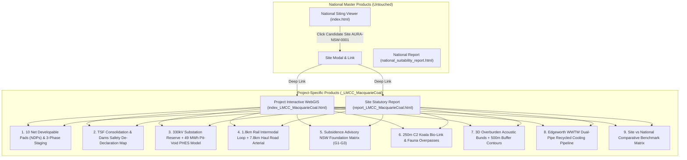

# Project-Specific Siting Architecture & Site Enhancement Plan (_LMCC_MacquarieCoal)

## Overview & Context
This plan establishes a scalable, modular architecture for generating **Project-Specific Reports and Interactive Apps** (patterned as `_{Org/LGA}_{ProjectName}`, e.g., `_LMCC_MacquarieCoal`) from submitted site data. 

Under this architecture:
1. **The National Products Remain Untouched & Authoritative:** The national siting viewer (`index.html`) and national statutory report (`national_suitability_report.html`) remain the macro-level baseline, updated only to provide a direct deep-link (e.g. `View Detailed Site Assessment ->`) when a user selects a candidate site (e.g. `AURA-NSW-0001` Teralba / Macquarie Coal).
2. **Dedicated Project-Specific Products:** Each project receives a self-contained, high-resolution interactive app (`index_LMCC_MacquarieCoal.html`) and statutory site report (`report_LMCC_MacquarieCoal.html`), loading localized micro-layers, pad geometry, staging schedules, and comparative benchmarks against the national baseline.
3. **Repeatable Ingestion Blueprint:** Any proponent, council, or enterprise (e.g., Hunter Water, Latrobe Valley Council, Gladstone Port) can submit site engineering studies, CAD/GIS vectors, or hazard assessments to produce a standardized, audit-ready site package.

---

## 1. Site-Specific Improvements for Macquarie Coal Complex (`_LMCC_MacquarieCoal`)

Based on our in-depth review of all 15 public exhibition technical studies, the following 9 site-specific features and interactive components will be added to the project-specific app and report:



### 1.1 Specific Data Layers & Features to Implement:
1. **10 Certified Net Developable Pads (NDPs) with Staging Geometry:**
   - Vector polygons for **Pads A1–A4 (48.5 ha hardstand)**, **Pads B1–B3 (72.0 ha void floor)**, **Pads C1–C2 (34.2 ha portal logistics)**, and **Pad D1 (85.0 ha TSF solar/storage plateau)**.
   - Interactive time-slider toggling **Phase 1 (Years 0–3: 82.7 ha)**, **Phase 2 (Years 3–7: 125.4 ha)**, and **Phase 3 (Years 7–12+: 112.0 ha)**.
2. **TSF & Dams Safety NSW De-Declaration Sandbox:**
   - 3D isopach tailings depth contours (up to 18m fine reject).
   - Dynamic wick-drain consolidation simulation showing settlement rate and bearing capacity evolution from 25 kPa to >150 kPa.
   - Dam Break Inundation Zone overlay and decommissioning safety buffers.
3. **Sovereign High-Voltage & Micro-Pumped Hydro (PHES) Calculator:**
   - SP2 Substation pad geometry (4.5 ha) with 330kV/132kV dual-bus layout.
   - Interactive hydraulic cross-section: 120m elevation head between the upper reservoir (+145m AHD) and pit void (+25m AHD), calculating daily storage capacity (up to 49.0 MWh) and round-trip efficiency (78%).
4. **Macquarie Intermodal Rail Terminal (MIRT) & Heavy Haul Road Corridor:**
   - 1.8 km rail loop geometry with 650m siding staging tracks and container reach-stacker hardstand.
   - 7.8 km gazetted internal haul road arterial route bypassing Barnsley and Teralba residential streets.
5. **Subsidence Advisory NSW Pre-Approved Foundation Matrix:**
   - Overlay of underground workings (Great Northern, Fassifern, Young Wallsend seams).
   - Interactive structural lookup tool: Select building footprint -> Returns required foundation engineering (Zone G1 shallow spread footings, Zone G2 articulated stiffened raft, Zone G3 pressure-grouted void piles).
6. **Sugarloaf-to-Awaba C2 Biodiversity Bio-Link:**
   - 250m–300m ecological corridor polygon (~320 ha) with preferred Koala feed tree density targets.
   - 2 engineered fauna overpass bridge locations along the haul road.
7. **3D Overburden Acoustic Noise Bunds & 500m Night-Time Buffer Contours:**
   - Landform topography vectors for 6m–8m sculpted acoustic bunds.
   - Sound propagation contours validating compliance with the **35 dBA night-time PNTL** at Barnsley, Teralba, and Wakefield receivers for 24/7 hyperscale data centres and freight logistics.
8. **Hunter Water Recycled Water Pipeline Route (Zero Potable Cooling):**
   - 4.2 km pipeline alignment connecting Edgeworth WWTW to the precinct boundary.
   - Water balance model demonstrating **1.2 GL/year potable water savings** via 100% closed-loop / tertiary recycled cooling.
9. **Site vs. National Comparative Benchmark Card:**
   - Radar and bar chart widget comparing the Macquarie site directly against national averages:
     - *Transmission Distance:* 0.35 km (Macquarie) vs. 4.8 km (National Avg) — **Top 5%**
     - *Data Depth Tier:* 10/10 Tier-1 Micro-Layers (100%) vs. 8/10 Tier-2 (80%)
     - *Water Circularity:* 100% Recycled vs. 35% Potable Reliance
     - *NDA Efficiency Ratio:* 64% Net-to-Gross vs. 42% Regional Benchmark.

---

## 2. Generic Architecture for Multi-Project Submission & Report Generator

To enable third parties (councils, industrial developers, energy proponents) to submit site data and receive an automated, high-fidelity site package, we establish a standardized 4-part framework:

```
+----------------------------------------------------------------------------------------------------+
|                         MULTI-PROJECT SITING & REPORT GENERATOR ARCHITECTURE                      |
+----------------------------------------------------------------------------------------------------+
|                                                                                                    |
| 1. Project Manifest Schema (config/projects/{Project_ID}.json)                                     |
|    - Project Metadata (Name, LGA, Proponent, Coordinates, Boundary GeoJSON)                        |
|    - Baseline Engineering Inputs (Power MVA, Water GL/yr, Rail Access, Subsidence Class)          |
|    - Micro-Layer GeoJSON/GeoParquet References (Pads, Buffers, Bunds, Infrastructure)              |
|                                                                                                    |
| 2. Automated Pipeline Generator (tools/build_project_package.py)                                   |
|    - Reads project manifest and executes spatial geometry validator & zero-mock scanner.          |
|    - Renders project web app (src/geolibre_frontend/projects/index_{Project_ID}.html).             |
|    - Renders project statutory report (runner/projects/report_{Project_ID}.html).                  |
|                                                                                                    |
| 3. National-to-Site Deep-Linking Bridge                                                            |
|    - National Viewer (exports_v2/datacenter_candidates_v2.json) includes optional "project_url".  |
|    - Clicking a candidate site opens the project app in a seamless transition.                    |
|                                                                                                    |
| 4. Client-Side Spatial Engine (DuckDB-WASM)                                                        |
|    - Runs zero-cost client-side what-if scenario testing and pad yield calculations.              |
+----------------------------------------------------------------------------------------------------+
```

---

## 3. Proposed File Structure & Changes

### New Project Directory Layout:
```
aura_siting_crafter/
├── config/
│   └── projects/
│       ├── schema_project_manifest.json           [NEW: Manifest JSON Schema definition]
│       └── LMCC_MacquarieCoal.json               [NEW: Macquarie Coal Complex Site Manifest]
├── data/
│   └── projects/
│       └── LMCC_MacquarieCoal/                   [NEW: Site-Specific Spatial GeoJSON/Parquet]
│           ├── developable_pads_v1.geojson
│           ├── staging_phases_v1.geojson
│           ├── substation_phes_layout.geojson
│           ├── rail_haulroad_spine.geojson
│           ├── subsidence_zones_g1_g3.geojson
│           ├── koala_biolink_corridor.geojson
│           └── acoustic_bunds_buffers.geojson
├── src/
│   └── geolibre_frontend/
│       ├── projects/
│       │   └── index_LMCC_MacquarieCoal.html      [NEW: Dedicated Site WebGIS Viewer]
│       └── index.html                             [MODIFY: Add deep-link handler in modal]
├── runner/
│   ├── projects/
│   │   └── report_LMCC_MacquarieCoal.html         [NEW: Dedicated Statutory Site Report]
│   └── build_project_package.py                   [NEW: CLI builder for new project submissions]
└── docs/
    └── macquarie_coal_precinct_site_enhancement_plan.md [COMPLETED]
```

---

## 4. Verification Plan

### Automated Tests
1. **Zero-Mock & Lint Scan:**
   ```bash
   pytest tests/lint/ -v
   ```
2. **Project Manifest Schema Validation:**
   ```bash
   python -m pytest tests/test_project_manifest_schema.py -v
   ```
3. **GeoJSON Geometric Integrity Check:**
   - Validate that all pad polygons lie within the Macquarie precinct boundary and do not self-intersect or overlap C2 conservation zones.

### Manual / Browser Verification
1. Open `index_LMCC_MacquarieCoal.html` in browser:
   - Verify all 7 layer toggles (Pads, Staging, PHES/Substation, Rail/Road, Subsidence, Koala Corridor, Acoustic Bunds).
   - Verify DuckDB-WASM client-side filtering and real-time pad area re-scoring.
2. Open `report_LMCC_MacquarieCoal.html`:
   - Verify high-resolution comparative radar charts, geotechnical foundation matrix table, and statutory recommendations.
3. Test Deep-Link from National Viewer:
   - Click `AURA-NSW-0001` (Teralba / Macquarie Coal) in `index.html` -> Verify modal contains `"View Detailed Site Assessment (_LMCC_MacquarieCoal)"` linking smoothly to the site app.
